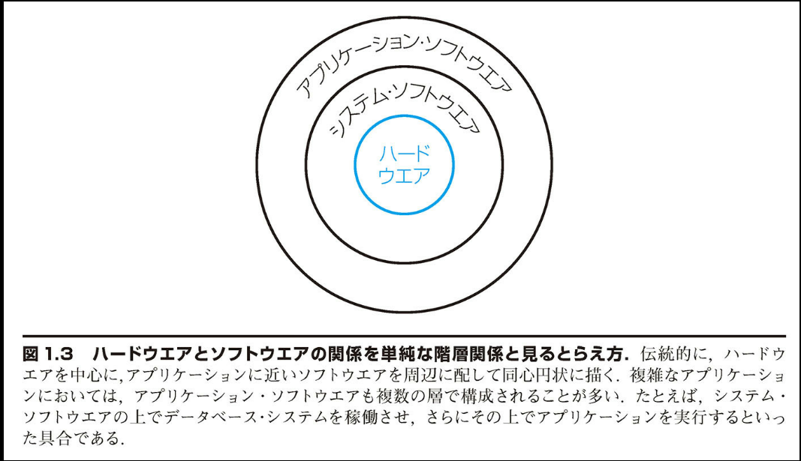
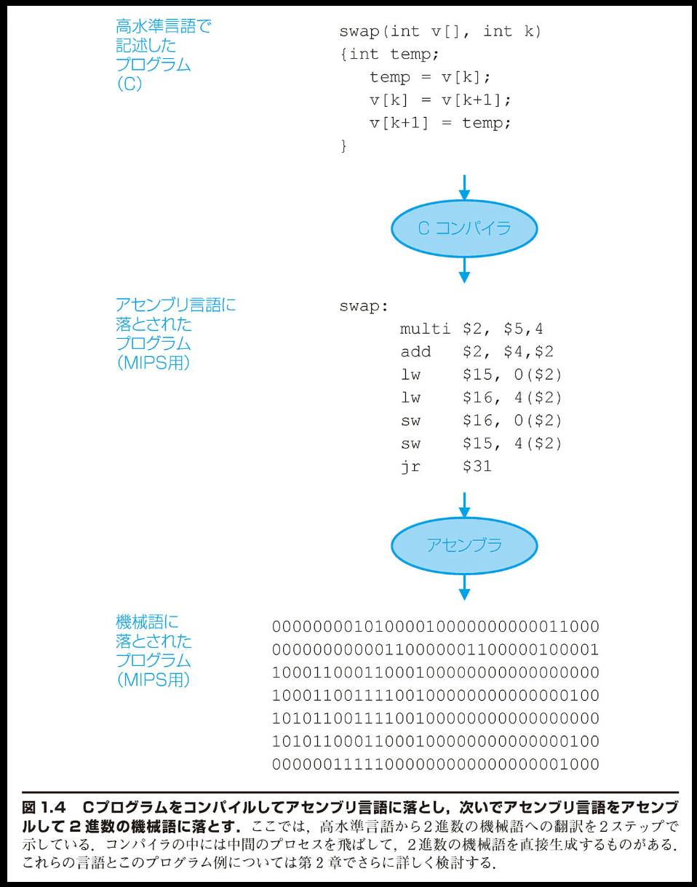

## 1.3 プログラムの裏側

> 「私がパリでフランス語で話したとき、フランス人はただ目を丸くするだけであった。私がいくら彼らの母国語で話しても、愚かなフランス人にはついに理解させられなかった。」
> Mark Twain*, The Innocents Abroad (地中海遊覧記), 1869* (訳注) マーク・トウェイン, 米国の小説家, 本名 Samuel L. Clemens. 1835-1910

ワード・プロセッサや大規模なデータベース・システムのような代表的なアプリケーションは、何百万ステップものコードで構成され、アプリケーションをサポートする複雑な機能を備えた精巧なソフトウェア・ライブラリを利用している。後で学ぶように、コンピュータ内のハードウェアは非常に単純な低水準の命令を実行できるだけである。複雑なアプリケーションから単純な命令に至るためには、ソフトウェアの層をいくつか経由して、高水準の処理を単純なコンピュータ命令に順次変換または翻訳する必要がある。これは、主要なアイデアの「抽象化」の例である。

以上に述べたソフトウェアの層は、基本的に図 1.3 のような階層構造で構成されている。ハードウェアが中央に位置し、アプリケーション・ソフトウェアが外周を取り巻き、その間に各種のシステム・ソフトウェア (system software) がはさまれている。

システム・ソフトウェアには種々のタイプがあるが、今日のあらゆるコンピュータに不可欠なものが 2 つある。それはオペレーティング・システムとコンパイラである。オペレーティング・システム (operating system) はユーザーのプログラムとハードウェアの仲介役であるとともに、種々のサービスおよび監視機能を果たす。中でも重要なのは、下に示す機能である。

■ 基本的な入出力処理を行う

■ 外部記憶およびメモリを割当てる

■ コンピュータを同時に使用する複数のアプリケーションの間で、コンピュータ資源の共有を図る

今日使用されているオペレーティング・システムの例としては、Linux、iOS、Android、Windows が挙げられる。コンパイラ (compiler) は別の重要な機能を果たす。C、C++、Java、Visual Basic のような高水準言語で書かれたプログラムを、ハードウェアが実行可能な命令に翻訳するのである。現代のプログラミング言語は精巧になっており、ハードウェアが実行できる命令は単純なので、高水準言語のプログラムからハードウェアの命令へと翻訳する処理は複雑なものになる。このプロセスについては、まず以下に概説し、第 2 章と付録 A でさらに掘り下げて説明することにしたい。

### 高水準言語からハードウェアの言語へ

電子的なハードウェアと情報を交換するには、電子的な信号を送らなければならない。コンピュータが理解しうる最も簡単な信号はオン (on) かオフ (off) かである。つまり、コンピュータのアルファベットは 2 文字しかない。英語の 26 文字のアルファベットで書き表せることに際限がないのと同様に、コンピュータの 2 文字のアルファベットでコンピュータが行えることにも際限はない。この 2 つの信号は数字の 0 と 1 で表す。そこで、一般に、コンピュータの言語は 2 を基数とする数字、つまり 2 進数 (binary number) であると言う。個々の数字をバイナリ・ディジット (binary digit)、あるいは略してビット (bit) と呼ぶ。コンピュータは人が与えた指示どおりに動く。その指示を命令

(instruction) と呼ぶ。命令はコンピュータが理解できるビットを並べたけものであり、数字とみなすこともできる。たとえば、あるコンピュータで 2 つの数字を足す命令は下記のビットで表現される：

`10001100101000000`

命令とデータの両方に数字を用いる理由は第 2 章において説明する。したがって、詳しいことは第 2 章に譲るとして、ここでは命令とデータの両方に数字を使用することはコンピュータを使用する基本であるとだけ言っておく。

初期のプログラマは 2 進数を使用してコンピュータと情報を交換した。しかし、それは非常に煩わしい方法だったので、ほとなく彼らはコンピュータへの命令をもう少し人間に近い言葉で書き表す方法を考案した。当初はその表記を人手で 2 進数に翻訳していた。しかし、それもめんどうなことであった。そこで、記号（シンボル）で書き表されたプログラムをコンピュータを使って 2 進数に翻訳するプログラムが発明された。この種のプログラムは、アセンブラ (assembler) と名付けられた。アセンブラは、シンボルで書き表された命令を 2 進数に翻訳するプログラムである。たとえば、プログラマが下記のように書いたとする。

`add A, B`

これをアセンブラで翻訳すると、下記のようになる。

`10001100101000000`

この命令はコンピュータに 2 つの数値の A と B を加算するように指示する。このようなシンボル形式の言語はアセンブリ言語 (assembly language) と名付けられた。この名前は今日でも依然として使用されている。それに対して、機械が理解する 2 進数の言語を機械語 (machine language) と呼ぶ。

アセンブリ言語はマシンが直接理解できる機械語よりは相当に改善されたとは言うものの、自然な表記法と言えるにはほど遠かった。たとえば、科学者が流体のシミュレーションに使用する言語や会計士が帳簿の貸借を合わせるのに使用する言語からはかけ離れていた。アセンブリ言語を使用する場合、プログラマはコンピュータの動作に対応して 1 行ずつ命令を書かなければならなかった。その結果、プログラマはコンピュータのように思考することを余儀なくされた。

より強力な言語をコンピュータの命令へと翻訳するプログラムを開発できる——それに気付いたことは、初期のコンピュータ利用における画期的な進歩の 1 つであった。こうして高水準プログラミング言語 (high-level programming language)、およびそのような言語で書かれたプログラムを命令に翻訳するコンパイラが開発されたおかげで、今日のプログラマは高い生産性を上げ、しかも精神衛生を保っていられる。プログラムと言語の以上のような関係を図 1.4 に示す。これは、「抽象化」の効果を示すもう 1 つの例である。

高水準プログラミング言語を使用すると、プログラマは下記のように書くことができる。

`A + B`

これをコンパイラを使ってコンパイルすると、下記のアセンブリ言語ステートメントが得られる。

`add A, B`

これをアセンブラを使ってアセンブルすると、前述のような 2 進数命令が得られる。この命令が数値の A と B を加算するようにコンピュータに指示する。

高水準プログラミング言語の使用には、重要な利点がいくつかある。第 1 に、英語と代数式を使用するので、プログラマは自然言語に近い言語で思考でき、得られる結果も意味の分かりにくい記号の羅列ではなくテキストに近いものとなる（図 1.4 を参照）。さらに、用途に応じて言語を設計できる。たとえば、科学技術計算用に Fortran が開発され、事務処理用に COBOL が開発され、記号処理用に LISP が開発された。もっと狭いユーザー・グループを対象とした、特定分野用の言語もある。例として、流体のシミュレーションを行うためのプログラミング言語が挙げられる。

第 2 の利点は、プログラマの生産性が向上することである。ソフトウェア開発に関して広く意見の一致が得られている事柄に、処理内容を表すのに必要な行数が少ないプログラミング言語ほど、プログラム開発にかかる時間が少なくて済む、ということがある。簡明さという点で、高水準言語はアセンブリ言語よりも明らかに優れている。

最後の利点は、プログラムをコンピュータから独立させられることである。その理由は、コンパイラおよびアセンブラは、高水準言語を任意のコンピュータ用の 2 進数命令に翻訳できるからである。以上の利点が非常に大きなため、今日ではアセンブリ言語で一から組まれるプログラムはほとんどない。

はい、用語の定義を一覧形式で起こします：

システム・ソフトウェア (<<)
共通に利用されるサービスを提供するソフトウェア。オペレーティング・システム、コンパイラ、アセンブラなどが含まれる。

オペレーティング・システム (<<)
コンピュータ上で実行されるプログラムのために、そのコンピュータの資源を管理したり監視したりするプログラム。

コンパイラ (<<)
高水準言語の文（ステートメント）をアセンブリ言語の文に翻訳するプログラム。

バイナリ・ディジット (<<)
「ビット」(bit) とも言う。2 進数を表現する 2 つの数字 0 と 1 のどちらかで表される。データを構成する最小単位。

命令 (<<)
コンピュータ・ハードウェアが認識して従う指示。

アセンブラ (<<)
シンボル（記号）表記のプログラムをバイナリ（2 進表現）に翻訳するプログラム。

アセンブリ言語 (<<)
マシン命令をシンボル（記号）表記で表現する言語。

機械語 (<<)
コンピュータに対する命令を 2 進数で表したもの。

高水準プログラミング言語 (<<)
英語の単語と代数記号で記述され、コンパイラによってアセンブリ言語に翻訳できる、移植性のある言語。例として、C、C++、Java、Visual Basic などが挙げられる。
