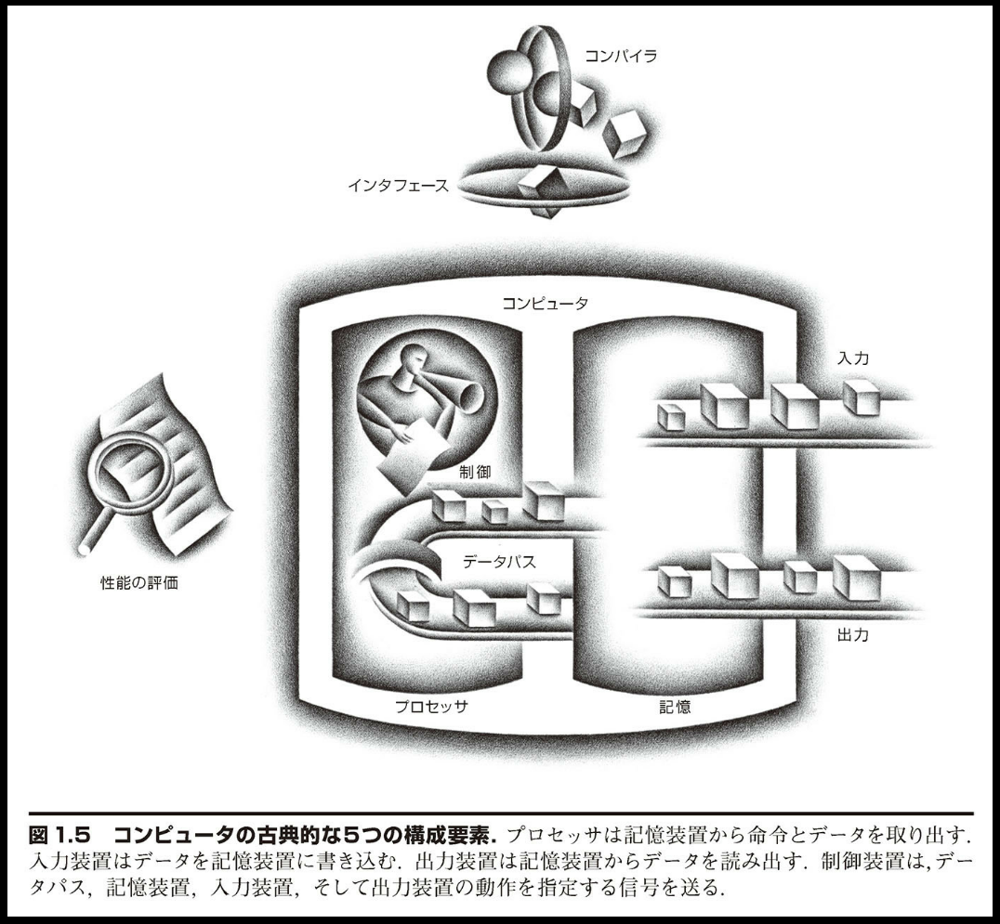
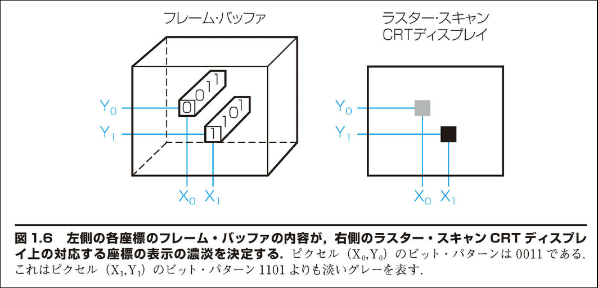
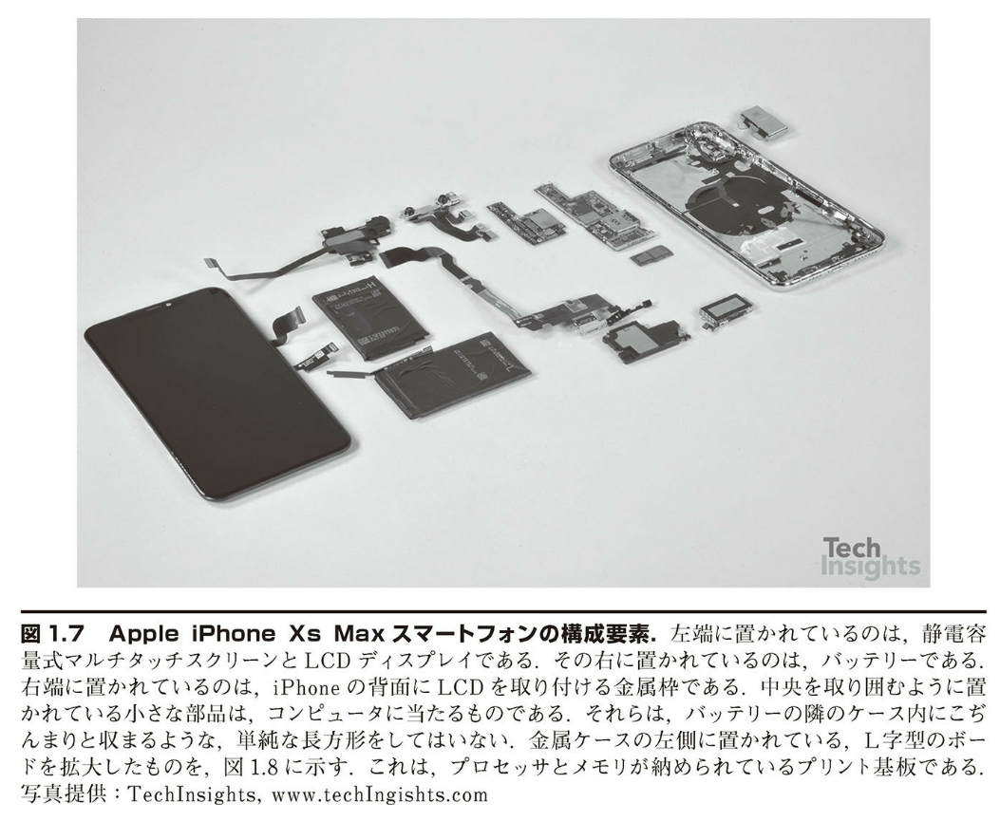
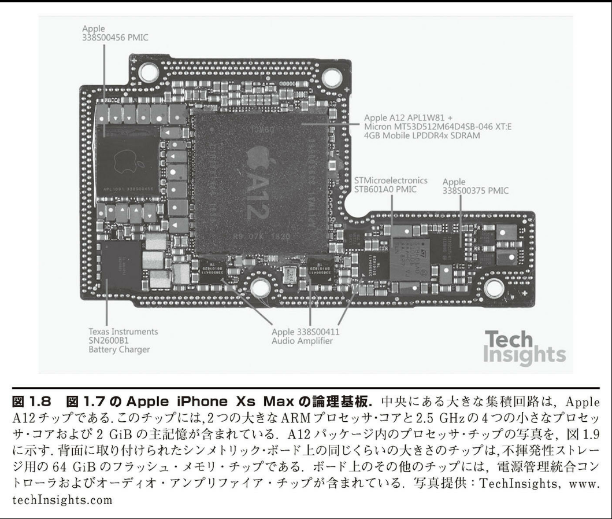
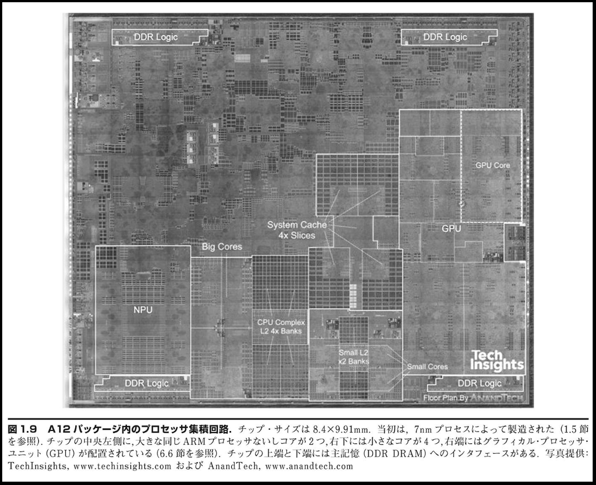

## 1.4 | コンピュータの内部

個々のプログラムの根底にあるソフトウェアという概念を知ったので、次にコンピュータの箱を開けてハードウェアの中身を見てみよう。いかなるコンピュータでも、根底にあるハードウェアは基本的に同じ機能を遂行する。それは、データの入力、データの出力、データの処理、データの記憶である。これらの機能をどのように実行するかが本書の中心的なテーマであり、以降の章はこれら 4 つの機能に関してそれぞれ異なる側面から説明するものと言える。

非常に重要なのでしっかり頭に刻み込んでほしい事項が出てきたとき、本書ではそれらを、「根本事項」と題して強調することとする。本書には根本事項が十数項目ある。その最初は、データの入力、出力、処理、記憶のタスクを遂行するコンピュータの 5 つの構成要素である。

コンピュータの主要な 2 つの構成要素は、マイクロフォンのような入力装置（input device）と、スピーカーのような出力装置（output device）である。名前から類推されるように、入力はコンピュータにデータを入力するものであり、出力は処理結果をユーザーに示すためのものである。装置によっては、入力と出力の両方の機能を果たすものがある。無線ネットワークがその例である。

入出力（I/O）装置については第 5 章と第 6 章で詳しく説明する。ここでは、ハードウェアの概要をざっと眺めてみよう。まず、外部入出力装置から始める。

### 【根本事項】

コンピュータの古典的な 5 つの構成要素は、入力、出力、記憶、データバス、制御である。データバスと制御を合わせてプロセッサと呼ぶこともある。コンピュータの標準的な構成を図 1.5 に示す。この構成は、どのようなハードウェア・テクノロジを採用するかに左右されない。現在および過去の、すべてのコンピュータのすべての要素は概念的にこれらの 5 つに分類できる。この点を常に読者の念頭に置いてもらうため、以降の各章の最初のページにコンピュータの 5 つの構成要素を図示し、該当の章で取り上げる部分を色で強調して示す。

### 画面の内側

最も人目を引く入出力はグラフィック・ディスプレイであろう。ほとんどすべてのパーソナル・モバイル・デバイスでは、液晶ディスプレイ（liquid crystal display: LCD）が使用されることが多い。ディスプレイ装置を薄くして、消費電力を下げるためである。LCD は光源ではなく、光の透過量を制御するだけである。通常、LCD には棒状の分子が含まれている。その分子が、背面から照射される光（場合によっては反射光）の偏光面をねじ曲げる働きをする。液晶に電圧をかけると、分子の配列が変わって、光をねじ曲げなくなる。偏光角が 90 度異なる 2 枚のスクリーンの間に液晶物質がはさまれているので、光はねじ曲げられないとその間を通過できない。今日、ほとんどの LCD ではアクティブ・マトリックス・ディスプレイ（active matrix display）技術が使用されている。このアクティブ・マトリックスには、電圧を精密に制御して画像を鮮明にするための小さなスイッチが、ピクセルごとに備えられている。CRT の場合と同様、各点に対応した赤・緑・青のマスクによって、最終画像における 3 原色の彩度が決まる。カラー・アクティブ・マトリックス LCD では、各点に 3 つのトランジスタ・スイッチが付いている。

画像は画素つまりピクセル（pixel）のマトリクスで構成される。これはビットのマトリクスとも見ることができ、ビットで描いた画像をビット・マップ（bit map）と呼ぶ。画面の大きさと解像度によって、表示画面のマトリクスのサイズは典型的なタブレットでは 1024×768 から 2048×1536 ピクセルに及ぶ。カラー・ディスプレイでは 3 原色（赤、緑、青）のそれぞれに 8 ビットを必要とする。つまり、1 ピクセル当たり 24 ビットを使用し、何千万色ものカラーを表示できる。

グラフィック・ディスプレイを支える主要ハードウェアは、ラスター・リフレッシュ・バッファ（raster refresh buffer）、または別名をフレーム・バッファ（frame buffer）と呼ぶ。画面上に表示される画像がフレーム・バッファ中にビット・マップの形式で格納される。そして、それがある一定のリフレッシュ・レートで読み出されて、画面に表示される。1 ピクセル当たり 4 ビットを用いたフレーム・バッファの例を図 1.6 に示す。

ビット・マップの目的は画面に表示する画像を忠実に表現することである。グラフィック・システムに対して要求が
高まる理由として、人の目が変化の検出に優れている点を挙げられる。たとえば、画面を更新した際、変更のあった部分となかった部分との間のごくわずかのずれを、人の目は検出できる。

### タッチスクリーン

> 「コンピュータのディスプレイを通して、私は航行中の航空母艦の甲板に戦闘機を着艦させたり、素粒子がポテンシャルの井戸に衝突するのを観察したり、ロケットに乗って光速に近い速さで飛行したりした。それは、コンピュータが内部で行っている処理を目に見える形にして眺めたということである。」
> Ivan Sutherland, コンピュータ・グラフィックスの父、
> Scientific American, 1984

PC では、キーボードやマウスと共に、LCD ディスプレイも使用されている。ところが、ポスト PC 時代のタブレットやスマートフォンでは、キーボードやマウスに代わって、タッチスクリーンが使用される。マウスを使う場合は、対象を間接的に指す。それに対して、タッチスクリーンのユーザー・インタフェースには、ユーザーが関心のある対象を直接ポイントするという、優れた利点がある。

タッチスクリーンを実現する方法はいろいろあるが、今日の多くのタブレットでは、静電容量方式が用いられている。人は電気的な導体であるので、ガラスのような絶縁体が透明な導体で覆われているスクリーンに人が触れると、静電界に歪みが生じ、その結果として静電容量が変化する。この技法では、同時に複数の箇所に触れることができる。それにより、魅力的なユーザー・インタフェースにつながりうる、ジェスチャー操作を可能としている。

### 筐体の中身

Apple iPhone Xs Max スマートフォンの内部を図 1.7 に示す。この装置の大部分は、コンピュータの古典的な 5 つの構成要素うちの入出力装置によって占められているが、それは驚くべきことではない。それらの入出力装置を列挙すると、静電容量式マルチタッチ LCD ディスプレイ、前向きカメラ、後向きカメラ、マイクロフォン、ヘッドフォン・ジャック、スピーカー、加速度計、ジャイロスコープ、Wi-Fi ネットワーク、Bluetooth ネットワークなどである。データバス、制御、およびメモリは、ほんの一部を占めるにすぎない。

図 1.8 中の小さな長方形には、先進技術を駆使したデバイスである集積回路（integrated circuit）、通称チップ（chip）が収容されている。図 1.8 の中央に見られる A12 パッケージには、クロック周波数が 2.5GHz の大きな ARM プロセッサと小さな ARM プロセッサが 2 つ収容されている。プロセッサ（processor）はプログラムの命令に忠実に従って動く部分であり、数値演算を行ったり、条件を判定したり、入出力に信号を送ったりする動作を行う。プロセッサのことを CPU と呼ぶこともある。CPU とはお役所的響きのある中央演算処理装置（central processor unit）の略である。

ハードウェアをさらに深く覗いてみよう。図 1.9 はマイクロプロセッサの内部を拡大したものである。プロセッサは大別して 2 つの要素で構成される。すなわち、データバス（datapath）と制御（control）である。前者は手足の役割を果たし、後者は神経系の役割を果たす。データバスは演算処理を行う。制御は、プログラムの命令に従って何を行うべきかを、データバスとメモリと入出力に指示する。第 4 章で、性能を高めるためのデータバスと制御について説明する。

図 1.8 中の iPhone Xs Max パッケージには、2 つのメモリ・チップも収容されている。各チップの容量は 32 ギビット、または 2GiB である。メモリ（memory）は、実行中のプログラムと、プログラムが必要とするデータを格納する場所である。メモリは DRAM チップで構成されている。DRAM はダイナミック RAM（dynamic random access memory：記憶保持動作の要る随時読み出し書き込み可能なメモリ）の略である。プログラムの命令とデータを収めるためには、いくつかの DRAM がまとめて使用される。磁気テープ装置のように順を追ってしか読み書きできない記憶装置とは対照的に、RAM ではどの部分を読み出すにもかかる時間は同じである。

ハードウェアの各要素を掘り下げて見ていくと、マシンの内部構造が見えてくる。プロセッサ内には、別のタイプのメモリであるキャッシュ・メモリもある。キャッシュ・メモリ（cache memory）は、DRAM にとってのバッファの働き

をする小さくて高速なメモリである（キャッシュの一般的な定義は、「物を隠しておく安全な場所」である）。キャッシュは、異なるメモリ技術であるスタティック RAM（static random access memory：SRAM）を使用して作られている。SRAM は高速だが集積密度が低いので、DRAM よりも高価である（第 5 章を参照）。SRAM と DRAM は記憶階層の 2 つの層である。

上で述べたように、設計を改善する主要なアイデアの 1 つは、抽象化である。最も重要な抽象化の 1 つは、ハードウェアと最低水準のソフトウェアとの間のインタフェースである。ソフトウェアは体系的言語を通してハードウェアと連絡を取る。そこで使われる言葉を命令と呼び、言語体系をコンピュータの命令セット・アーキテクチャ（instruction set architecture）または単にアーキテクチャ（architecture）と言う。命令セット・アーキテクチャには、2 進数の機械語を正しく動作させるためにプログラムが知っていなければならない事柄がすべて含まれる。通常、入出力処理の実行およびメモリの割り当てをはじめとする低水準のシステム機能は、オペレーティング・システムによってカプセル化される。したがって、アプリケーション・プログラマはそのような詳細について心配する必要はない。アプリケーション・プログラマに提供される、基本命令セットとオペレーティング・システム・インタフェースとの組み合わせを、アプリケーション・バイナリ・インタフェース（application binary interface: ABI）と呼ぶ。

命令セット・アーキテクチャのおかげで、コンピュータ設計者はコンピュータの機能をそれが実行されるハードウェアから独立して論ずることができる。たとえば、ディジタル時計の機能（時刻を刻む、時刻を表示する、アラームを設定するなど）を、時計のハードウェア（水晶発振器、LED ディスプレイ、プラスチック・ボタンなど）から独立して語ることができるのと同じである。コンピュータ設計者は、アーキテクチャとアーキテクチャの実装方式（implementation）とを区別する。アーキテクチャの実装方式とは、抽象化されたアーキテクチャに基づくハードウェアである。ここから次の根本事項が浮かび上がってくる。

---

### 【根本事項】

ハードウェアもソフトウェアも一連の階層から構成される。下位階層は上位階層から細目を隠す働きをする。この抽象化の原理を利用して、ハードウェア設計者もソフトウェア設計者もコンピュータ・システムの複雑さに対処する。抽象化されたさまざまな水準間のインタフェースの中で特に重要なものに、命令セット・アーキテクチャがある。これはハードウェアと最低水準のソフトウェアとの間のインタフェースである。この抽象化されたインタフェースのおかげで、コストおよび性能の異なるさまざまな実現方式のもとでも、同じソフトウェアの実行が可能になる。

---

### データの安全な格納場所

これまで、データの入力、データを用いての計算、データの表示について見てきた。ところが、コンピュータは電源が切れると、それまで処理したものがすべて失われてしまう。というのも、コンピュータ内部の記憶には揮発性メモリ（volatile memory）が使用されているからである。つまり、電気が切れると、記憶内容が失われてしまう。これに対し、DVD プレーヤは、電源を切っても録画されている映画は消えない、不揮発性メモリ（nonvolatile memory）技術を利用しているからである。

そこで、実行中のプログラムとデータの保持に使用する揮発性メモリと、実行していないプログラムとデータの保持用のメモリとを区別することとする。前者を主記憶（main memory）または 1 次記憶（primary memory）と呼び、後者を 2 次記憶（secondary memory）と呼ぶ。2 次記憶は記憶階層の次の下位層を形成する。1 次記憶としては、1975 年以来、ずっと DRAM が主流を占めている。一方、2 次記憶としては、もっと前から、ずっと磁気ディスク（magnetic disk）装置が主流となっている。サイズおよび形状の理由から、パーソナル・モバイル・デバイスでは不揮発性メモリの一種であるフラッシュ・メモリ（flash memory）がディスクに代わって使用されている。iPhone Xs Max の 64GiB のフラッシュ・メモリが収容されているチップを、図 1.8 に示す。フラッシュ・メモリは、DRAM よりも遅いが、不揮発性であることに加えて、DRAM よりもずっと安い。ビット当たりのコストはディスクよりも高いが、ディスクよりもはるかに小型で、壊れにくく、消費電力が少ない。したがって、PMD に関しては、フラッシュ・メモリが標準の 2 次記憶になっている。残念ながら、ディスクや DRAM と異なり、フラッシュ・メモリは多くの回数書き込みを行うと寿命を迎える。したがって、ファイル・システムは書き込み回数を記録しておき、メモリが寿命に達するのを避ける方策を講じておくとよい。たとえば、よく使用されるデータの格納場所を移動させる。第 5 章で、フラッシュ・メモリについてさらに詳しく説明する。

### 他のコンピュータとの通信

ここまで、入力、演算、表示、データの保存について説明してきた。しかし、今日のコンピュータの観点からすると、まだ抜けているものが 1 つある。それはコンピュータ・ネットワークである。図 1.5 に示したプロセッサが記憶装置や入出力に接続されているように、コンピュータはネットワークにより相互接続される。ネットワークで他のコンピュータと通信することを通じて、ユーザーはコンピュータの力を増幅できる。今日、ネットワークはコンピュータ・システムのバックボーンとなるまでに普及した。新しく製品化されるパーソナル・モバイル・デバイスまたはサーバーは、ネットワーク用インタフェースを最低限装備していなければ物笑いの種となるだろう。コンピュータをネットワークに接続すれば、下記の利点が得られる。

■ 通信：コンピュータ間で情報を高速に交換できる。

■ 資源の共有：個々のコンピュータがそれぞれ独自の入出力を備えるのではなく、ネットワークを通して複数のコンピュータで入力を共有できる。

■ リモート・アクセス：遠隔地のコンピュータ同士をつなぐことによって、ユーザーは自分のコンピュータのそばにいなくてもよくなる。

ネットワークの伝送路長と性能は千差万別である。通信のコストは、通信速度および伝送路長の増大につれて高くなる。おそらく最も知られたネットワークは Ethernet であろう。Ethernet は伝送路長が最大 1 キロメートルで、伝送速度は最大で毎秒 40G ビットである。伝送路長と速度の制約上、Ethernet は建物の同一フロアのコンピュータを接続するのに適する。という訳で、Ethernet はいわゆるローカル・エリア・ネットワーク（local area network）の代表格となっている。ローカル・エリア・ネットワークは、ルーティングやセキュリティの機能も備えたスイッチと相互接続される。ワイド・エリア・ネットワーク（wide area network）は、大陸間をまたがってインターネットのバックボーンを形成し、Web をサポートしている。媒体には、基本的には光ファイバが使用されている。通常、回線は電話会社から借り受けている。

この 40 年の間で、ネットワークの進歩によりコンピュータ利用形態が変わってきた。それには、ネットワークがあまねく普及したことと、ネットワークの性能が劇的に向上したことの、2 つの側面がある。1970 年代には、個人で電子メールにアクセスできる人はほとんどおらず、インターネットも Web も存在せず、2 地点間で大量のデータを受け渡す主たる方法は磁気テープを物理的に郵送することであった。ローカル・エリア・ネットワークはほとんど存在せず、わずかに存在したワイド・エリア・ネットワークの伝送容量は小さくてアクセスできる人も限られていた。

ネットワーク技術が改善されるにつれて、コストは大幅に安くなり、情報伝送の容量もはるかに増大した。たとえば、約 40 年前に開発された、標準化された最初のローカル・エリア・ネットワークは Ethernet の 1 バージョンであり、最大伝送容量（「バンド幅」とも言う）は毎秒 10M ビットであった。それが 100 台は無理にしても、数十台ものコンピュータで共有されているのが一般的だった。今日、ローカル・エリア・ネットワーク技術は毎秒 1 ～ 100G ビットの伝送容量を持つが、せいぜい数台程度のコンピュータで共有されるようになっている。光通信技術も同様の成長を遂げており、ワイド・エリア・ネットワークの伝送容量はキロビット単位からギガビット単位へと増大し、世界的なネットワークに接続されるコンピュータは数百台から数え切れないほどの台数へと増大している。以上のような劇的なネットワークの普及と伝送容量の増大により、過去 30 年間の情報革命においては、ネットワーク技術が中心的な役割を担うようになった。

ここ 15 年ほど、別の革新的なネットワーク技術により、コンピュータ間の通信方法が新たな展開を見せている。ワイヤレス技術が広く普及して、ポスト PC 時代を迎えたのである。ワイヤレスが爆発的に普及するようになった背景には、メモリなどの半導体に使われているのと同じ低コストの半導体技術（CMOS）を用いて、無線通信を行えるようになったことがある。現在利用可能なワイヤレス技術は、IEEE の標準では 802.11ac と呼ばれる。この技術を利用することにより、毎秒 1M ビットから 100M ビット近くまでのデータ伝送が可能になる。ワイヤレス技術は、たまたまその近くにいるすべてのユーザーが電波を共有するという点で、有線のネットワークとは大きく異なっている。

【自己診断】
■ 半導体の DRAM メモリとフラッシュ・メモリとディスク記憶装置は大きく異なっている。それぞれについて、揮発性、おおよその相対アクセス時間、DRAM と比較してのおおよその相対コストのそれぞれについて、列挙せよ。

【解答】

#### 1. DRAM メモリ

- 揮発性：揮発性（電源を切ると内容が消える）
- アクセス時間：基準となるため相対比較なし
- コスト：基準となるため相対比較なし

#### 2. フラッシュ・メモリ

- 揮発性：不揮発性（電源を切っても内容が保持される）
- アクセス時間：DRAM より遅い
- コスト：DRAM よりもずっと安い

#### 3. ディスク記憶装置（磁気ディスク）

- 揮発性：不揮発性（電源を切っても内容が保持される）
- アクセス時間：フラッシュ・メモリよりさらに遅い
- コスト：フラッシュ・メモリよりも安価（ビット当たりのコストはフラッシュ・メモリより低い）

なお、フラッシュ・メモリは、DRAM よりも遅いが磁気ディスクよりは速く、アクセス時間は約 5 ～ 50 マイクロ秒である点も補足として挙げられます。

---

入力装置（<<）
コンピュータに情報を与えるのに用いる装置。キーボードがその例である。

出力装置（<<）
計算処理の結果をユーザーまたは他のコンピュータに伝えるための装置。ディスプレイは前者の例である。

液晶ディスプレイ（LCD）（<<）
液晶ポリマーの薄い層を使用し、電圧をかける・かけないによって光を透過させたり遮断したりするディスプレイ技術。

アクティブ・マトリックス・ディスプレイ（<<）
個々のピクセルごとに、光の透過を制御するトランジスタを備えている液晶ディスプレイ。

ピクセル（<<）
画像の最小単位。画面はマトリックス状に構成された何十万ないし何百万ものピクセルによって構成される。

集積回路（<<）
チップ（chip）とも言う。数十個から数百万個のトランジスタを集積した電子素子。

中央演算処理装置（CPU）（<<）
「プロセッサ」とも言う。コンピュータの中核的な部分で、データバスと制御から構成され、数値演算、数値の条件判定、入出力装置の駆動などの処理を行う。

データバス（<<）
プロセッサの構成要素のうち、算術演算を実行する部分。

制御（<<）
プロセッサの構成要素の 1 つで、プログラムの命令に従って、データバスと主記憶と入出力装置を制御する。

メモリ（<<）
実行中のプログラムおよびそのプログラムが必要とするデータを保持する記憶領域。

ダイナミック RAM（DRAM）（<<）
不揮発性半導体メモリの一種。DRAM より安価で遅いが、磁気ディスクより高価で速い。アクセス時間は約 5 ～ 50 マイクロ秒であり、2020 年における G バイト当たりのコストは 0.06 ～ 0.12 ドルである。

ローカル・エリア・ネットワーク（LAN）（<<）
地理的に限定された区画内でデータを交換するように設計されたネットワーク。通常は 1 つの建物内に布設する。

ワイド・エリア・ネットワーク（<<）
数百キロメートルもの距離にまたがるネットワーク。大陸間を結ぶこともある。
