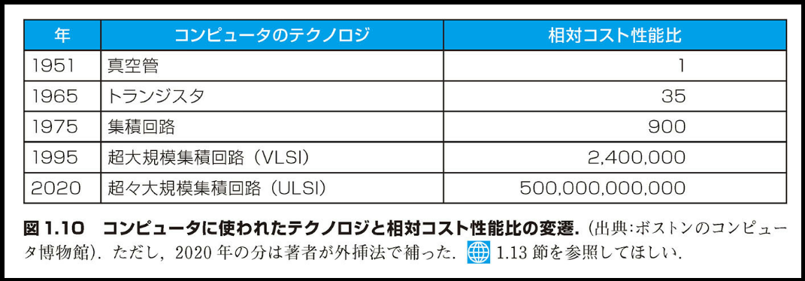
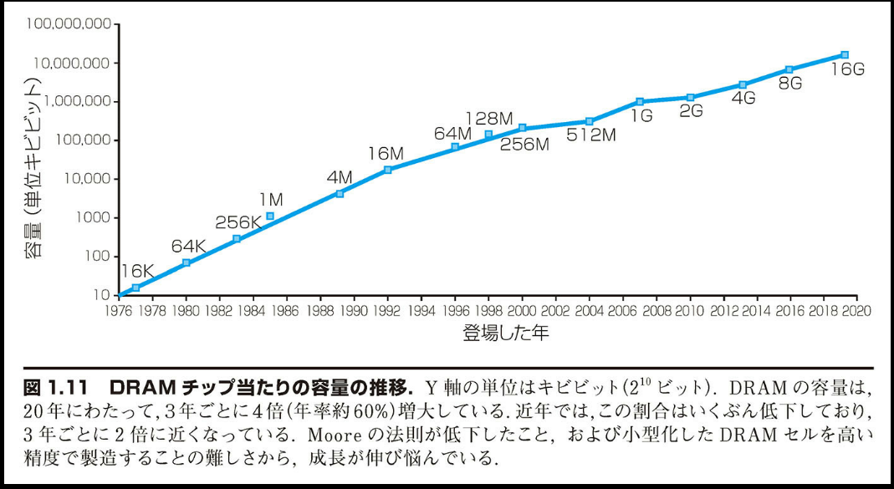
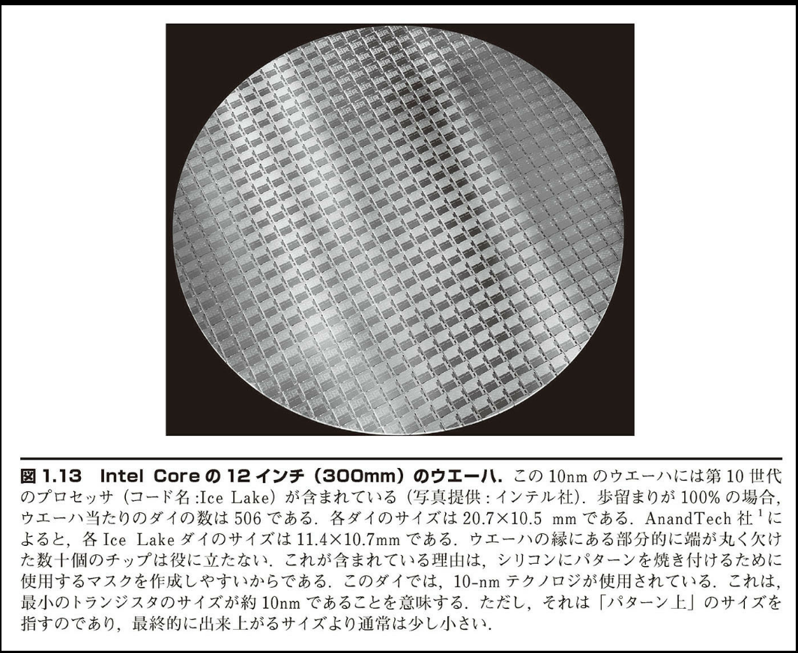

## 1.5 プロセッサおよびメモリを製造するための技術

プロセッサとメモリは信じられないほど急速に進歩した。その原動力となったのは、コンピュータ設計者が最新エレクトロニクス技術を応用して、開発競争にしのぎを削ったことである。コンピュータに適用された基本テクノロジの歴史的推移と、単位コスト当たりの相対性能の概算値を図 1.10 に示す。エレクトロニクス技術はコンピュータの能力と急速な進歩の礎なので、コンピュータにかかわる専門家はすべて集積回路の基礎を習得しておくべきである。



図 1.10 コンピュータに使われたテクノロジと相対コスト性能比の変遷.（出典：ボストンのコンピュータ博物館）。ただし、2020 年の分は著者が外挿法で補った。1.13 節を参照してほしい。

トランジスタ（transistor）は電気的なオン／オフ動作をするスイッチである。集積回路（integrated circuit）は数十から数百のトランジスタを 1 チップにまとめて接続したものである。容量が連続的に倍増することを Gordon Moore が予測したとき、チップ当たりのトランジスタの数の伸び率に着目した。その後、1 チップに載せられるトランジスタ数は、数百から数百万へと驚異的なまでに増大した。その事実を表すために、超大規模（very large scale）という形容句が集積回路という用語に付けられるようになった。超大規模集積回路（very large scale integrated circuit）を略して VLSI と言う。

この集積度の増大率は驚くほど一定である。図 1.11 は、1977 年以来の DRAM 容量の成長を示す。これで見ると、3 年ごとに容量が 4 倍に、規則正しく増えている。その結果、数十年間で 16,000 倍以上に増大した。図 1.11 はまた、Moore の法則が低下して、最近では容量が 4 倍増大するのに 6 年かかっていることをも示す。



それでは、集積回路の生産方法を順を追って見ていこう。チップの製造はシリコン（silicon）から始まる。これは砂の中に含まれている物質である。シリコンは電気を中程度にしか通さないので、半導体（semiconductor）と呼ばれる。特別な化学処理でシリコンにある種の物質を加えると、シリコン中の小さな領域に下記の 3 つの性質のいずれかを持たせることができる。

■ 電気をよく通す（銅線やアルミ線と同様）

■ 電気をよく絶縁する（プラスチック被覆やガラスと同様）

■ 特定の条件に応じて電気を通したり絶縁したりする（スイッチの役割をする）

トランジスタは最後の分類に属する。結局、VLSI は数十億もの導体と絶縁体とスイッチを組み合わせて単一の小さなパッケージに仕立てたものである。

集積回路の製造コストはチップのコストの重要な部分を占めるので、コンピュータの設計者にとって重要な意味を持つ。図 1.12 に集積回路の製造工程を示す。工程はシリコン結晶インゴット（silicon crystal ingot）から始まる。インゴットは巨大なソーセージのような形をしており、直径は 8 ～ 12 インチ、長さは約 12 ～ 24 インチある。インゴットを薄切りにして、厚さ 0.1 インチほどのウエーハ（wafer）にする。ウエーハに化学物質でパターンを形成し、一連の加工を施して先に説明したトランジスタと導体と絶縁体を作成する。今日の集積回路ではトランジスタは 1 層だけだが、絶縁層で仕切ることにより、2 ～ 8 層の金属導体の配線層を設けることが可能である。

ウエーハ自体の傷でも、または一連のパターン形成工程で微細な傷が生じても、ウエーハの傷を含む領域は不良品となる。そのような欠陥（defect）があるために、完全なウエーハを製造することは事実上不可能である。この不完全性に対処するための最も簡単な方法は、単一ウエーハ上に独立した構成要素を数多く配置することである。その後で、ウエーハを構成要素単位に切り出し（dice）して、個々のダイ（die）－略して俗に言うチップ（chip）に分ける。図 1.13 は、切り出し前のマルチプロセッサが載っているウエーハの写真である。前に示した図 1.9 は、マイクロプロセッサの個々のダイを示している。



このようにウエーハを小さく分割すれば、不幸にしてウエーハに傷があった場合も、全体ではなく傷のある部分のダイのみを破棄するだけで済む。このことを量的に表す値が歩留まり（yield）である。つまり歩留まりとは、ウエーハ上のダイの総数のうちの良品の割合である。

ダイのサイズが大きくなるにつれて、集積回路のコストは急激に上昇する。その理由は 2 つある。具体的には、歩留まりが下がること、ウエーハに載せられるダイの数が少なくなることである。コストを下げるためには、トランジスタと配線の両方の寸法を小さくした次世代プロセスを使用して、ダイの大きさを「縮める」ことが多い。それにより、歩留まりとウエーハ当たりのダイの数が向上する。2020 年において代表的であったのは、7 ナノメートル（nm）プロセスである。これは、基本的に、ダイ上の最小のトランジスタのサイズが 7nm であることを意味する。

良品のダイを選別して、パッケージの入出力ピンに接続する。この工程をボンディングと言う。この工程でも不良品が発生する可能性があるので、パッケージ化された部品が最終的にテストされる。テストに合格した良品が順次に出荷される。

これまでチップのコストについて述べてきたが、コストと価格の間には違いがある。企業は投資利益率を最大化するために、市場が受け入れる最高の価格を付ける。それで、研究開発（R&D）、マーケティング、営業、製造、機器の保守、建物の賃借、金融などのコスト、および税引き前利益や税金をカバーする。DRAM のように供給企業が何社もある普遍的なチップよりも、1 社のみから提供される比類のないチップの方が、利幅が大きくなりうる。需要と供給の比率に基づいて、価格は変動する。多くの企業にとって、需要よりも多くのチップを製造することは容易である。

補足：集積回路のコストは下記の 3 つの簡単な式で表すことができる。

```math
ダイ当たりのコスト = \frac{ウエーハ当たりのコスト}{ウエーハ当たりのダイの数 × 歩留まり}
```

```math
ウエーハ当たりのダイの数 \approx \frac{ウエーハの面積}{ダイの面積}
```

```math
歩留まり = \frac{1}{(1 + (単位面積の欠陥数 × ダイの面積/2))^2}
```

最初の式は簡単に導き出せる。2 番目の式は近似式である。ウエーハの周辺部の丸く欠けた、長方形のダイになりきれない面積を差し引いていないからである（図 1.13 を参照）。最後の式は、半導体工場における歩留まりの傾向に基づいた経験則である。式中の指数は、重要な処理工程の数に関係している。

これで分かるように、欠陥率およびダイとウエーハのサイズの影響を受けるため、コストは一般にダイの面積と直線的な比例関係は持たない。

### 【自己診断】

集積回路のコストを決める鍵となる要因は量産効果である。チップを大量に製造するとコストが下がる理由を説明しているのは、下記のどれか。

1. 大量生産するならば、製造プロセスの設計を特殊化できるので、歩留まりが向上する。

2. 大量に生産される部品を設計する仕事は、少量の部品を設計するよりも、負荷が軽い。

3. チップの製造に使用されるマスクは高価なので、量が増えればチップ当たりのコストが下がる。

4. 開発設計のコストは高く、生産量とはほとんど関係ない。したがって、部品の生産量が増えればダイ当たりの開発コストが下がる。

5. 大量生産する部品は、通常は少量しか生産しない部品よりも、ダイのサイズが小さい。したがって、ウエーハ当たりの歩留まりが高い。

【解答】

正解は 4 です。

理由：
開発設計のコストは固定費であり、生産量に関係なく一定のコストがかかります。この固定費を生産量で割ることで、1 個あたりの開発コストを計算します。そのため、生産量が増えれば増えるほど、1 個（ダイ）あたりの開発コストは下がることになります。

他の選択肢が不正解である理由：

- 1.歩留まりは製造プロセスの完成度に依存しますが、単純な生産量の増加が直接歩留まりの向上につながるわけではありません。

- 2.設計の負荷は生産量ではなく、製品の複雑さや要求される性能に依存します。

- 3.マスクのコストは確かに高価ですが、これは量産効果の主要因ではありません。

- 5.ダイのサイズは製品の機能要件によって決まり、生産量の多寡とは直接の関係がありません。

したがって、量産効果によるコスト低下を最も適切に説明しているのは、固定費である開発設計コストが生産量の増加に伴って 1 個あたりでは低下するという 4 番の説明となります。

---

＜用語説明＞

トランジスタ（<<）
電気的に制御されるオン／オフのスイッチ。

VLSI（超大規模集積回路）（<<）
数十万個から数百万個のトランジスタを集積した電子素子。

シリコン（<<）
半導体の性質を持つ自然界の物質。

半導体（<<）
電気をある程度しか通さない物質。

シリコン結晶インゴット（<<）
シリコン結晶でできた棒。直径が 8 ～ 12 インチ、長さが 12 ～ 24 インチ。

ウエーハ（<<）
シリコンのインゴットを輪切りにした、厚さ 2.5mm にも満たない薄い円板。チップを製造する材料として使用する。

欠陥（<<）
ウエーハ中に元々あったか、またはパターン形成工程で発生した微細な傷。欠陥はダイの不良品が発生する原因となる。

ダイ（<<）
ウエーハから切り出された個々の長方形の部分。俗に「チップ」で通っている。

歩留まり（<<）
ウエーハ上のダイの総数に対する良品のダイの割合。
