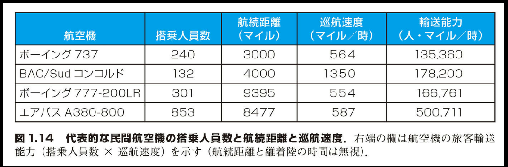
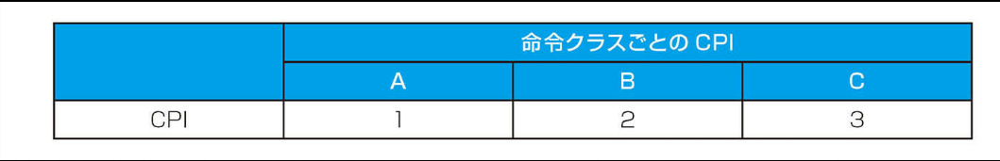
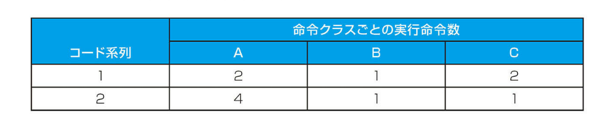
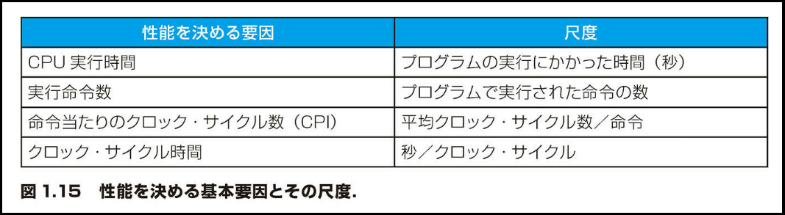
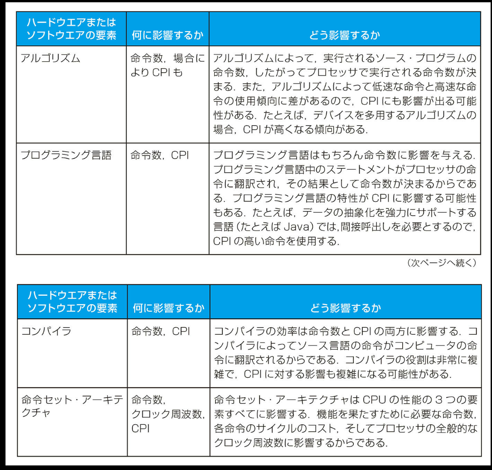

## 1.6 | 性能

コンピュータの性能評価は、非常に挑戦的な課題である。現代のソフトウェアは規模が大きく複雑になっている上に、ハードウェア設計者がさまざまな性能改善技法を採用しているため、性能評価が非常に難しくなっているからである。

数あるなかからコンピュータを選ぶ際には、性能が重要な関心事となる。コンピュータ各機種の性能の正確な測定と比較は、購入者ひいては設計者にとって、きわめて重要である。コンピュータの販売担当者はその点をよく心得ている。彼らは顧客に対して自分たちが販売するコンピュータのもっとも優れた面を強調するのが常である。そして、その面が顧客のアプリケーションのニーズに本当に適しているかどうかを、意に介していないことが多い。したがって、機種選定の際には、性能を測定する最善の方法やその限界を理解していることが重要である。

この節では、性能を判定する各種の方法について説明する。それから、コンピュータのユーザーと設計者の両者の観点から、性能の測定基準について説明する。また、各種の測定基準の関係を明らかにし、プロセッサの性能を表す古典的な公式を提示する。この式は本書全体を通じて使用する。

### 性能の定義

あるコンピュータが他のコンピュータよりも性能が優れていると言うとき、それは何を意味するのであろうか。これは簡単な質問のように思える。しかし、旅客機の性能を議論する場合と対比してみると、この問題がいかに微妙なものかが分かるだろう。図 1.14 に、代表的な民間航空機を、搭乗人員数と航続距離と巡航速度の各データとともに示す。

この表中のどの航空機が性能的に最も優れているかを知りたければ、最初に性能とは何かを定義する必要がある。性能の測定基準はいろいろある。巡航速度が最も速い旅客機を選ぶならば、コンコルド（2003 年にサービスが停止された）となる。航続距離が最も長いものを選ぶならば、ボーイング 777-200LR となる。搭乗人員数が最も多いものを選ぶならば、エアバス A380-800 ということになる。

### 図 1.14 代表的な民間航空機の搭乗人員数と航続距離と巡航速度。

右端の欄は航空機の旅客輸送能力（搭乗人員数 × 巡航速度）を示す（航続距離と離着陸の時間は無視）。

[表の内容]
航空機 | 搭乗人員数 | 航続距離(マイル) | 巡航速度(マイル/時) | 輸送能力(人・マイル/時)
---|---|---|---|---
ボーイング 737 | 240 | 3000 | 564 | 135,360
BAC/Sud コンコルド | 132 | 4000 | 1350 | 178,200
ボーイング 777-200LR | 301 | 9395 | 554 | 166,761
エアバス A380-800 | 853 | 8477 | 587 | 500,711



では、速度を基準に性能を定義することとしよう。それでも、2 通りの定義が考えられる。まず、巡航速度が最高の旅客機、つまり 1 人の旅客を最短時間で運べるものが最速、という定義が可能である。一方、500 人の旅客を最短時間で運びたいのならば、右端の欄から明らかなように、最も性能が優れている機種はエアバス A380-800 となる。コンピュータの性能も同様に、いくつかの違った形で定義できる。

2 台の別々のデスクトップ・コンピュータ上で同じプログラムを実行する場合は、先にジョブを終えたデスクトップ・コンピュータの方が速いと言うだろう。しかし、大勢のユーザーからジョブが投入されるタイムシェアリング方式の大型コンピュータを稼働させているコンピュータ・センターでは、すべてのジョブを先に終わらせたコンピュータの方が速いと言うだろう。個人のコンピュータ・ユーザーは応答時間（response time）の短さに関心がある。応答時間とは、作業を開始してから終了するまでの時間であり、実行時間（execution time）とも言う。コンピュータ・センターの管理者はスループット（throughput）またはバンド幅（bandwidth）を増やすことに関心がある。このスループットとは、一定時間内に終了した作業の総量である。以上から分かるように、応答時間の方が重視されるパーソナル・モバイル・デバイスと、スループットの方が重視されるサーバーの性能を比較しようとすれば、ほとんどの場合、異なるアプリケーション群と異なる性能の尺度が必要となる。

---

### スループットと応答時間

#### 【例 題】

コンピュータ・システムに下記の変更を加えた場合、スループットが増大するか、応答時間が短縮されるか、あるいはその両方の効果が得られるか。

1. コンピュータのプロセッサを高速なものに取り替える。
2. 複数プロセッサを使用してタスクを分担しているシステム（たとえば、Web の検索システム）に、プロセッサを追加する。

#### 【解 答】

応答時間の短縮は、ほとんどの場合スループットの改善につながる。したがって、上記のケース 1 では応答時間とスループットの両方が改善される。ケース 2 では、個々のタスクが速く終わるわけではない。したがって、スループットだけが増大する。しかし、ケース 2 で処理能力よりも仕事量の方が多かった場合、あふれた仕事は待ち行列に入れられる。その場合、スループットの増大が応答時間の短縮につながることがある。待ち行列中で待つ時間が短縮されるからである。このように、実際のコンピュータ・システムにおいては、応答時間またはスループットのどちらかを変えると両方に影響が及ぶことが多い。

---

コンピュータの性能を検討するにあたって、本書では最初の数章において、主として応答時間に目を向ける。性能を最大化するには、タスクの応答時間つまり実行時間を最短化する必要がある。したがって、あるコンピュータ X に関して、性能と実行時間の間に下記の関係が成り立つ。

```math
性能_X = \frac{1}{実行時間_X}
```

つまり、コンピュータ X とコンピュータ Y があって、X の方が Y よりも性能が高いと言う場合、下記式が成り立つことを意味する。

```math
性能_X > 性能_Y
```

```math
\frac{1}{実行時間_X} > \frac{1}{実行時間_Y}
```

```math
実行時間_Y > 実行時間_X
```

すなわち、X が Y よりも速ければ、実行時間は Y の方が X よりも長い。

コンピュータの設計を議論する際、2 つの異なるコンピュータの性能を定量的に関連づけたいことがよくある。そこで、「X は Y よりも n 倍速い」と言うとき、下記の式が成り立つことを意味するものとする。

```math
\frac{性能_X}{性能_Y} = n
```

X が Y よりも n 倍速ければ、実行時間は Y の方が X よりも n 倍長い。

```math
\frac{性能_X}{性能_Y} = \frac{実行時間_Y}{実行時間_X} = n
```

### 相対性能

【例 題】
同じプログラムを実行するのにかかる時間が、コンピュータ A では 10 秒、コンピュータ B では 15 秒とする。A は B よりもどれだけ速いか。

【解 答】
A が B よりも n 倍速いというとき、下記の関係が成り立つ。

```math
\frac{性能_A}{性能_B} = \frac{実行時間_B}{実行時間_A} = n
```

したがって、性能の比率は下記のようになる。

```math
\frac{15}{10} = 1.5
```

よって、A は B よりも 1.5 倍速い。

上の例題において、コンピュータ B はコンピュータ A よりも 1.5 倍遅いと言うこともできる。なぜならば、

```math
\frac{性能_A}{性能_B} = 1.5
```

は下記をも意味するからである。

```math
\frac{性能_A}{1.5} = 性能_B
```

単純化のため、コンピュータの性能を定量的に比較するときは、通常は「より速い」という表現を用いることにする。

性能と実行時間は逆数の関係にあるので、性能を増大させるためには、実行時間を減少させる必要がある。「増大させる」および「減少させる」という表現の混同を避けるために、本書では通常「性能を増大させる」および「実行時間を減少させる」という意味で、「性能を改善する」または「実行時間を改善する」という言い方をする。

### 性能の測定

コンピュータの性能を測る手段は時間である。同じ量の仕事をこなす場合、実行時間が最も短いコンピュータが最も速い。プログラムの実行時間（execution time）はプログラム当たりの秒数で測定する。しかし、時間の測り方といっても、何を対象とするかによって方法がいろいろある。最も単純な時間の定義は、応答時間（response time）または経過時間（elapsed time）である。これはタスクの完了に要した合計時間であり、ディスク・アクセス、メモリ・アクセス、入出力（I/O）動作、オペレーティング・システムのオーバヘッド（間接作業）などのすべてを含む。

しかしコンピュータは、タイムシェアリング方式で動作し、プロセッサが同時に複数のプログラムを処理するケースが多い。その場合、システムは 1 つのプログラムの経過時間の最短化よりも、スループットの最適化に重点が置かれる。したがって、経過時間と、プロセッサが実際に処理に費やした時間とを区別したい。そこで、CPU 実行時間（CPU execution time）ないし単に CPU 時間（CPU time）という概念を導入する。これは該当プログラムのために CPU が費やした時間であり、入出力待ち時間や他のプログラムを実行させるための時間を含まない（ユーザーが知覚する応答時間はプログラムの経過時間であって CPU 時間ではないことに注意）。CPU 時間はさらに 2 つに分けられる。1 つはプログラム中で費やされた CPU 時間であり、ユーザー CPU 時間（user CPU time）と呼ぶ。もう 1 つはプログラムに代わってオペレーティング・システムがタスクを遂行するために費やした CPU 時間であり、システム CPU 時間（system CPU time）と呼ぶ。システム CPU 時間とユーザー CPU 時間の正確な区別は難しい。なぜならば、オペレーティング・システムの動作を、個々のどのプログラムのためのものと割り振ることは、一般には難しいからである。また、種々のオペレーティング・システムに機能の違いがあることも理由である。

本書では経過時間に基づく性能と CPU 実行時間に基づく性能とを一貫して区別する。他に負荷の掛かっていないシステム上での経過時間を指してシステム性能（system performance）という用語を使用し、ユーザー CPU 時間を指して CPU 性能（CPU performance）という用語を使用する。この節では、CPU 性能を集中的に取り上げる。しかし、性能のまとめ方の議論は経過時間と CPU 時間のどちらを用いて測定した場合にも同じように適用できる。

---

#### 【プログラム性能の理解】

アプリケーションが異なれば、コンピュータ・システムの性能の各要因に対する影響力も異なる。サーバー上で稼働するものは特にそうだが、多くのアプリケーションは入出力の性能に大きく左右される。そして入出力の性能は、ハードウェアとソフトウェアの両方の影響を受ける。このため、時計で計測した合計経過時間が、関心を持つべき性能の尺度になる。アプリケーション環境によっては、スループット、応答時間、またはその 2 つの複雑な組み合わせ（たとえば、最高スループットと最悪の場合の応答時間）にユーザーの関心は向かう。プログラムの性能を改善するためには、まず問題となる性能の尺度を明確に定義し、それからプログラムを実行して計測することにより、性能上のボトルネックを探る。次章以降、システムの各部ごとのボトルネックを探し出して、性能を改善するための方法を説明する。

---

コンピュータ・ユーザーとして、我々は時間に関心がある。しかし、コンピュータ性能を詳細に検討するときは、別の測定基準を使用する方が便利である。特に、コンピュータ設計者は、ハードウェアが基本機能をどれだけ高速に実行できるかを表す測定基準を用いたがる。コンピュータはほとんどすべて、クロックに基づいて動作を行う。クロックはハードウェア内で事象を起こすタイミングを決定する。その時間間隔をクロック・サイクル時間（clock cycle time）と呼ぶ（クロック、クロック・サイクル、クロック時間、クロック周期、サイクル・タイムと呼ぶこともある）。コンピュータの設計者はクロック周期（clock period）の長さを表すのに、クロック・サイクル時間（たとえば、250 ピコセカンドまたは 250ps）を使用することもあれば、クロック周波数（clock rate）（たとえば、4 ギガヘルツまたは 4GHz）を使用することもある。後者は前者の逆数である。次節において、ハードウェアの設計者が使うクロック・サイクルとコンピュータのユーザーが使う秒との関係を公式化する。

#### 【自己診断】

1. パーソナル・モバイル・デバイスとクラウドを両方使用するアプリケーションが、ネットワークの性能に制約されることはわかっているものとする。下記記す変更は、スループットの改善だけに影響するか、応答時間とスループットの両方の改善に影響するか、あるいはどちらの改善にも役立たないか。

   a. PMD とクラウドの間のネットワーク・チャネルを追加して、全体的なネットワーク・スループットを高めるとともに、ネットワークにアクセスできるまでの遅延を短縮する（チャネルが 2 本に増えたため）。

   b. ネットワーク・ソフトウェアを改善する。それにより、ネットワーク通信の遅延を短縮できるが、スループットは向上しない。

   c. コンピュータのメモリを増設する。

2. コンピュータ C はコンピュータ B よりも性能が 4 倍優れている。コンピュータ B があるアプリケーションを実行するのに 28 秒かかるとする。そのアプリケーションをコンピュータ C で実行するのに要する時間はどれだけか。

#### 【解答】

1. ネットワークの変更による影響の分析：

   a. ネットワーク・チャネルの追加：

   - 応答時間とスループットの両方が改善される
   - 理由：チャネルが 2 本になることで、全体的なネットワーク・スループットが向上し、同時にアクセス待ち時間（遅延）も短縮されるため

   b. ネットワーク・ソフトウェアの改善：

   - 応答時間のみが改善される
   - 理由：通信の遅延は短縮されるが、スループットは向上しないと明示されているため

   c. メモリの増設：

   - どちらの改善にも役立たない
   - 理由：アプリケーションはネットワークの性能に制約されていることが前提条件として示されており、メモリの増設はネットワークのボトルネックを解消しないため

2. コンピュータ C の実行時間の計算：

```math
\frac{性能_C}{性能_B} = 4 = \frac{実行時間_B}{実行時間_C}
```

したがって：

```math
実行時間_C = \frac{実行時間_B}{4} = \frac{28}{4} = 7
```

コンピュータ C での実行時間は 7 秒である。

### CPU 性能とその要因

性能を検討する際に使用する測定基準はユーザーと設計者とでは異なっていることが多い。その別々の測定基準同士の関連を把握できれば、性能に関する設計変更がユーザーの目に見える形でどのように現われるかを示すことができる。この時点では CPU 性能に議論を限定しているので、最終的な性能測定基準は CPU 実行時間である。そこで、最も基本的な測定基準（クロック・サイクル数とクロック・サイクル時間）を CPU 時間と関係付ける公式を下に示す。

```math
あるプログラムの
CPU実行時間 = そのプログラムの
CPUクロック・サイクル数 × クロック・サイクル時間
```

クロック・サイクル時間はクロック周波数の逆数なので、上式は下記のように書き表すこともできる。

```math
あるプログラムの
CPU実行時間 = \frac{そのプログラムのCPUクロック・サイクル数}{クロック周波数}
```

この公式から明らかに読み取れるのは、ハードウェア設計者が性能を向上させるには、クロック・サイクル長を短縮するか、プログラムが必要とするクロック・サイクル数を減らせばよいという点である。後の章でも述べるが、プログラムが必要とするクロック・サイクル数と各クロック・サイクル長に関して、設計者は二律背反的な選択に追られることがよくある。クロック・サイクル数を減らす方向の技法は、クロック・サイクル時間を延ばすように作用することが多いのである。

### 性能の改善

【例 題】
クロック周波数が 2GHz のコンピュータ A 上で 10 秒で実行できるプログラムがある。このプログラムを 6 秒で実行できるコンピュータ B を開発したい。新しいコンピュータの設計者はクロック周波数を上げることはできるが、そうすると CPU 設計の別の面に影響が出る。そのプログラムに関しては、コンピュータ A 上で実行するのに比べて、コンピュータ B では 1.2 倍のクロック・サイクル数が必要になるという。クロック周波数をどこまで上げればよいか。

【解 答】
まず、コンピュータ A 上でそのプログラムが必要とするクロック・サイクル数を把握しよう。

```math
CPU時間_A = \frac{CPUクロック・サイクル数_A}{クロック周波数_A}
```

```math
10秒 = \frac{CPUクロック・サイクル数_A}{2 × 10^9 サイクル/秒}
```

```math
CPUクロック・サイクル数_A = 10秒 × 2 × 10^9 サイクル/秒
```

```math
= 20 × 10^9 サイクル
```

コンピュータ B のクロック周波数は下記の方程式で算出することができる。

```math
CPU時間_B = \frac{1.2 × CPUクロック・サイクル数_A}{クロック周波数_B}
```

```math
6秒 = \frac{1.2 × 20 × 10^9 サイクル}{クロック周波数_B}
```

```math
クロック周波数_B = \frac{1.2 × 20 × 10^9 サイクル}{6秒}
```

```math
= 4 × 10^9 サイクル/秒 = 4GHz
```

よって、コンピュータ B 上でそのプログラムを 6 秒で実行するには、クロック周波数をコンピュータ A の 2 倍に上げなければならない。

### 命令の性能

上の例題の方程式では、プログラムに必要な命令数については触れられていない。しかし、コンパイラは実行すべき命令を生成し、コンピュータは命令実行を通してプログラムを動かすのであるから、実行時間はプログラム中の命令の数に依存するはずである。プログラムの実行時間を算出する 1 つの方法は、その時間が、実行された命令数に 1 命令当たりの平均実行時間を掛けたものに等しいと考えることである。そうすると、プログラムに必要なクロック・サイクル数は次の式で表すことができる。

```math
CPUクロック・サイクル数 = プログラムの実行命令数 × 命令当たりの平均クロック・サイクル数
```

命令当たりの平均クロック・サイクル数（clock cycles per instruction）は各命令を実行するのに必要なクロック・サイクル数の平均である。これを略して CPI とも言う。命令が異なれば、その実行に要する時間も異なるので、CPI はプログラム中の実行されたすべての命令の平均値である。同じ命令セット・アーキテクチャをとりながら実現方式の異なるコンピュータを比較するうえで、CPI は 1 つの手掛かりとなる。当然ながら、プログラムの実行命令数は同じだからである。

---

### 性能方程式の使用

#### 【例 題】

同じ命令セット・アーキテクチャを実現した 2 種類のコンピュータがあるとする。コンピュータ A はクロック・サイクル時間が 250ps で、あるプログラムでの CPI が 2.0 であるとする。コンピュータ B はクロック・サイクル時間が 500ps で、同じプログラムでの CPI が 1.2 であるとする。このプログラムに関しては、どちらのプログラムがどのくらい速いか。

#### 【解 答】

このプログラムに関して、どちらのプログラムも同じ数の命令を実行する。その数を I とする。それに基づいて、各コンピュータで要するクロック・サイクル数を次式により算出する。

```math
CPUクロック・サイクル数_A = I × 2.0
```

```math
CPUクロック・サイクル数_B = I × 1.2
```

その結果に基づき、CPU 時間を算出できる。

```math
CPU時間_A = CPUクロック・サイクル数_A × クロック・サイクル時間_A
         = I × 2.0 × 250ps = 500 × Ips
```

同様にして、

```math
CPU時間_B = I × 1.2 × 500ps = 600 × Ips
```

よって、コンピュータ A の方が速い。速さの違いの度合いは実行時間の比を取ることによって算出される。

```math
\frac{CPU性能_A}{CPU性能_B} = \frac{実行時間_B}{実行時間_A} = \frac{600 × Ips}{500 × Ips} = 1.2
```

以上から、このプログラムに関しては、コンピュータ A がコンピュータ B よりも 1.2 倍速いと言うことができる。

### 古典的な CPU 性能方程式

このことから、性能に関する公式を実行命令数（プログラムによって実行される命令の数）と CPI とクロック・サイクル時間によって、下記のように表すことができる。

```math
CPU時間 = 実行命令数 × CPI × クロック・サイクル時間
```

または、クロック周波数はクロック・サイクル時間の逆数なので、下記のように表せる。

```math
CPU時間 = \frac{実行命令数 × CPI}{クロック周波数}
```

この公式は非常に有用である。この式では、性能に影響を及ぼす 3 つの主要な要因が分離されているからである。異なる実現方式や設計上の選択肢を評価する際、それらがこの 3 つの項目にどんな影響を与えるかがわかれば、上記の公式を使用して比較検討ができる。

---

### コード系列の比較

#### 【例 題】

コンパイラ設計者が、あるコンピュータ用にコンパイラが生成するコード系列を 2 通り検討している。ハードウェア設計者からは下記のデータが提供されている



検討中の高水準言語に関して、コンパイラの設計者が考えている 2 つのコード系列における、命令クラス別の実行
命令数は下記のとおりである.



どちらのコード系列の方が実行される命令数が多いか、どちらのコード系列の方が実行速度が速いか。それぞれの CPI はいくつか。

#### 【解 答】

コード系列 1 では、2 + 1 + 2 = 5 つの命令が実行される。系列 2 では、4 + 1 + 1 = 6 つの命令が実行される。したがって、コード系列 1 の方が実行される命令数が少ない。

実行命令数と CPI に基づき、下記の式を使用して、各コード系列のクロック・サイクル数を得ることができる。

```math
CPUクロック・サイクル数 = \sum_{i=1}^{n} (CPI_i × C_i)
```

その結果は下記のようになる。

```math
CPUクロック・サイクル数_1 = (2 × 1) + (1 × 2) + (2 × 3) = 10サイクル
```

```math
CPUクロック・サイクル数_2 = (4 × 1) + (1 × 2) + (1 × 3) = 9サイクル
```

したがって、コード系列 2 の方が、実行する命令数が 1 つ多いにもかかわらず、実行速度が速い。コード系列 2 で、実行命令数が多いのに全体のクロック・サイクル数が少ないということは、CPI が小さいことに他ならない。CPI は下記の式によって算出される。

```math
CPI = \frac{CPUクロック・サイクル数}{実行命令数}
```

```math
CPI_1 = \frac{CPUクロック・サイクル数_1}{実行命令数_1} = \frac{10}{5} = 2
```

```math
CPI_2 = \frac{CPUクロック・サイクル数_2}{実行命令数_2} = \frac{9}{6} = 1.5
```

---

#### 【根本事項】

コンピュータの性能に関する基本的な測定要素とその尺度を図 1.15 に示す。それらの要素から、下記の式によって、プログラムの実行時間（単位：秒）を求めることができる。

```math
実行時間 = \frac{秒}{プログラム} = \frac{実行命令数}{プログラム} × \frac{クロック・サイクル数}{命令} × \frac{秒}{クロック・サイクル}
```

コンピュータの性能を表す完全かつ信頼性のある唯一の尺度は時間であることを常に念頭に置いておいてほしい。たとえば、命令セットを変更して実行命令数を少なくするようにすると、クロック・サイクル時間を長くするかまたは CPI を増やすようにコンピュータ構成を変更せざるをえなくなり、結果として実行命令数の削減による時間短縮が相殺されてしまうことがある。また、CPI は実行された命令ミックスのタイプに左右されるので、実行される命令数が一番少ないプログラムの実行速度が一番速いとは限らない。



| 性能を決める要因                        | 尺度                                 |
| --------------------------------------- | ------------------------------------ |
| CPU 実行時間                            | プログラムの実行にかかった時間（秒） |
| 実行命令数                              | プログラムで実行された命令の数       |
| 命令当たりのクロック・サイクル数（CPI） | 平均クロック・サイクル数/命令        |
| クロック・サイクル時間                  | 秒/クロック・サイクル                |

それでは、どうしたらこれらの 3 つの項目の値を知ることができるだろうか。CPU 実行時間はプログラムを動かしてみれば分かるし、クロック・サイクル時間はコンピュータの性能諸元として発表されているのが普通である。しかし、実行命令数と CPI の値の入手は難しい。もちろん、クロック周波数と CPU 実行時間が分かれば、実行命令数と CPI は一方から他方を計算で算出できる。

実行命令数の測定には、プログラムの実行状況を分析集計するソフトウェア・ツールまたはアーキテクチャのシミュレータを使用する。あるいは、ハードウェアのカウンタを使用する方法もある。プロセッサの中には、実行命令数、平均 CPI、性能低下の要因などといった種々の計数値を記録するために、カウンタを備えているものが多い。実行命令数がアーキテクチャに依存するといっても、アーキテクチャの実現方式には依存しないので、実現方式を詳細に知らなくとも、実行命令数は測定できる。一方、CPI はコンピュータ設計上の細かな要因に広範に依存する。その要因は、メモリ・システムやプロセッサの構造（第 4 章と第 5 章で検討する）、さらにはアプリケーション中で実行される命令クラス別の出現頻度（命令ミックス）にまで及ぶ。という訳で、CPI は同じ命令セットに基づく別の実現方式のコンピュータの間でも異なるし、アプリケーションによっても異なる。

上の例題は、1 つの要素（実行命令数）のみを用いた性能評価の危険性を示している。何機種かのコンピュータを比較するときは、実行時間を決定する 3 つの要因をすべて考慮に入れなければならない。上の例題のクロック周波数のように、値の同じ要因がある場合、値が異なる要因のみの比較で性能を判定できる。ただし、CPI は命令ミックス（instruction mix）によって異なるので、クロック周波数が同じ場合でも、実行命令数と CPI の両方を比較しなければならない。この点をさらに詳しく検討するために、演習問題の中には、コンピュータおよびコンパイラの拡張によりクロック周波数と CPI と実行命令数に影響が出るケースを評価する設問がある。図 1.13 節では、広く利用されているがすべての要因を考慮に入れていないため、誤解を招きかねない性能尺度について説明する。

---

#### 【プログラム性能の理解】

プログラムの性能はアルゴリズム、言語、コンパイラ、アーキテクチャ、そして実際のハードウェアに左右される。これらの要素が CPU 性能を表す式の各要素にどう影響するかを、下の表に要約して示す。



| ハードウェアまたはソフトウェアの要素 | 何に影響するか              | どう影響するか                                                                                                                                                                                                                                                                                                                                   |
| ------------------------------------ | --------------------------- | ------------------------------------------------------------------------------------------------------------------------------------------------------------------------------------------------------------------------------------------------------------------------------------------------------------------------------------------------ |
| アルゴリズム                         | 命令数、場合により CPI も   | アルゴリズムによって、実行されるソース・プログラムの命令数、したがってプロセッサで実行される命令数が決まる。また、アルゴリズムによって低速な命令と高速な命令の使用傾向に差があるので、CPI にも影響が出る可能性がある。たとえば、デバイスを多用するアルゴリズムの場合、CPI が高くなる傾向がある。                                                 |
| プログラミング言語                   | 命令数、CPI                 | プログラミング言語はもちろん命令数に影響を与える。プログラミング言語中のステートメントがプロセッサの命令に翻訳され、その結果として命令数が決まるからである。プログラミング言語の特性が CPI に影響する可能性もある。たとえば、データの抽象化を強力にサポートする言語（たとえば Java）では、間接呼出しを必要とするので、CPI の高い命令を使用する。 |
| コンパイラ                           | 命令数、CPI                 | コンパイラの効率は命令数と CPI の両方に影響する。コンパイラによってソース言語の命令がコンピュータの命令に翻訳されるからである。コンパイラの役割は非常に複雑で、CPI に対する影響も複雑になる可能性がある。                                                                                                                                        |
| 命令セット・アーキテクチャ           | 命令数、クロック周波数、CPI | 命令セット・アーキテクチャは CPU の性能の 3 つの要素すべてに影響する。機能を果たすために必要な命令数、各命令のサイクルのコスト、そしてプロセッサの全般的なクロック周波数に影響するからである。                                                                                                                                                   |

補足：第 4 章で論ずるが、CPI の最小値は 1.0 であると読者は思っているかもしれない。しかし、プロセッサの中には、1 クロック・サイクル当たりに複数の命令をフェッチして実行するものがある。そのような方式に対応するため、CPI の逆数をとった、クロック・サイクル当たりの命令数（IPC）という尺度が考案された。プロセッサがクロック・サイクル当たり平均して 2 つの命令を実行するならば、その IPC は 2 であり、したがって CPI は 0.5 となる。

補足：従来クロック・サイクルは固定的であった。ところが、エネルギーを節約したり、一時的に性能を増進させたりするために、今日のプロセッサの中にはクロック周波数を変えられるものがある。したがって、プログラムに関して、平均クロック周波数を使用する必要がある。たとえば、Intel Core i7 では、チップが過熱するまで、クロック周波数を 10%ほど高めることができる。インテル社では、これをターボ・モードと呼んでいる。

【自己診断】

あるデスクトップ・プロセッサ上で、Java で組まれたあるアプリケーションが 15 秒で実行されている。新しい Java コンパイラがリリースされて、必要な命令数は前のコンパイラの 0.6 倍で済むようになったが、CPI は逆に 1.1 倍に増加した。この新しいコンパイラを使用した場合、このアプリケーションはどれだけ高速になると期待されるか。

```math
a. \frac{15 × 0.6}{1.1} = 8.2秒
```

```math
b. 15 × 0.6 × 1.1 = 9.9秒
```

```math
c. \frac{15 × 1.1}{0.6} = 27.5秒
```

(解答)

この問題を段階的に解いていきましょう。

1. まず、実行時間の計算式を確認します：

   - 実行時間 = 命令数 × CPI × クロック・サイクル時間

2. 変化する要素を整理します：

   - 命令数：元の命令数 × 0.6（40%減少）
   - CPI：元の CPI × 1.1（10%増加）
   - クロック・サイクル時間：変化なし

3. 新しい実行時間の計算：
   - 新実行時間 = (元の命令数 × 0.6) × (元の CPI × 1.1) × クロック・サイクル時間
   - = 元の実行時間 × 0.6 × 1.1
   - = 15 秒 × 0.6 × 1.1
   - = 9.9 秒

したがって、正解は b. 15 × 0.6 × 1.1 = 9.9 秒 です。

理由：

- 命令数が 0.6 倍になったことで実行時間は短縮されますが、
- CPI が 1.1 倍になったことで一部相殺され、
- 最終的には元の実行時間の 66%（0.6 × 1.1 = 0.66）となり、9.9 秒になります。

---

応答時間（<<）
「実行時間」ともいう。コンピュータがタスクを完了させるのに必要な合計時間。ディスク・アクセス、メモリ・アクセス、入出力動作、オペレーティング・システムのオーバヘッド、CPU 実行時間などを含む。

スループット（<<）
「バンド幅」ともいう。もう 1 つの性能測定指標。単位時間当たりに終了した作業の量を表す。

CPU 実行時間（<<）
「CPU 時間」ともいう。あるタスクの実行で CPU が費やした実際の時間。

ユーザー CPU 時間（<<）
プログラム自身が費やす CPU 時間。

システム CPU 時間（<<）
プログラムに代わって、オペレーティング・システムがタスクを遂行するために CPU が費やした時間。

クロック・サイクル時間（<<）
「クロック」、「クロック周期」、「サイクル」ともいう。1 クロック期間の占める時間。通常は一定間隔で刻まれるプロセッサのクロックに対する用語。

クロック周期（<<）
各クロック・サイクルの長さ。

命令当たりの平均クロック・サイクル数（CPI）（<<）
プログラム全体またはプログラムの一部分の命令を実行した時の、1 命令当たりの平均クロック・サイクル数。

命令ミックス（<<）
1 本もしくは複数本のプログラムにまたがっての種々の命令の出現頻度の集計値。
