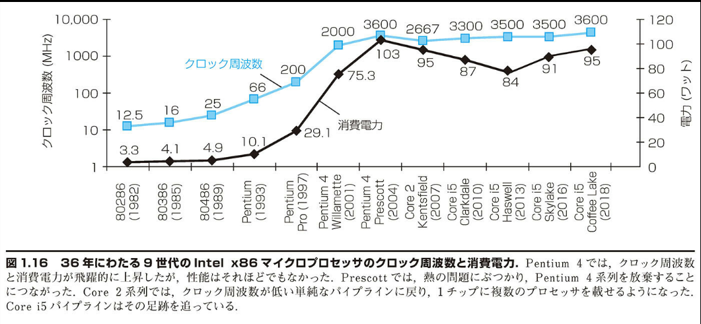

## 1.7 | 電力の壁

図 1.16 に、36 年にわたる 9 世代の Intel マイクロプロセッサのクロック周波数と消費電力の上昇傾向を示す。クロック周波数と消費電力は共に、10 年ほど急速に上昇したが、最近は頭打ちになっている。両者が一緒に上昇したのは、この 2 つが相関性を持つからである。また、最近になって両者の上昇ペースが落ちた理由は、最産品のマイクロプロセッサの冷却能力に制約があることから、実質的に電力の限界にぶつかったからである。



図 1.16 36 年にわたる 9 世代の Intel x86 マイクロプロセッサのクロック周波数と消費電力。Pentium 4 では、クロック周波数と消費電力が飛躍的に上昇したが、性能はそれほどでもなかった。Prescott では、熱の問題にぶつかり、Pentium 4 系列を放棄することにつながった。Core 2 系列では、クロック周波数が低い順統なパイプラインに戻り、1 チップに複数のプロセッサを載せるようになった。Core i5 パイプラインはその足跡を追っている。

電力によって、冷却能力の限界がもたらされた。しかし、ポスト PC 時代において、実際に限界的な資源はエネルギーである。パーソナル・モバイル・デバイスにおいては、バッテリーの寿命が切り札になりうる。ウエアハウス・スケール・コンピュータのアーキテクトは 5 万台のサーバーの電力供給と冷却のコストを削減しようとしている。この規模になると、コストが高くなるからである。プログラムの性能に関して、時間を秒で計ることは、MIPS のような単位で計るよりも安全である（1.11 節を参照）。それと同様に、エネルギーの性能に関しては、ジュールで計る方が、ジュール/秒にすぎないワットのような単位で計るよりも、よい方法である。

集積回路の支配的なテクノロジは、CMOS（相補型金属酸化膜半導体）と呼ばれている。CMOS の場合、エネルギー消費の主たる要因はいわゆる動的エネルギー、すなわちトランジスタを 0 から 1 に、またはその逆に切り替える際に消費されるエネルギーである。動的な消費電力は各トランジスタの容量性負荷および印加電圧によって、下記の式のように決まる。

```math
エネルギー ∝ 容量性負荷 × 電圧 ²
```

この式で表されるのは、0→1→0 または 1→0→1 とトランジスタを切り替える間の、パルスのエネルギーである。したがって、単一の切り替えのエネルギーは下記の式で表される。

```math
エネルギー ∝ 1/2 × 容量性負荷 × 電圧²
```

トランジスタ当たりの必要な電力は、ちょうど切り替えのエネルギーと切り替えの周波数の積となる。

```math
消費電力 ∝ 1/2 × 容量性負荷 × 電圧² × 切り替え周波数
```

切り替え周波数はクロック周波数の関数である。トランジスタ 1 個当たりの容量性負荷は、出力に接続されるトランジスタの数（ファンアウト（fanout）と呼ぶ）、および配線とトランジスタの両方の静電容量を決定する製造テクノロジという、2 つの要因の関数である。

図 1.16 に関して、電力が 30 倍にしかならない間に、クロック周波数はどうして 1,000 倍にも上昇したのだろうか。電力は電圧の 2 乗の関数なので、電圧を下げれば電力、よってエネルギーを削減できる。技術革新の新しい世代ごとに、それが行われてきた。通常、世代が変わることに、電圧は約 15%下げられてきた。その結果、約 20 年の間に、電圧は 5V から 1V にまで下がった。以上が、電力の増大が 30 倍に収まっている理由である。

---

### 相対電力

#### 【例 題】

従来の複雑性の高いプロセッサに比べて容量性負荷が 85%の、新しいより簡素なプロセッサを開発するとしよう。さらに、新しいプロセッサでは電圧を調整可能で、旧プロセッサに比べて電圧を 15%下げられるとする。それにより、周波数を 15%下げられる。これにより動的電力はどのような影響を受けるか。

#### 【解 答】

```math
\frac{電力_{new}}{電力_{old}} = \frac{(容量性負荷 × 0.85) × (電圧 × 0.85)² × (切り替え周波数 × 0.85)}{容量性負荷 × 電圧² × 切り替え周波数}
```

上式より、電力の相対比は下記のようになる。

```math
0.85⁴ = 0.52
```

よって、新しいプロセッサが使用する電力は従来のプロセッサの約半分になる。

現在の問題は、電圧をさらに下げると、完全に閉まらない水道栓のように、トランジスタの漏洩性が高くなると予想されることである。今でさえ、サーバー・チップの消費電力の約 40%は漏洩電流によるものである。トランジスタの漏洩性がさらに高くなると、プロセス全体が扱いにくくなってしまう。

電力の問題に対処するため、設計者は冷却能力を高めようと大きな装置を取り付けたり、あるクロック・サイクルにおいて動いていないチップ領域への電力供給を止めるようにしたりしている。チップを冷却する強力な技法はたくさんあり、それによってたとえば消費電力を 300 ワットにまで上げることもできる。しかし、そのような技法はパーソナル・コンピュータさらにはサーバーに適用するには一般に高価すぎる。パーソナル・モバイル・デバイスに関しては、言うまでもない。

電力の壁に突き当たった以上、コンピュータの設計者は新しい方策を講ずる必要がある。そこで、これまで 30 年間にわたってマイクロプロセッサを設計してきたのとは、違った方法を選ぶことになった。

補足： CMOS における電力消費の主たる要因は動的電力であるが、静的な電力消費も発生する。トランジスタがオフの場合でも、漏洩電流が流れるからである。サーバーにおいては、消費電力の 40%が一般には漏洩電流によるものである。したがって、トランジスタの数を増やせば、たとえトランジスタが常にオフであっても、消費電力は増える。現在、漏洩電流を抑えるために、種々の設計技法や技術革新が試みられている。しかし、さらに電圧を下げることは容易でない。

補足： 集積回路にとって電力が難題であるのには、理由が 2 つある。第 1 に、電力をチップ全体に供給し分配しなければならない。現代のマイクロプロセッサでは、電力供給および接地だけのために、何百本ものピンが使用されている。同様に、チップの一部に対する電力供給および接地だけのために、チップが複数のレベルに渡って相互接続されている。第 2 に、電力は熱として消費されるので、その熱を除去しなければならない。サーバー・チップは 100W を超える熱を出しうる。そのため、ウエアハウス・スケール・コンピュータにおいては、チップおよび周囲のシステムを冷却することに大きなコストがかかっている（第 6 章を参照）。
