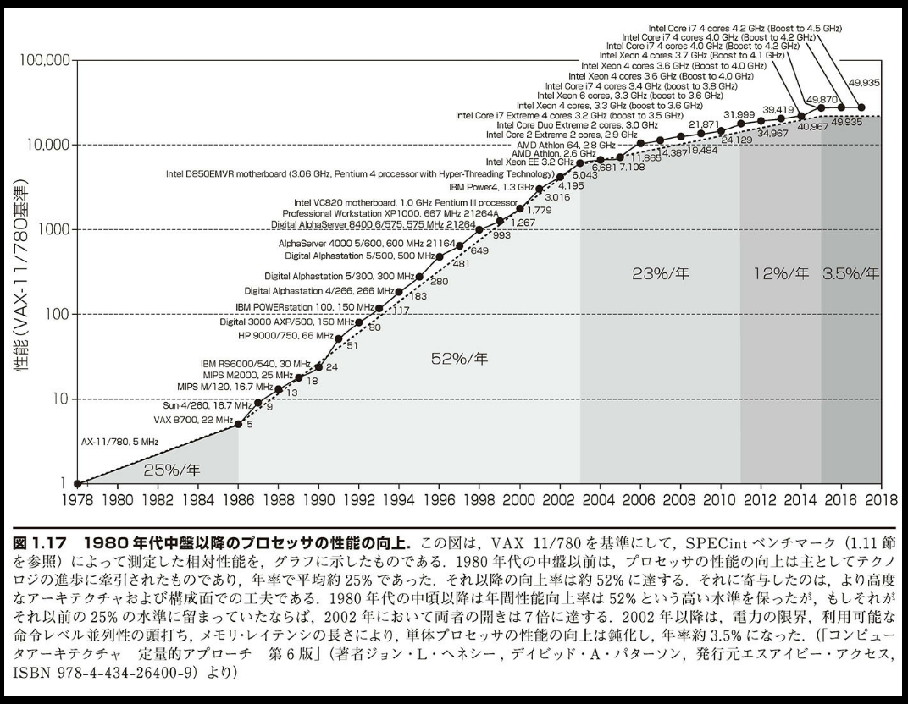

## 1.8 方向転換：ユニプロセッサからマルチプロセッサへ

> 「これまで、ほとんどのソフトウェアは音楽で言えば独奏向けのようなものであった。現在の世代のチップになって、二重奏や四重奏や少人数のアンサンブルのような経験を積み始めた。しかし、大規模なオーケストラや合唱団のための楽譜を書くことは、今までとは違った挑戦的な課題である。」
> Brian Haynes,
> Computing in a Parallel Universe, 2007

電力の壁にぶつかって、マイクロプロセッサの設計は劇的な変更を迫られた。

図 1.17 に、デスクトップ向けマイクロプロセッサ用のプログラムの応答時間の改善の経緯を示す。2002 年以降、年間の向上率は 1.5 から 1.03 へと低下している。

ここで、デスクトップ・コンピュータおよびサーバー・コンピュータのメーカーの対応が変わってきた。単体プロセッサ上で単一のプログラムを実行する応答時間を短縮する努力を続けるのではなく、2006 年時点ではすべてのメーカーが 1 つのチップに複数のプロセッサを載せたマイクロプロセッサを出荷するようになったのである。これにより多くの場合、応答時間よりもスループットを高める効果が期待できる。プロセッサとマイクロプロセッサとが混同されることを避けるため、メーカーはプロセッサを「コア」と呼び、複数のプロセッサを載せたマイクロプロセッサを一般に「マルチコア・マイクロプロセッサ」と呼んでいる。たとえば、「クアッドコア」マイクロプロセッサは 4 つのプロセッサつまりコアを搭載したチップを意味する。

プログラマは従来、ハードウェア、アーキテクチャ、コンパイラの進歩のおかげで、18 か月ごとにプログラムの性能を倍増させることができた。プログラムの組み方を変える必要はなかった。しかし今日、応答時間を大きく改善したければ、複数のプロセッサをうまく活用できるように、プログラムを組み直す必要がある。加えて、新しいマイクロプロセッサが登場したら処理をより高速化できるという、以前のようなメリットを享受したければ、コア数の増大と一緒に、プログラマはプログラム・コードの性能を改善する努力を続けなければならないだろう。

ソフトウェアとハードウェアがどのように連携しているかを強調して示すため、本書では随所に「ハードウェアとソフトウェアのインタフェース」という囲みを配している。その最初のものを下に示す。こうした囲みでは、この重要なインタフェースの本質をまとめている。

---

### 【ハードウェアとソフトウェアのインタフェース】

並列処理はコンピュータ処理の性能にとって常に重要であったが、それが表に出てこないことが多かった。たとえば、第 4 章で説明するパイプライン処理がそうである。それは、命令の実行を重複させることによりプログラムの実行を高速化する、精巧な技法である。パイプライン処理は命令レベル並列性（instruction-level parallelism）を利用した例である。この場合、ハードウェア上の並列的な動作は抽象化されており、プログラマもコンパイラも、ハードウェアは命令を逐次的に実行していると思っていてよい。

ハードウェアの並列性を明示的に意識して、それに合わせてプログラムを組み直すようプログラマに強いることは、コンピュータ・アーキテクチャ上の「タブー」であった。過去において、そのような変化を当てにした会社は失敗の憂き目を見たからである（インターネット上の図 6.16 節を参照）。こうした歴史上のいきさつから言って、最終的にはプログラマが明示的な並列プログラミングへの転換に成功するだろうという見込みに、IT 業界全体が将来を賭けたことは、驚きである。

---

プログラマにとって、並列プログラムを明示的に組むことがなぜそれほど難しかったのだろうか。第 1 の理由はこうである。並列プログラミングとはその定義上、性能を上げるためのプログラミングである。したがって、プログラミングが難しくなる。正しくて、重要な問題を解決し、人またはそのプログラムを呼出した他のプログラムに有用なインタフェースを提供するだけではなく、高速に実行されなければならない。高い性能が必要ないならば、逐次プログラムを組むだけでよいのである。

第 2 に、並列処理ハードウェアを高速に動かすためには、各プロセッサに同時にほぼ同じ量の仕事を与え、スケジューリングや調整のオーバヘッドが並列処理の潜在的な性能の利点を損なうことのないように、プログラマがアプリケーションを分割しなければならないことが挙げられる。

たとえとして、新聞記事を書くことを考えてみよう。記者が 8 人がかりで同じ特集記事に取り組めば、8 倍早く記事を完成させられる可能性がある。それを実現するには、全体の作業を分割して、各記者が同時に作業を進められるようにする必要があるだろう。この場合、分割した作業をスケジューリングする必要がある。何かがうまくいかなくて、1 人の記者だけが他の 7 人よりも長くかかってしまったならば、記者を 8 人注ぎ込んだ利点はなくなってしまう。つまり、所望の速度を達成するには、負荷を平準化しなければならない。もう 1 つの危険として、各記者がそれぞれの分担部分を書くためには、調整の話し合いに長い時間をとられることだろう。また、記事のある部分（たとえば結論）に、他の部分がすべて完成するまで着手できないならば、それが足を引っ張ることになる。したがって、意思疎通および同期のオーバヘッドを減らすために、注意を払う必要がある。このたとえ話と並列プログラミングのどちらでも、関係者間のスケジューリング、負荷平準化、同期、意思疎通のオーバヘッドの抑制が難題となる。想像がつくだろうが、新聞記事を書く記者の数や並列プログラミングのプロセッサの数が増えれば増えるほど、問題は厄介になる。

業界における以上のような大転換を反映するため、本書のこの第 6 版では、以降の章のそれぞれで、各章における並列革命の意味について 1 つの節を割いて説明する。

■ 第 2 章、2.11 節「並列処理と命令：同期」。通常、独立した並列タスクの間では、折りに触れての調整が必要となる。たとえば、作業の完了を通知する必要がある。この章では、タスク間の同期をとるために、マルチコア・プロセッサで使用される命令について説明する。

■ 第 3 章、3.6 節「並列処理とコンピュータの算術演算：部分語並列性」。おそらく、構築するのが最も単純な並列処理の形態は、いくつかの要素の計算を並行して進めることだろう。2 つのベクトルを掛け合わせるときが、その例である。部分語並列処理では、多くのオペランドを同時に操作できる、幅の広い算術演算ユニットを提供する。

■ 第 4 章、4.11 節「命令を通じた並列処理」。明示的な並列処理プログラミングは難しいので、暗黙的な並列性をハードウェアおよびコンパイラによって明示化させる試みに、1990 年代に当初はパイプライン処理を通して膨大な努力が払やされた。この章では、それらの挑戦的な技法をいくつか説明する。こうした技法には、複数の命令を同時にフェッチして実行し判定結果で推測することや、予測に基づく命令の投機的な実行などが含まれる。

■ 第 5 章、5.10 節「並列処理と記憶階層：キャッシュ・コヒーレンス」。通信のコストを下げる方法の 1 つは、すべてのプロセッサが同じアドレス空間を使用して、任意のプロセッサが任意のデータを読んだり書いたりできるようにすることである。データの一時コピーをプロセッサの近くにある高速なメモリ中に保持するために、今日ではすべてのプロセッサがキャッシュを使用していることを考えれば、各プロセッサに対応するキャッシュ間で共有データの値に一貫性がなかったならば、並列プログラミングがいっそう困難になることは、容易に想像できる。この章では、すべてのキャッシュ内のデータの一貫性を保つ仕組みについて説明する。

■ 第 5 章、5.11 節「並列処理と記憶階層：RAID」。この節では、多くのディスクを連動させて使用すると、スループットをいかに高められるかについて、説明する。このアイデアは、安価なディスクの冗長配列（RAID）が考案され、発端となった。実際、RAID は非常に人気を博した。それは、多数のディスクを編成することにより、高い信頼性が得られることの証明である。この節では、RAID のレベルの違いにより、性能、コスト、および信頼性がどのように違ってくるかを説明する。

上記の節に加え、1 つの章をまるごと並列処理に割く。第 6 章においては、並列プログラミングの課題をさらに掘り下げて解説する。共有アドレシングと明示的なメッセージ交換という、通信に対する 2 通りの対照的な方式を提示し、並列プロセッサのベンチマーク・テストの難しさについて検討し、マルチコア・マイクロプロセッサの新しい単純な性能モデルを紹介し、最後にそのモデルを用いてマルチコア・マイクロプロセッサの 4 つの例を説明して評価する。

上で述べたように、第 3 章から第 6 章にわたって、行列ベクトル乗算を使用して、いろいろなタイプの並列処理によって性能が相当に向上する様子を示している。

付録 C では、デスクトップ・コンピュータに搭載されて普及が拡大しているハードウェアの構成要素、GPU について解説する。グラフィックス処理を高速化するために開発された GPU は、それ自体がプログラミング・プラットフォームになりつつある。容易に想像がつくように、現在では GPU は並列処理を多用している。

付録 C では NVIDIA GPU を取り上げて、その並列プログラミング環境のいくつかの部分に焦点を当てて説明する。
