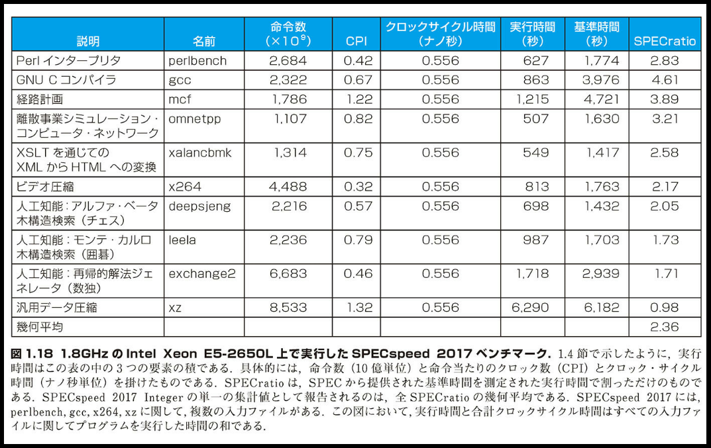
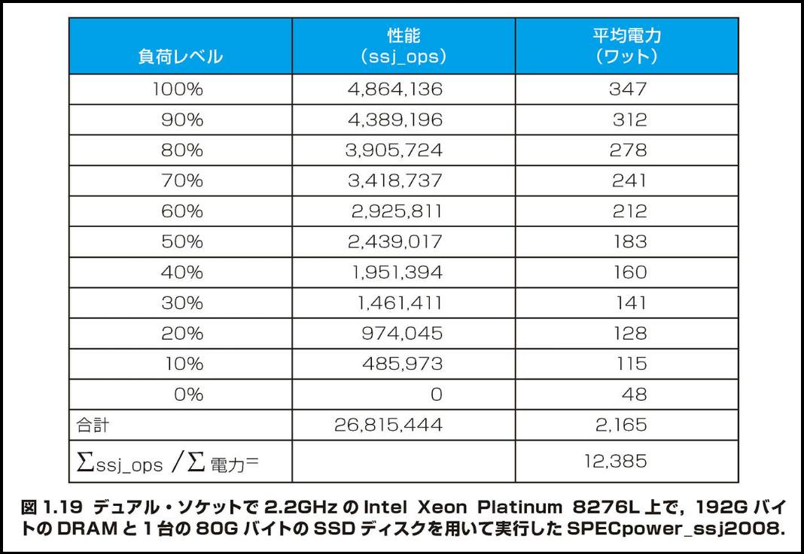

## 1.9 ｜実例：Intel Core i7 のベンチマーク・テスト

> 「私はコンピュータは本と同様に普遍的に適用できるアイデアだと思った。しかし、コンピュータがこんなにも急速に進歩するとは思わなかった。現在のように、1 つのチップ上にこれほど多くの部品を敷せるようになるとは、思いもよらなかった。トランジスタは不意に出現した。そして、なにごとも予想以上の速さで進展した。」
> J. Presper Eckert、ENIAC の共同開発者の 1 人、1991 年の談話

各節に「実例」と題する節を置き、本書で示した概念を読者が日常的に使用しているコンピュータと関連づける。この実例の節では、現代のコンピュータの基本的な技術を取り上げる。この最初の「実例」の節では、集積回路の製造方法および性能と消費電力の測定方法を、Intel Core i7 を例に説明しよう。

### SPEC CPU ベンチマーク

毎日のように同じプログラムを実行しているコンピュータ・ユーザーは、新しいコンピュータを評価する人として最適であろう。実行している一連のプログラムが、コンピュータに対する負荷（workload）となる。異なるコンピュータ・システムを評価するには、各コンピュータにその負荷をかけて実行時間を比較すればよい。しかし、たいていのユーザーはそのようなことができる状況にない。したがって、コンピュータの性能測定は、他の方法に頼らざるをえない。この場合、ユーザーが加えるであろう負荷に対するコンピュータ性能を、正しく反映できるような測定方法を用いたい。こうした評価を行うときは、コンピュータの性能測定を目的としたプログラムを使用する。その種のプログラムをベンチマーク（benchmark）と呼ぶ。ベンチマークは、ユーザー・プログラムの代わりに性能評価のためにコンピュータにかける負荷となる。上で注意したように、一般的な場合を高速化するためには、まずどの場合が一般的であるかを、正確に知る必要がある。したがって、コンピュータ・アーキテクチャにおいて、ベンチマーク・テストはきわめて重要な役割を演ずる。

SPEC（System Performance Evaluation Cooperative）は、現代のコンピュータ・システム用の標準ベンチマーク・スイートを開発することを目的として、多数のコンピュータ・ベンダーが出資してサポートしている組織である。1989 年に SPEC は初めて、プロセッサの性能に焦点を当てたベンチマーク・セットを開発した（現在はそれを SPEC89 と呼ぶ）。このベンチマークは 5 世代にわたって改善されてきている。最新のバージョンは SPEC CPU2017 であり、10 本の整数用ベンチマーク（SPECspeed 2017 Integer）と 13 本の浮動小数点用ベンチマーク（SPECspeed 2017 Floating Point）から構成される。整数用のベンチマークには、C コンパイラの一部から、チェス・プログラム、さらには量子コンピュータのシミュレーションまでのバリエーションがある。浮動小数点用のベンチマークには、有限要素モデリングのための構造格子のコード、分子動力学における粒子法のコード、流体力学における疎な線形代数の方程式のコードが含まれる。

SPEC の整数用ベンチマークを Intel Xeon E5-2650L 上で実行した結果を、図 1.18 に示す。ここには、実行時間を左右する命令数、CPI、クロックサイクル時間も示してある。CPI の変動幅が 4 倍あることに注意してほしい。



コンピュータのマーケティングの便宜を図るため、10 本の整数用ベンチマークの結果を集計して単一の数値として報告するよう、SPEC は定めている。そのためには、測定された実行時間を正規化する。具体的には、基準プロセッサ上での実行時間を測定対象のコンピュータ上での実行時間で割る。その結果として得られる比率を SPECratio と呼ぶ。これには、値が大きいほど性能が高いという、わかりやすい利点がある。要するに、SPECratio は実行時間の逆数をとったものである。SPECspeed 2017 の集計測定値は、全 SPECratio の幾何平均をとることによって得られる。

補足： SPECratio を使用して 2 つのコンピュータを比較するときには、幾何平均を使用する。正規化の基準にどのコンピュータを使用しても、同じ比率が答えとして得られるようにするためである。正規化された実行時間の算術平均をとると、正規化の基準にどのコンピュータを選定したかによって、結果が変わってくる。

幾何平均は下記の式で表される。

```math
\sqrt[n]{\prod_{i=1}^{n} 実行時間比_i}
```

ここで、実行時間比\_i は、負荷中の全部で n 本のプログラムのうちの i 番目のプログラムの実行時間を、基準コンピュータに照らして正規化したものである。また、

```math
\prod_{i=1}^{n} a_i は a_1 × a_2 × ... × a_n の積を意味する。
```

### SPECpower ベンチマーク

このように、エネルギーと電力の重要性が増大してきたので、SPEC は電力を測定するためのベンチマークを追加した。これは、ある期間サーバーを稼働させ、10%刻みで負荷を変化させて、消費電力を報告するものである。上に似た Intel Nehalem プロセッサを使用したサーバーでテストした結果を、図 1.19 に示す。



[表の内容]
負荷レベル | 性能(ssj_ops) | 平均電力(ワット)
---|---|---
100% | 4,864,136 | 347
90% | 4,389,196 | 312
80% | 3,905,724 | 278
70% | 3,418,737 | 241
60% | 2,925,811 | 212
50% | 2,439,017 | 183
40% | 1,951,394 | 160
30% | 1,461,411 | 141
20% | 974,045 | 128
10% | 485,973 | 115
0% | 0 | 48
合計 | 26,815,444 | 2,165
Σssj_ops /Σ 電力= | | 12,385

図 1.19 デュアル・ソケットで 2.2GHz の Intel Xeon Platinum 8276L 上で、192G バイトの DRAM と 1 台の 80G バイトの SSD ディスクを用いて実行した SPECpower_ssj2008.

SPECpower は、Java ビジネスアプリケーションの SPEC ベンチマーク（SPECJBB2005）から始まった。このアプリケーションでは、Java の仮想マシン、コンパイラ、ガーベッジ・コレクタ、そしてオペレーティング・システムの種々の機能に加え、プロセッサ、キャッシュ、主記憶も動作させる。性能はスループットで測定する。単位は毎秒当たりのビジネス処理数である。この場合も、コンピュータのマーケティングの便宜を図るために、SPEC では得られた数値の集まりを「ワット当たりの総合 ssj_ops」という単一の数値にまとめる。この単一の集計値を算出する公式は下記のとおりである。

```math
ワット当たりの総合ssj\_ops = \left(\sum_{i=0}^{10} ssj\_ops_i\right)/\left(\sum_{i=0}^{10} 電力_i\right)
```

ここで、ssj_opsi は各負荷レベルでの性能であり、電力 i は各負荷レベルで消費された電力である。

---

負荷（<<）
コンピュータ上で実行される一連のプログラム。ユーザーが実行する実際の一連のアプリケーションであることもあれば、実際のプログラムに構成を似せて作成したものであることもある。負荷に関しては通常、対象のプログラムとその相対実行頻度の両方を指定する。

ベンチマーク（<<）
コンピュータの性能を比較するために使用するプログラム。
