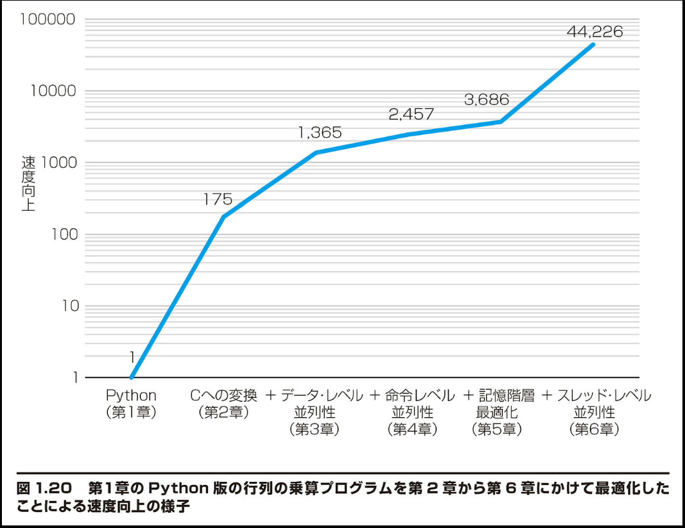

## 1.10 高速化：Python 言語版の行列の乗算

本書で紹介するアイデアの効力を検証するために、各章に「高速化」で始まる節を設ける。そこでは行列の乗算プログラムを示し、章を追うごとにその性能を順次改善していく。まず最初に、Python 言語で組んだプログラムを下に示す。

```python
for i in xrange(n):
    for j in xrange(n):
        for k in xrange(n):
            C[i][j] += A[i][k] * B[k][j]
```

ここでは Google Cloud Engine 内の n1-standard-96 サーバーを使用する。このサーバーは Intel Skylake Xeon チップを 2 つ搭載しており、各チップにはプロセッサないしコアが 24 個搭載されていて、Python バージョン 3.1 が動く。行列のサイズが 960×960 であるならば、Python を使用してこのプログラムを実行するのに、約 5 分かかる。浮動小数点演算の所要時間は行列のサイズが大きくなるにつれて増大するので、行列のサイズが 4096×4096 になると、このプログラムの実行時間はほぼ 6 時間となる。Python を使えば行列の乗算プログラムを楽早く組むことができるが、答えを得るのにそんなに長く待つのをいとわない人がいるだろうか。

第 2 章では、Python 言語版の乗算プログラムを C 言語版に変換する。それにより、性能が 200 倍も向上する。C 言語によるプログラミングの抽象化は Python 言語よりもはるかにハードウェアに近い。本書においてプログラミングの例に C 言語を使用するのはそのためである。抽象化のギャップを埋めることによっても、C 言語は Python 言語よりも実行速度がずっと速くなる [Leiserson, 2020]。

■ 第 3 章では、データ・レベル並列性の概念に基づき、C イントリンシックを通して部分語並列性を利用して、性能を約 8 倍向上させる。

■ 第 4 章では、命令レベル並列性の概念に基づき、複数命令の発行およびアウト・オブ・オーダー実行機能を有するハードウェアを利用するためにループ展開を行って、性能をさらに約 2 倍向上させる。

■ 第 5 章では、記憶階層最適化の概念に基づき、キャッシュ・ブロッキングを行って、サイズの大きな行列を処理する性能をさらに約 1.5 倍向上させる。

■ 第 6 章では、スレッド・レベル並列性の概念に基づき、マルチコア・ハードウェアを利用するために OpenMP 内で並列処理 for ループを使用して、性能をさらに 12 ～ 17 倍向上させる。

後ろの 4 ステップでは、現代のマイクロプロセッサの根底にあるハードウェアが実際にどのように作動するかについての理解を活用する。それを実現するのに必要な C 言語プログラムの行数は全部でわずか 21 である。図 1.20 に、上記の 6 ステップを通じた速度向上のグラフを示す。速度の目盛りは対数尺である。最初の Python 版よりも速度は約 5 万倍向上している。待ち時間はほぼ 6 時間から 1 秒弱に短縮されている。

補足： Python プログラムの速度を向上させるために、プログラマは通常、Python 自体でプログラムをコーディングする代わりに、高度に最適化されたライブラリを呼び出す。そのような NumPy ライブラリを使用すると、960×960 の行列の乗算の所要時間はほるかに短縮されて 4 ～ 5 分から 1 秒未満になる。


