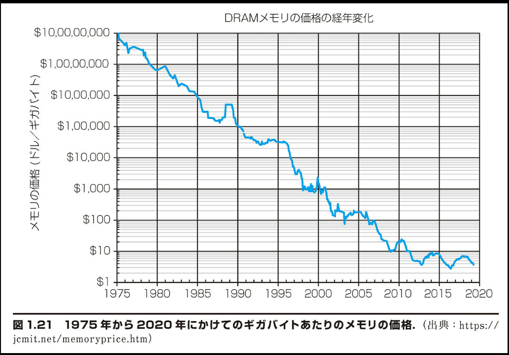

## 1.14 | 自習

第 6 版から各章に自習の節を追加する．その中で，読者が考えることを促す問題をいくつか出すとともに，答えを示して読者が理解したかどうかをチェックする手助けとする．

■ アーキテクチャに関する主要なアイデアと実例との対応付け：下記の現実の例にコンピュータ・アーキテクチャに関する 7 つの主要なアイデアの最もよく適合するものを対応させよ．

1. 先に洗った物を乾燥させている間に、次の物を洗って、洗濯時間を短縮すること
2. 車の前扉の鍵をなくした場合に備えて、予備の鍵を隠すこと
3. 冬に長距離ドライブの経路を決める際に、通過する予定の都市の天気予報をチェックすること
4. スーパーマーケットでの 10 品目以下の小口購入者向けの急行レジ
5. 大都市の図書館システムの出張所
6. 四輪すべて電動モーターで駆動される自動車
7. 自動駐車および走行のオプションを購入する必要のある、車のオプションの自動運転モード

■ 最速の測定方法：同じ命令セットを実行している，3 種類のプロセッサ P1，P2，P3 について検討する．P1 は，クロックサイクル時間が 0.33ns で，CPI が 1.5 である．P2 は，クロックサイクル時間が 0.40ns で，CPI が 1.0 である．P3 は，クロックサイクル時間が 0.25ns で，CPI が 2.2 である．

1. クロック周波数とは何か．どのプロセッサのクロック周波数が最速か．
2. 最も早いコンピュータはどれか．答えが上の(1)と異なる場合は，なぜか説明せよ．最も遅いのはどれか．
3. 上の(1)と(2)への答えはベンチマークの重要性をどのように反映しているか．

■ Amdahl の法則と兄弟のよしみ：Amdahl の法則は基本的に収穫逓減の法則である．この法則は，投資に対してだけではなく，コンピュータ・アーキテクチャにも当てはまるのである．この法則を説明するのに役立つ例がここにある．読者の兄弟が新興企業に参加して，読者に貯金をいくらか投資させようとすると仮定しよう．その兄弟は「確実に儲かるから」と言って勧誘する．

1. 読者は貯金の 10%を投資することにする．自分の貯金全体を倍増させるには，その新興企業への投資収益率はどれほどでなければならないか．ただし，投資先はその新興企業のみと想定する．
2. その新興企業への投資から，上記の(1)で計算したとおりの収益が得られたとする．その新興企業への投資からの収益の 90%を実現するためには，貯金をどれほど投資しなければならないか．95%の場合はどうか．
3. 上記の結果はコンピュータに関する Amdahl の観察とどのように関係するか．Amdahl の法則と兄弟のよしみについてはどうか．

■ DRAM の価格対コスト：図 1.21 に，1975 年から 2020 年に至る DRAM チップの価格のグラフを示す．また，図 1.11 には，同じ期間の DRAM の容量が示されている．それらの図から，容量が 100 万倍増大し（16Kbit から 16Gbit），ギガバイトあたりの価格が 2500 万倍低下した（1 億ドルから 4 ドル）ことが見て取れる．GiB あたりの価格は時間の経過につれて上下に変動しているのに対して，チップあたりの容量は円滑な成長曲線を示していることにも，注意して欲しい．

1. 図 1.21 において，Moore の法則が低下した証拠を見て取れるか．
2. 価格の低下率はチップあたりの容量の増大率よりも，なぜ 25 倍高くなりえたのか．チップの容量の増大以外に，他にどんな理由がありえるか．
3. 3 ないし 5 年のサイクルでギガバイトあたりの価格がなぜ変動すると思うか．そのことは，1.5 節の末尾の補足に示したチップのコストの計算式または市場の他の要因に関連するのか．

【自習問題への解答】

■ アーキテクチャに関する主要なアイデアと実例との対応付け

1. パイプライン処理を通じた性能
2. 冗長性を通じた信頼性（並列性を通じた性能と言うことも可能）
3. 予測を通じた性能
4. 一般的な場合を高速化
5. 記憶階層
6. 並列性を通じた信頼性（パイプライン処理を通じた性能と言うことも可能）
7. 設計を単純化するための抽象化

■ 最速の測定方法

1. クロック周波数はクロックサイクル数の逆数である．P1=1/（0.33×10−9 秒）=3 GHz．P2=1/（0.40×10−9 秒）=2.5 GHz．P3=1/（0.25×10−9 秒）=4 GHz．P3 のクロック周波数が最高．

2. それらのプロセッサの命令セット・アーキテクチャは同じであるので，プログラムの命令数はすべて同じである．したがって，命令あたりの平均クロックサイクル数(CPI)とクロックサイクル時間の積として性能を測定できる．それは，命令の平均実行時間でもある．
   a. P1 = 1.5 × 0.33 ns = 0.495 ns
   （CPI／クロック周波数を使用して平均命令時間を計算することもできる．具体的には，1.5/3.0 GHz = 0.495 ns）
   b. P2 = 1.0 × 0.40 ns = 0.400 ns （または 1.0/2.5 GHz = 0.400 ns）
   c. P3 = 2.2 × 0.25 ns = 0.550 ns （または 1.0/4.0 GHz = 0.550 ns）
   P2 が最も早く，P3 が最も遅い．平均してクロック周波数が最高であるにもかかわらず，P3 はクロックサイクル数が非常に多いので，高いクロック周波数の利点を失っている．

3. CPI の計算は何らかのベンチマークを実行することに基づいていた．そのベンチマークが実際の世界を代表するものであれば，これらの質問に対する答えは正しい．ベンチマークが非現実的であれば，答えは正しくない可能性がある．クロック周波数のように宣伝しやすい単柄と実際の性能には差がありうるので，良いベンチマークを開発することが重要である．

■ Amdahl の法則と兄弟のよしみ

1. 貯金を倍増させるためには 11 倍の投資収益率が必要である．
   90% × 1 + 10% × 11 = 2.0 となる
2. 満額の収益の 90%を得るためには，貯金の 89%を投資しなければならない．

11× の 90% = 9.9× であるので，11% × 1 + 89% × 11 = 9.9 となる
満額の収益の 95%を得るためには，貯金の 94.5%を投資しなければならない．
11× の 95% = 10.45× であるので，5.5% × 1 + 94.5% × 11 = 10.45 となる

3. 成功した新興企業のように投資収益率が高かったとしても，投資しなかった部分からは収益は生まれない．それと同様に，コンピュータの一部をどんなに高速化しようとも，高速化されなかった部分が高速化の制約となる．読者が投資する金額は，兄弟の発言がどれだけ信用できるかに左右される．通常は，新興企業全体の 90%は成功しないのである．

■ DRAM の価格対コスト

1. 価格は変動しているが，2013 年以降は横這いになっているように見える．それは Moore の法則の低下と辻褄が合う．たとえば，GB あたりの DRAM の価格は 2013 年にも 2016 年にも，さらには 2019 年にも 4 ドルであった．過去にはそれほど長期間にわたって価格が横ばいであることはなかった．

2. どちらの図も，チップの容量以上に価格の改善に資する，DRAM チップの量に触れていない．通常，製造には習熟効果があって，生産量が 10 倍に増大すれば，コストが 2 分の 1 ほどに低下する．また，チップのパッケージングにもコストを下げる技術革新があった．それが長期的には価格の低下につながった．

3. DRAM はありふれた部品であり，類似製品を製造している企業が何社かあって，市場競争にさらされやすく，価格が変動しやすい．需要が供給を上回れば価格が上昇し，需給が逆転すれば価格が低下する．かって DRAM が非常に儲かる時期があって，業界は製造ラインを増設した．すると供給が過剰になり，価格が低下し，製造ラインは減らされた．

それぞれの問題と解答について解説させていただきます：

■ アーキテクチャに関する主要なアイデアと実例との対応付け
この問題は、コンピュータアーキテクチャの抽象的な概念を日常生活の具体例と結びつける演習です。

解説：

- パイプライン処理（洗濯の例）は、複数の作業を並行して行うことで全体の効率を上げる手法を示しています
- 冗長性（予備の鍵）は、システムの信頼性を高めるためのバックアップ戦略を表現しています
- 予測（天気予報のチェック）は、先読みによる最適化の概念を示しています
- 一般的な場合の高速化（急行レジ）は、頻繁に発生するケースを効率的に処理する設計思想を表しています
- 記憶階層（図書館の出張所）は、アクセス頻度に応じたデータの配置を示しています
- 並列性（四輪電動）は、複数のユニットによる同時処理を表現しています
- 抽象化（自動運転オプション）は、複雑な実装を隠蔽してシンプルなインターフェースを提供する概念を示しています

■ 最速の測定方法
この問題は、プロセッサの性能評価には単純なクロック周波数だけでなく、実際の処理効率（CPI）も考慮する必要があることを教えています。

解説：

- クロック周波数が最高の P3 が必ずしも最速というわけではありません
- 実際の性能は「CPI × クロックサイクル時間」で決まります
- ベンチマークの選択が性能評価の結果に大きく影響することを示しています

■ Amdahl の法則と兄弟のよしみ
この問題は、システムの一部分だけを改善することの限界を、投資の例を使って説明しています。

解説：

- 全体の性能向上には、改善されない部分が制約となることを示しています
- 投資例を使うことで、抽象的な概念を具体的に理解しやすくしています
- 95%の改善を得るために必要な投資率が急激に上昇することは、限界収益逓減の法則を表現しています

■ DRAM の価格対コスト
この問題は、半導体産業における技術進歩と経済的要因の関係を分析しています。

解説：

- Moore の法則の限界が実際の市場データで確認できることを示しています
- 価格低下には技術進歩だけでなく、生産効率の向上や市場競争も大きく影響することを説明しています
- 需給バランスによる価格変動のメカニズムを具体的に示しています

これらの問題は、コンピュータアーキテクチャの理論を実践的な文脈で理解することを促す、よく考えられた教材となっています。
