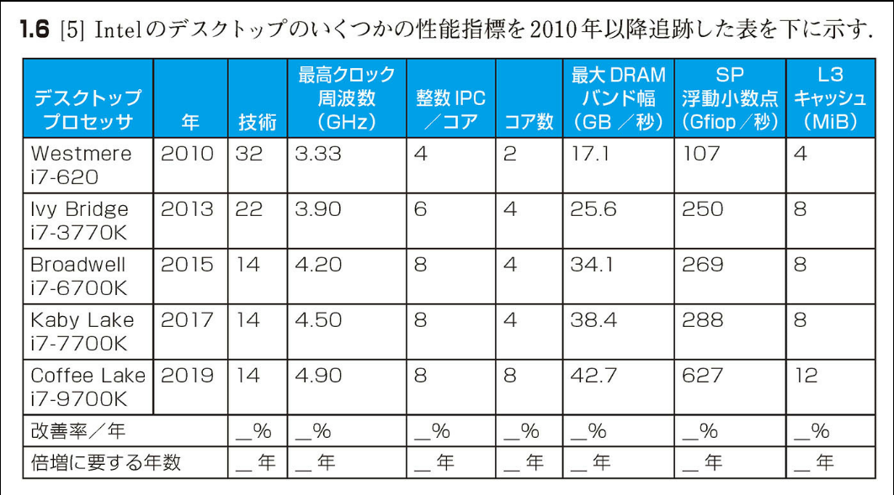

## 1.15 | 演習問題

問題を解くのにかかるであろう相対時間を各設問の後ろに [ ] で囲んで示してある。平均して、[10] は [5] の倍の時間がかかることを表す。演習にとりかかる前に読むべき節の番号を < >で囲んで示した。たとえば、< §1.4 >は 1.4 節「コンピュータの内部」を読んでから演習問題に取り組むべきことを意味する。

1.1 [2] < §1.1 > 3 つのタイプのコンピュータを上げて説明せよ。

1.2 [5] < §1.2 > コンピュータ・アーキテクチャにおける 7 つの主要なアイデアは他の分野のアイデアに似ている。7 つの主要なアイデアとは、具体的には、「設計を単純化するために抽象化する」「一般的な場合を高速化する」「並列処理を通じた性能の向上」「パイプライン処理を通じた性能の向上」「予測を通じた性能の向上」「記憶階層」および「冗長性を通じた信頼性」である。それらを、下記の他の分野のアイデアと対応させよ。

a. 自動車製造における組み立てライン

b. 吊り橋のケーブル

c. 風情報を組み入れた航空システムおよび航海システム

d. 高層ビルの高速エレベータ

e. 図書館の予備の机

f. 切替時間を短縮するための、CMOS トランジスタ上のゲート領域の増大

g. 走行車線監視システムや自動走行制御システムのような、既に基本的に車に装備されている既存のセンサー・システムを部分的に利用して制御する、自動運転自動車の製造

1.3 [2] < §1.3 > C 言語のような高水準言語で書かれたプログラムを、コンピュータのプロセッサによって直接実行される表現に、変換する手順を説明せよ。

1.4 [2] < §1.4 > 各三原色（赤、緑、青）にピクセル当たり 8 ビットを使用するカラー・ディスプレイがあり、そのフレーム・サイズが 1280×1024 である、と仮定する。

a. フレームを格納するためのフレーム・バッファの最小サイズをバイト単位で示せ。

b. 100M ビット/秒のネットワークを通じてフレームを送信するのに、最低どれだけ時間がかかるか。

1.5 [4] < §1.6 > 同じ命令セットを実行する 3 種類のプロセッサ、P1 と P2 と P3 があるとする。P1 のクロック周波数は 3 GHz であり、CPI は 1.5 である。P2 のクロック周波数は 2.5 GHz であり、CPI は 1.0 である。P3 のクロック周波数は 4.0 GHz であり、CPI は 2.2 である。

a. 秒当たりの命令数で表した場合、どのプロセッサの性能が最高であるか。

b. あるプログラムを各プロセッサが 10 秒で実行する場合、サイクル数および命令数はいくつか。

c. 実行時間を 30%短縮しようと努めている。しかし、そうすると、20%の CPI の増大につながる。この短縮を実現するためには、クロック周波数はどれほどであるべきか。

1.6 [5] Intel のデスクトップのいくつかの性能指標を 2010 年以降追跡した表を下に示す。



### [表の内容]

| デスクトップ プロセッサ | 年   | 技術 | 最高クロック周波数(GHz) | 整数 IPC/コア | コア数 | 最大 DRAM バンド幅(GB/秒) | SP 浮動小数点(Gflop/秒) | L3 キャッシュ(MiB) |
| ----------------------- | ---- | ---- | ----------------------- | ------------- | ------ | ------------------------- | ----------------------- | ------------------ |
| Westmere i7-620         | 2010 | 32   | 3.33                    | 4             | 2      | 17.1                      | 107                     | 4                  |
| Ivy Bridge i7-3770K     | 2013 | 22   | 3.90                    | 6             | 4      | 25.6                      | 250                     | 8                  |
| Broadwell i7-6700K      | 2015 | 14   | 4.20                    | 8             | 4      | 34.1                      | 269                     | 8                  |
| Kaby Lake i7-7700K      | 2017 | 14   | 4.50                    | 8             | 4      | 38.4                      | 288                     | 8                  |
| Coffee Lake i7-9700K    | 2019 | 14   | 4.90                    | 8             | 8      | 42.7                      | 627                     | 12                 |
| 改善率/年               | \_%  | \_%  | \_%                     | \_%           | \_%    | \_%                       | \_%                     | \_%                |
| 倍増に要する年数        | \_年 | \_年 | \_年                    | \_年          | \_年   | \_年                      | \_年                    | \_年               |

「技術」欄はプロセッサ製造プロセスにおけるダイ上のトランジスタの最小サイズを示す。ダイのサイズは比較的に一定であり、プロセッサを構成するトランジスタの数は(1/t)² に比例するものと想定する。ここで、t はダイ上のトランジスタの最小サイズとする。

各性能指標について、2010 年から 2019 年までの平均改善率を算出せよ。さらに、それに対応して、各性能指標の改善率を倍増させるのに必要な年数を算出せよ。

1.7 [20] < §1.6 > 同じ命令セット・アーキテクチャの実装形態が 2 通りあるとする。命令は、CPI に基づいて、4 つのクラス（A, B, C, D）に分けられる。実装形態 P1 は、クロック周波数が 2.5 GHz であり、クラスごとの CPI が 1, 2, 3, 3 である。実装形態 P2 は、クロック周波数が 3 GHz であり、クラスごとの CPI が 2, 2, 2, 2 である。

動的命令数が 1.0E6 のプログラムがある。その命令のクラス別の割合は、A が 10%、B が 20%、C が 50%、D が 20%である。P1 と P2 のどちらの実装形態の方が早いか。

a. 各実装形態のグローバル CPI はそれぞれいくつか。

b. 両方の場合の、必要なクロック・サイクル数はいくつか。

1.8 [15] < §1.6 > コンパイラはアプリケーションの性能に甚大な影響を与える。あるプログラムを、A と B の 2 つのコンパイラでコンパイルしたとする。A でコンパイルした結果は、動的命令数は 1.0E9 であり、実行時間は 1.1 秒であった。B でコンパイルした結果は、動的命令数は 1.2E9 であり、実行時間は 1.5 秒であった。

a. プロセッサのクロック・サイクル時間が 1ns であるとして、各プログラムの平均 CPI を求めよ。

b. コンパイルしたプログラムを 2 つのプロセッサ上で別々に実行したとする。両方のプロセッサでの実行時間が同じであったとしたら、コンパイラ A によって生成されたコードを実行したプロセッサのクロックは、コンパイラ B によって生成されたコードを実行したプロセッサのクロックよりも、どれだけ早いか。

c. 新しいコンパイラが開発された。そのコンパイラでコンパイルした結果は、命令数はわずか 6.0E8 であり、平均 CPI は 1.1 であった。この新しいコンパイラを使用すると、元のプロセッサ上でコンパイラ A または B を使用したのに比べて、どれだけ速くなるか。

1.9 2004 年にリリースされた Pentium 4 Prescott プロセッサは、クロック周波数が 3.6GHz であり、電圧が 1.25 V であった。このプロセッサは、平均して、10W の静的電力と 90 W の動的電力を消費した、と仮定する。

2012 年にリリースされた Core i5 Ivy Bridge は、クロック周波数が 3.4GHz であり、電圧が 0.9 V であった。このプロセッサは、平均して、30W の静的電力と 40 W の動的電力を消費した、と仮定する。

1.9.1 [5] < §1.7 > 各プロセッサについて、平均容量性負荷を求めよ。

1.9.2 [5] < §1.7 > 各テクノロジに関して、静的電力で構成される合計消費電力のパーセント、および動的電力に対する静的電力の割合、を求めよ。

1.9.3 [15] < §1.7 > 合計消費電力を 10%減らしたいならば、漏洩電流を同じに保つためには、電圧をどれだけ下げるべきであるか。

1.10 あるプロセッサの CPI が、算術命令に関しては 1、ロード/ストア命令に関しては 12、分岐命令に関しては 5 である、と仮定する。また、単一のプロセッサ上であるプログラムを実行するのに必要な命令数が、算術命令に関しては 2.56E9、ロード/ストア命令に関しては 1.28E9、分岐命令に関しては 2 億 5600 万である、と仮定する。各プロセッサのクロック周波数は 2GHz であるとする。

プログラムは複数のコア上で実行されるように並列化されていて、プロセッサ当たりの算術命令とロード/ストア命令の数は 0.7×p（p はプロセッサの数）になるが、プロセッサ当たりの分岐命令の数は変わらない、と仮定する。

1.10.1 [5] < §1.7 > コアの数が 1、2、4、8 のそれぞれの場合の、このプログラムの合計実行時間を求めよ。また、コアの数が 2、4、8 のそれぞれの場合の、単一のコアの場合に対する、相対速度向上率を示せ。

1.10.2 [10] < §1.6, 1.8 > 算術命令の CPI が倍になったとしたら、コアの数が 1、2、4、8 のそれぞれの場合に、プログラムの実行時間にどのような影響が出るか。

1.10.3 [10] < §1.6, 1.8 > この CPI での、コア数が 4 のプロセッサの性能に、単一のコアの性能を匹敵させるためには、ロード/ストア命令の CPI をどこまで減らすべきか。

1.11 直径が 15cm のウエーハがあるとする。そのコストは 12、含まれるダイの数は 84、欠陥の数は 0.020/cm² である。もう 1 つ、直径が 20cm のウエーハがあるとする。そのコストは 15、含まれるダイの数は 100、欠陥の数は 0.031/cm² である。

1.11.1 [10] < §1.5 > 両方のウエーハの歩留りを求めよ。

1.11.2 [5] < §1.5 > 両方のウエーハのダイ当たりのコストを求めよ。

1.11.3 [5] < §1.5 > ウエーハ当たりのダイの数が 10%増大し、単位面積当たりの欠陥数が 15%増大したならば、ダイの面積と歩留りはどうなるか。

1.11.4 [5] < §1.5 > 製造工程が改善されて、歩留りが 0.92 から 0.95 へと向上したとする。ダイの面積が 200mm² であるとして、改善の前後の、単位面積当たりの欠陥数を求めよ。

1.12 AMD Barcelona 上で実行された SPEC CPU2006 bzip2 ベンチマーク・テストの結果、命令数が 2.389E12、実行時間が 750s、参照時間が 9650s であった。

1.12.1 [5] < §1.6, 1.9 > クロック・サイクル時間が 0.333ns であるならば CPI はいくつになるか。

1.12.2 [5] < §1.9 > SPECratio を求めよ。

1.12.3 [5] < §1.6, 1.9 > ベンチマークの命令数が 10%増大したが、CPI には影響がなかったならば、CPU 時間はどれだけ増大するか。

1.12.4 [5] < §1.6, 1.9 > ベンチマークの命令数が 10%増大したが、CPI が 5%増大したならば、CPU 時間はどれだけ増大するか。

1.12.5 [5] < §1.6, 1.9 > この変化に対応して、SPECratio はどう変化するか。

1.12.6 [10] < §1.6 > クロック周波数が 4GHz の新しいバージョンの AMD Barcelona を開発しているとする。命令セットに命令をいくつか追加した結果、命令数が 15%削減された。実行時間は 700s に短縮され、新しい SPECratio は 13.7 になった。新しい CPI を求めよ。

1.12.7 [10] < §1.6 > クロック周波数を 3GHz から 4GHz に上げたところ、1.12.1 で得られたよりも、CPI の値が大きくなった。この CPI の増大と、クロック周波数の増大とは、似ているかどうか判定せよ。もし似ていないならば、なぜか。

1.12.8 [5] < §1.6 > CPU 時間はどれだけ削減されたか。

1.12.9 [10] < §1.6 > 2 番目のベンチマーク libquantum に関して、実行時間が 960ns、CPI が 1.61、クロック周波数が 3GHz である、と仮定する。クロック周波数を 4GHz に上げたところ、実行時間が 10%削減されたが、CPI は不変であった、とする。命令数はいくつか。

1.12.10 [10] < §1.6 > 命令数を維持し、CPI は不変のまま、CPU 時間をさらに 10%削減するためには、クロック周波数をどうする必要があるか。

1.12.11 [10] < §1.6 > 命令数を変えずに、CPI を 15%削減し、CPU 時間を 20%削減するためには、クロック周波数をどうすべきか。

1.13 1.11 節では、性能の尺度として性能方程式の一部だけを利用することに関する落とし穴を示した。それを例証するために、次の 2 つのプロセッサを検討してみよう。プロセッサ P1 のクロック周波数は 4GHz、平均 CPI は 0.9 であり、5.0E9 命令を実行する必要がある。プロセッサ P2 のクロック周波数は 3GHz、平均 CPI は 0.75 であり、1.0E9 命令を実行する必要がある。

1.13.1 [5] < §1.6, 1.11 > よくある誤信は、クロック周波数が最大のコンピュータの性能が最も高い、とみなすことである。P1 と P2 に関して、それが正しいかどうかチェックせよ。

1.13.2 [10] < §1.6, 1.11 > 別の誤信は、最大の数の命令を実行するプロセッサが最大の CPU 時間を必要とする、とみなすことである。プロセッサ P1 が 1.0E9 個の一連の命令を実行しているとし、P1 と P2 の CPI が変わらないとして、P1 が 1.0E9 個の命令を実行するのに要するのと同じ時間に、P2 が実行できる命令の数を求めよ。

1.13.3 [10] < §1.6, 1.11 > 広く浸透している誤信として、MIPS (million instructions per second) 値を用いて 2 種類のプロセッサの性能を比較し、MIPS 値の大きいプロセッサの方が性能が高い、とみなす考え方がある。P1 と P2 に関して、それが正しいかどうかチェックせよ。

1.13.4 [10] < §1.11 > もう 1 つの一般的な性能の尺度に、MFLOPS (million floating-poing operations per second) 値がある。これは下記の式で定義される。

MFLOPS = 浮動小数点演算の実行数/実行時間（1E6 単位）

しかし、この値には MIPS 値と同じ問題がある。P1 および P2 上で実行される命令の 40%が浮動小数点命令である、と仮定する。このプロセッサの MFLOPS 値を求めよ。

1.14 1.11 節に示した別の落とし穴は、コンピュータのただ 1 つの要素を改善することにより、そのコンピュータの性能全般の改善を期待することであった。あるプログラムを実行するのに、250s かかるコンピュータがあるとする。その実行時間のうち、70s は浮動小数点命令の実行に、80s はロード/ストア命令の実行に、40s は分岐命令の実行に、費やされるとする。

1.14.1 [5] < §1.11 > 浮動小数点命令の実行時間が 20%短縮されたならば、合計時間はどれだけ短縮されるか。

1.14.2 [5] < §1.11 > 合計時間が 20%短縮されたならば、整数命令の時間はどれだけ短縮されるか。

1.14.3 [5] < §1.11 > 分岐命令の時間を短縮するだけで、合計時間を 20%短縮できるか。

1.15 あるプログラムを実行するのに必要なタイプ別の命令数が、浮動小数点命令は 50×10⁶、整数命令は 110×10⁶、ロード/ストア命令は 80×10⁶、分岐命令は 16×10⁶ であるとする。各タイプの命令の CPI はそれぞれ 1、1、4、2 である。プロセッサのクロック周波数は 2GHz であるとする。

1.15.1 [10] < §1.11 > プログラムの実行速度を 2 倍に高めたければ、浮動小数点命令の CPI をどれだけ改善しなければならないか。

1.15.2 [10] < §1.11 > プログラムの実行速度を 2 倍に高めたければ、ロード/ストア命令の CPI をどれだけ改善しなければならないか。

1.15.3 [5] < §1.11 > 整数命令と浮動小数点命令の CPI を 40%引き下げ、ロード/ストア命令と分岐命令の CPI を 30%引き下げたならば、プログラムの実行時間はどれだけ改善されるか。

1.16 [5] < §1.8 > マルチプロセッサ・システムにおいて、複数のプロセッサ上で実行されるようにプログラムが適合化されているとき、各プロセッサ上での実行時間は計算時間とオーバヘッド時間で構成される。オーバヘッド時間とは、重要な部分をロックしたり、あるプロセッサから別のプロセッサにデータを送信したりするのに、必要な時間である。

1 台のプロセッサ上であるプログラムを実行するのにかかる時間 t が 100s であるとする。p 台のプロセッサを使用する場合、各プロセッサが必要とする時間は、t/p の他に、プロセッサの台数に関係なくオーバヘッドとして 4s かかる。プロセッサの台数を 2、4、8、16、32、64、128 とした場合の、各プロセッサの実行時間を算出せよ。各場合について、1 台のプロセッサで実行した場合と比べての速度向上率、および実際の速度向上比と理想的な速度向上比（オーバヘッドがなかった場合の速度向上比）の割合を示せ。

---

## 解答と解説

1.13 1.11 節では、性能の尺度として性能方程式の一部だけを利用することに関する落とし穴を示した。それを例証するために、次の 2 つのプロセッサを検討してみよう。プロセッサ P1 のクロック周波数は 4GHz、平均 CPI は 0.9 であり、5.0E9 命令を実行する必要がある。プロセッサ P2 のクロック周波数は 3GHz、平均 CPI は 0.75 であり、1.0E9 命令を実行する必要がある。

1.13.1 [5] < §1.6, 1.11 > よくある誤信は、クロック周波数が最大のコンピュータの性能が最も高い、とみなすことである。P1 と P2 に関して、それが正しいかどうかチェックせよ。

1.13.2 [10] < §1.6, 1.11 > 別の誤信は、最大の数の命令を実行するプロセッサが最大の CPU 時間を必要とする、とみなすことである。プロセッサ P1 が 1.0E9 個の一連の命令を実行しているとし、P1 と P2 の CPI が変わらないとして、P1 が 1.0E9 個の命令を実行するのに要するのと同じ時間に、P2 が実行できる命令の数を求めよ。

1.13.3 [10] < §1.6, 1.11 > 広く浸透している誤信として、MIPS (million instructions per second) 値を用いて 2 種類のプロセッサの性能を比較し、MIPS 値の大きいプロセッサの方が性能が高い、とみなす考え方がある。P1 と P2 に関して、それが正しいかどうかチェックせよ。

1.13.4 [10] < §1.11 > もう 1 つの一般的な性能の尺度に、MFLOPS (million floating-poing operations per second) 値がある。これは下記の式で定義される。

MFLOPS = 浮動小数点演算の実行数/実行時間（1E6 単位）

しかし、この値には MIPS 値と同じ問題がある。P1 および P2 上で実行される命令の 40%が浮動小数点命令である、と仮定する。このプロセッサの MFLOPS 値を求めよ。

1.14 1.11 節に示した別の落とし穴は、コンピュータのただ 1 つの要素を改善することにより、そのコンピュータの性能全般の改善を期待することであった。あるプログラムを実行するのに、250s かかるコンピュータがあるとする。その実行時間のうち、70s は浮動小数点命令の実行に、80s はロード/ストア命令の実行に、40s は分岐命令の実行に、費やされるとする。

1.14.1 [5] < §1.11 > 浮動小数点命令の実行時間が 20%短縮されたならば、合計時間はどれだけ短縮されるか。

1.14.2 [5] < §1.11 > 合計時間が 20%短縮されたならば、整数命令の時間はどれだけ短縮されるか。

1.14.3 [5] < §1.11 > 分岐命令の時間を短縮するだけで、合計時間を 20%短縮できるか。

1.15 あるプログラムを実行するのに必要なタイプ別の命令数が、浮動小数点命令は 50×10⁶、整数命令は 110×10⁶、ロード/ストア命令は 80×10⁶、分岐命令は 16×10⁶ であるとする。各タイプの命令の CPI はそれぞれ 1、1、4、2 である。プロセッサのクロック周波数は 2GHz であるとする。

1.15.1 [10] < §1.11 > プログラムの実行速度を 2 倍に高めたければ、浮動小数点命令の CPI をどれだけ改善しなければならないか。

1.15.2 [10] < §1.11 > プログラムの実行速度を 2 倍に高めたければ、ロード/ストア命令の CPI をどれだけ改善しなければならないか。

1.15.3 [5] < §1.11 > 整数命令と浮動小数点命令の CPI を 40%引き下げ、ロード/ストア命令と分岐命令の CPI を 30%引き下げたならば、プログラムの実行時間はどれだけ改善されるか。

1.16 [5] < §1.8 > マルチプロセッサ・システムにおいて、複数のプロセッサ上で実行されるようにプログラムが適合化されているとき、各プロセッサ上での実行時間は計算時間とオーバヘッド時間で構成される。オーバヘッド時間とは、重要な部分をロックしたり、あるプロセッサから別のプロセッサにデータを送信したりするのに、必要な時間である。

1 台のプロセッサ上であるプログラムを実行するのにかかる時間 t が 100s であるとする。p 台のプロセッサを使用する場合、各プロセッサが必要とする時間は、t/p の他に、プロセッサの台数に関係なくオーバヘッドとして 4s かかる。プロセッサの台数を 2、4、8、16、32、64、128 とした場合の、各プロセッサの実行時間を算出せよ。各場合について、1 台のプロセッサで実行した場合と比べての速度向上率、および実際の速度向上比と理想的な速度向上比（オーバヘッドがなかった場合の速度向上比）の割合を示せ。

それぞれの問題を解いていきましょう。

1.3 [2] C 言語プログラムからプロセッサ実行可能形式への変換手順：

1. コンパイル

- C 言語のソースコードを、アセンブリ言語に変換する
- コンパイラがソースコードの構文解析を行い、最適化を施す

2. アセンブル

- アセンブリ言語を機械語（オブジェクトコード）に変換する
- 各アセンブリ命令が対応する機械語命令に変換される

3. リンク

- オブジェクトコードと必要なライブラリを結合する
- 実行可能なバイナリファイルを生成する

4. ロード

- 実行可能ファイルをメモリにロードする
- プロセッサが直接実行できる状態になる

  1.4 [2] カラー・ディスプレイのフレーム・バッファとデータ転送：

a. フレーム・バッファの最小サイズ計算：

- 1 ピクセルあたりのビット数 = 8(赤) + 8(緑) + 8(青) = 24 ビット = 3 バイト
- 総ピクセル数 = 1280 × 1024 = 1,310,720 ピクセル
- フレーム・バッファの最小サイズ = 1,310,720 × 3 = 3,932,160 バイト (約 3.93MB)

b. ネットワーク転送時間の計算：

- フレームの総ビット数 = 3,932,160 × 8 = 31,457,280 ビット
- 転送速度 = 100M ビット/秒 = 100,000,000 ビット/秒
- 最小転送時間 = 31,457,280 ÷ 100,000,000 = 0.31457 秒 ≈ 0.315 秒

したがって、フレーム・バッファには最低 3,932,160 バイトが必要で、100M ビット/秒のネットワークでの転送には最低約 0.315 秒かかります。

これは理想的な条件での計算であり、実際の転送時間は、ネットワークのオーバーヘッド、パケットの損失、再送信などの要因により、より長くなる可能性があることに注意が必要です。

では、順番に解いていきましょう。

1.5 [4] プロセッサの性能比較：

a. 秒当たりの命令数（IPS: Instructions Per Second）の計算：

- P1: 3 GHz ÷ 1.5 CPI = 2.0 billion IPS
- P2: 2.5 GHz ÷ 1.0 CPI = 2.5 billion IPS
- P3: 4.0 GHz ÷ 2.2 CPI = 1.82 billion IPS

→ P2 が最高性能（2.5 billion IPS）

b. 10 秒実行時の計算：
P1:

- サイクル数 = 3 GHz × 10 秒 = 30 billion サイクル
- 命令数 = 30 billion ÷ 1.5 = 20 billion 命令

P2:

- サイクル数 = 2.5 GHz × 10 秒 = 25 billion サイクル
- 命令数 = 25 billion ÷ 1.0 = 25 billion 命令

P3:

- サイクル数 = 4.0 GHz × 10 秒 = 40 billion サイクル
- 命令数 = 40 billion ÷ 2.2 = 18.18 billion 命令

c. 実行時間 30%短縮、CPI 20%増加の場合の必要クロック周波数：

- 新しい実行時間 = 元の時間 × 0.7
- 新しい CPI = 元の CPI × 1.2
- 必要なクロック周波数 = 元のクロック周波数 × 1.2 ÷ 0.7 = 元のクロック周波数 × 1.714

  1.6 [5] Intel プロセッサの性能推移：

年間改善率の計算式：
改善率 = (最終値/初期値)^(1/年数) - 1

倍増年数の計算式：
倍増年数 = ln(2)/ln(1 + 年間改善率)

各指標の計算（2010 年から 2019 年の 9 年間）：

1. 技術（プロセス）：

- 改善率 = (14/32)^(1/9) - 1 = -9.15%/年
- 倍増年数：改善ではなく減少のため計算不要

2. クロック周波数：

- 改善率 = (4.90/3.33)^(1/9) - 1 = 4.37%/年
- 倍増年数 = 16.2 年

3. 整数 IPC/コア：

- 改善率 = (8/4)^(1/9) - 1 = 8.01%/年
- 倍増年数 = 9.0 年

4. コア数：

- 改善率 = (8/2)^(1/9) - 1 = 16.68%/年
- 倍増年数 = 4.5 年

5. DRAM バンド幅：

- 改善率 = (42.7/17.1)^(1/9) - 1 = 10.69%/年
- 倍増年数 = 6.8 年

6. SP 浮動小数点：

- 改善率 = (627/107)^(1/9) - 1 = 21.75%/年
- 倍増年数 = 3.5 年

7. L3 キャッシュ：

- 改善率 = (12/4)^(1/9) - 1 = 13.03%/年
- 倍増年数 = 5.7 年

この結果から、SP 浮動小数点性能が最も速く改善し（21.75%/年）、クロック周波数の改善が最も遅い（4.37%/年）ことがわかります。また、プロセス技術（トランジスタサイズ）は改善率がマイナスになっています（小さくなる方向への改善）。

それぞれの問題を順番に解いていきましょう。

1.7 [20] 実装形態 P1 と P2 の性能比較：

a. グローバル CPI の計算：

P1 のグローバル CPI：

- A(10%): 0.10 × 1 = 0.1
- B(20%): 0.20 × 2 = 0.4
- C(50%): 0.50 × 3 = 1.5
- D(20%): 0.20 × 3 = 0.6
  グローバル CPI = 0.1 + 0.4 + 1.5 + 0.6 = 2.6

P2 のグローバル CPI：

- すべてのクラスで CPI = 2
  グローバル CPI = 2.0

b. 必要なクロック・サイクル数：

P1：

- クロック・サイクル数 = 動的命令数 × グローバル CPI
- = 1.0E6 × 2.6 = 2.6E6 サイクル
- 実行時間 = 2.6E6 / 2.5E9 = 1.04 ミリ秒

P2：

- クロック・サイクル数 = 1.0E6 × 2.0 = 2.0E6 サイクル
- 実行時間 = 2.0E6 / 3.0E9 = 0.67 ミリ秒

したがって、P2 の方が実行時間が短く、より高速です。

1.8 [15] コンパイラの性能比較：

a. 平均 CPI の計算：
コンパイラ A：

- 実行時間 = 1.1 秒 = 1.1E9 ns
- クロックサイクル数 = 1.1E9
- 平均 CPI = クロックサイクル数 / 動的命令数
- = 1.1E9 / 1.0E9 = 1.1

コンパイラ B：

- 実行時間 = 1.5 秒 = 1.5E9 ns
- クロックサイクル数 = 1.5E9
- 平均 CPI = 1.5E9 / 1.2E9 = 1.25

b. クロック速度の比率：

- 実行時間はクロック周期 × 命令数 ×CPI に比例
- 実行時間が同じなので：
  Clock_A × 1.0E9 × 1.1 = Clock_B × 1.2E9 × 1.25
  Clock_A / Clock_B = (1.2 × 1.25) / (1.0 × 1.1) = 1.36

したがって、コンパイラ A を実行したプロセッサのクロックは 36%速い必要があります。

c. 新コンパイラの性能向上率：
新コンパイラの実行時間：

- = 6.0E8 × 1.1 × 1ns = 0.66 秒

速度向上率：

- 対コンパイラ A = 1.1 秒 / 0.66 秒 = 1.67 倍
- 対コンパイラ B = 1.5 秒 / 0.66 秒 = 2.27 倍

よって、新コンパイラは、コンパイラ A と比べて 67%速く、コンパイラ B と比べて 127%速くなります。

それでは順番に解いていきましょう。

1.9 Pentium 4 と Core i5 の電力消費分析：

1.9.1 [5] 平均容量性負荷の計算：
動的電力の公式: P_dynamic = C × V² × f
C = P_dynamic / (V² × f)

Pentium 4 Prescott:

- C = 90 / (1.25² × 3.6E9) = 16 nF

Core i5 Ivy Bridge:

- C = 40 / (0.9² × 3.4E9) = 14.5 nF

  1.9.2 [5] 電力構成の分析：

Pentium 4 Prescott:

- 総電力 = 10W + 90W = 100W
- 静的電力の割合 = 10W/100W = 10%
- 動的電力に対する静的電力の割合 = 10W/90W = 11.1%

Core i5 Ivy Bridge:

- 総電力 = 30W + 40W = 70W
- 静的電力の割合 = 30W/70W = 42.9%
- 動的電力に対する静的電力の割合 = 30W/40W = 75%

  1.9.3 [15] 電圧低下の計算：

- 現在の総電力 = P_static + C × V² × f
- 目標は 90%の現在の電力
- 静的電力は一定
- 新しい電圧を Vnew とすると：
  P_static + C × Vnew² × f = 0.9(P_static + C × V² × f)

この方程式を解くことで必要な電圧低下を求められます。

1.10 並列処理の性能分析：

1.10.1 [5] 実行時間と速度向上率の計算：

単一コアでの実行時間計算：

- 算術命令: 2.56E9 × 1 = 2.56E9 サイクル
- ロード/ストア: 1.28E9 × 12 = 15.36E9 サイクル
- 分岐: 0.256E9 × 5 = 1.28E9 サイクル
  総サイクル数 = 19.2E9
  実行時間 = 19.2E9/2E9 = 9.6 秒

並列化時の実行時間（p コア）：

```
p=2: 5.376秒 (1.79倍速)
p=4: 3.264秒 (2.94倍速)
p=8: 2.208秒 (4.35倍速)
```

1.10.2 [10] 算術命令の CPI が 2 になった場合：

- 単一コア: 11.88 秒 (23.75%増加)
- 2 コア: 6.516 秒 (21.2%増加)
- 4 コア: 3.834 秒 (17.5%増加)
- 8 コア: 2.493 秒 (12.9%増加)

  1.10.3 [10] 4 コアと同等の性能を得るためのロード/ストア命令の CPI：

- 4 コアの実行時間 = 3.264 秒
- 単一コアで同じ実行時間を達成するために必要なロード/ストアの CPI を計算
- 新しい CPI を x とすると：
  (2.56E9 × 1 + 1.28E9 × x + 0.256E9 × 5) / 2E9 = 3.264
- 解くと、x ≈ 2.8

したがって、ロード/ストア命令の CPI を 12 から約 2.8 に減らす必要があります。

それでは順番に解いていきましょう。

1.11 ウエーハの歩留りとコスト分析：

1.11.1 [10] 歩留りの計算：
歩留り公式: Y = e^(-D×A)
ここで、D=欠陥密度、A=ダイの面積

15cm ウエーハ：

- 面積 = π(7.5)² = 176.7 cm²
- ダイあたりの面積 = 176.7/84 = 2.1 cm²
- 歩留り = e^(-0.020×2.1) = 0.959 = 95.9%

20cm ウエーハ：

- 面積 = π(10)² = 314.2 cm²
- ダイあたりの面積 = 314.2/100 = 3.14 cm²
- 歩留り = e^(-0.031×3.14) = 0.907 = 90.7%

  1.11.2 [5] ダイ当たりのコスト計算：
  コスト = ウエーハコスト/(歩留り × ダイ数)

15cm ウエーハ：

- 12/(0.959×84) = 0.149 ユニット/ダイ

20cm ウエーハ：

- 15/(0.907×100) = 0.165 ユニット/ダイ

  1.11.3 [5] ダイ数 10%増加、欠陥数 15%増加の影響：
  ダイ数が 10%増加 → ダイ面積は約 9.1%減少
  新しい歩留り = e^(-(D×1.15)×(A×0.909))
  = e^(-1.045×D×A) ≈ 0.96× 元の歩留り

  1.11.4 [5] 歩留りの改善に基づく欠陥密度計算：
  D = -ln(Y)/A

- 改善前：D = -ln(0.92)/200 = 0.000415/mm²
- 改善後：D = -ln(0.95)/200 = 0.000256/mm²

次に 1.12 を解きます：

1.12.1 [5] CPI の計算：

- クロック周期 = 0.333ns = 1/3GHz
- CPU 時間 = 命令数 ×CPI× クロック周期
- 750 = 2.389E12×CPI×(1/3E9)
- CPI = 0.942

  1.12.2 [5] SPECratio の計算：
  SPECratio = 参照時間/実行時間
  = 9650/750 = 12.87

  1.12.3 [5] 命令数 10%増加の影響：
  CPU 時間は比例して 10%増加（825 秒）

  1.12.4 [5] 命令数 10%増加と CPI 5%増加の影響：
  新 CPU 時間 = 元の時間 ×1.1×1.05 = 866.25 秒

  1.12.5 [5] 新 SPECratio の計算：
  新 SPECratio = 9650/866.25 = 11.14

  1.12.6 [10] 新 CPI の計算：

- 新命令数 = 2.389E12×0.85
- 700 = (2.389E12×0.85)×CPI×(1/4E9)
- CPI = 1.47

はい、では 1.12 の残りの問題を解いていきます。

1.12.7 [10] CPI とクロック周波数の関係分析：

- 元の CPI = 0.942（3GHz 時）
- 新しい CPI = 1.47（4GHz 時）
- CPI 増加率 = (1.47/0.942) = 1.56 = 56%増加
- クロック周波数増加率 = (4/3) = 1.33 = 33%増加

CPI の増加率がクロック周波数の増加率を上回っています。これは似ていないと判断できます。
理由：メモリアクセスなどの要因により、高クロック周波数での待ち時間が増加したためと考えられます。

1.12.8 [5] CPU 時間の削減率計算：

- 元の CPU 時間 = 750 秒
- 新しい CPU 時間 = 700 秒
- 削減率 = (750-700)/750 × 100 = 6.67%

  1.12.9 [10] libquantum の命令数計算：

- 元の実行時間 = 960ns
- 元の CPI = 1.61
- 元のクロック周波数 = 3GHz
- 新しい実行時間 = 960×0.9 = 864ns（10%削減）
- 新しいクロック周波数 = 4GHz
- CPI 不変 = 1.61

命令数を求める：
命令数 = 実行時間/(CPI× クロック周期)
= 864E-9/(1.61×(1/4E9))
= 2.147E3 命令

1.12.10 [10] さらに 10%の CPU 時間削減に必要なクロック周波数：

- 現在の CPU 時間 = 864ns
- 目標 CPU 時間 = 864×0.9 = 777.6ns
- CPU 時間 = 命令数 ×CPI×(1/クロック周波数)
- 777.6E-9 = 2.147E3×1.61×(1/f)
- f = 4.444GHz

必要なクロック周波数は約 4.444GHz（現在の 4GHz から 11.1%増加）

1.12.11 [10] CPI 15%削減と CPU 時間 20%削減のための必要クロック周波数：

- 新 CPI = 1.61×0.85 = 1.37
- 目標 CPU 時間 = 960×0.8 = 768ns
- 768E-9 = 2.147E3×1.37×(1/f)
- f = 3.82GHz

したがって、クロック周波数を 3.82GHz にする必要があります。これは元の 3GHz から 27.3%の増加を意味します。

これらの結果から、性能向上には単純にクロック周波数を上げるだけでなく、CPI の最適化も重要であることがわかります。また、クロック周波数の上昇が CPI の悪化を招く可能性があることも示されています。

1.13 から順番に解いていきましょう。

1.13 性能評価の落とし穴：

1.13.1 [5] クロック周波数と性能の関係：
P1:

- CPU 時間 = (5.0E9 × 0.9)/(4E9) = 1.125 秒

P2:

- CPU 時間 = (1.0E9 × 0.75)/(3E9) = 0.25 秒

P2 の方が実行時間が短いため、クロック周波数が高い P1 の方が性能が高いという考えは誤りです。

1.13.2 [10] 命令数と実行時間の関係：
P1 が 1.0E9 命令を実行する時間：

- 時間 = (1.0E9 × 0.9)/(4E9) = 0.225 秒

この同じ時間で P2 が実行できる命令数：

- 0.225 = (N × 0.75)/(3E9)
- N = 0.9E9 命令

したがって、P2 は同じ時間内に 0.9E9 命令を実行できます。

1.13.3 [10] MIPS による性能比較：
P1 の MIPS = 4000/0.9 = 4444 MIPS
P2 の MIPS = 3000/0.75 = 4000 MIPS

P1 の MIPS 値が高いですが、実際の実行時間では P2 の方が速いため、MIPS 値による比較は適切ではありません。

1.13.4 [10] MFLOPS 値の計算：
P1:

- 浮動小数点演算数 = 5.0E9 × 0.4 = 2.0E9
- MFLOPS = (2.0E9)/(1.125 × 1E6) = 1778 MFLOPS

P2:

- 浮動小数点演算数 = 1.0E9 × 0.4 = 0.4E9
- MFLOPS = (0.4E9)/(0.25 × 1E6) = 1600 MFLOPS

  1.14 部分的改善の影響：

  1.14.1 [5] 浮動小数点実行時間 20%短縮の影響：

- 浮動小数点時間の短縮 = 70 × 0.2 = 14 秒
- 新しい合計時間 = 250 - 14 = 236 秒
- 全体の短縮率 = (250-236)/250 = 5.6%

  1.14.2 [5] 全体 20%短縮に必要な整数時間短縮：

- 目標時間 = 250 × 0.8 = 200 秒
- 整数時間の必要な短縮 = 250 - 200 = 50 秒

  1.14.3 [5] 分岐命令による 20%短縮の可能性：

- 現在の分岐時間 = 40 秒
- 必要な短縮時間 = 250 × 0.2 = 50 秒
  分岐命令の時間（40 秒）が必要な短縮時間（50 秒）より小さいため、分岐命令の改善だけでは 20%の短縮は不可能です。

はい、では 1.15 と 1.16 を解いていきましょう。

1.15 命令タイプごとの性能改善：

まず、現在の実行時間を計算：

- 浮動小数点命令: 50×10⁶ × 1 = 50×10⁶ サイクル
- 整数命令: 110×10⁶ × 1 = 110×10⁶ サイクル
- ロード/ストア命令: 80×10⁶ × 4 = 320×10⁶ サイクル
- 分岐命令: 16×10⁶ × 2 = 32×10⁶ サイクル
  総サイクル数 = 512×10⁶
  実行時間 = 512×10⁶/(2×10⁹) = 0.256 秒

  1.15.1 [10] 浮動小数点命令の CPI 改善：

- 目標時間 = 0.256/2 = 0.128 秒
- 浮動小数点命令の CPI を改善しても、他の命令による時間（462×10⁶ サイクル）は変わらない
- 462×10⁶/(2×10⁹) = 0.231 秒 > 0.128 秒
  したがって、浮動小数点命令の CPI をいくら改善しても実行時間を半分にすることは不可能です。

  1.15.2 [10] ロード/ストア命令の CPI 改善：
  現在のサイクル = 512×10⁶
  目標サイクル = 256×10⁶
  ロード/ストア以外のサイクル = 192×10⁶

- (80×10⁶ × X) + 192×10⁶ = 256×10⁶
- X = 0.8
  したがって、ロード/ストアの CPI を 4 から 0.8 に改善する必要があります。

  1.15.3 [5] 複合的な CPI 改善の効果：
  新しいサイクル数：

- 浮動小数点: 50×10⁶ × (1×0.6) = 30×10⁶
- 整数: 110×10⁶ × (1×0.6) = 66×10⁶
- ロード/ストア: 80×10⁶ × (4×0.7) = 224×10⁶
- 分岐: 16×10⁶ × (2×0.7) = 22.4×10⁶
  総サイクル数 = 342.4×10⁶
  改善率 = (512-342.4)/512 = 33.1%

  1.16 [5] マルチプロセッサシステムの性能分析：

各プロセッサ数での実行時間計算：
時間 = t/p + オーバーヘッド = 100/p + 4

プロセッサ数ごとの分析：
2 プロセッサ：

- 実行時間 = 100/2 + 4 = 54 秒
- 速度向上率 = 100/54 = 1.85
- 理想比 = 1.85/2 = 0.93

4 プロセッサ：

- 実行時間 = 100/4 + 4 = 29 秒
- 速度向上率 = 100/29 = 3.45
- 理想比 = 3.45/4 = 0.86

8 プロセッサ：

- 実行時間 = 100/8 + 4 = 16.5 秒
- 速度向上率 = 100/16.5 = 6.06
- 理想比 = 6.06/8 = 0.76

16 プロセッサ：

- 実行時間 = 100/16 + 4 = 10.25 秒
- 速度向上率 = 100/10.25 = 9.76
- 理想比 = 9.76/16 = 0.61

32 プロセッサ：

- 実行時間 = 100/32 + 4 = 7.125 秒
- 速度向上率 = 100/7.125 = 14.04
- 理想比 = 14.04/32 = 0.44

64 プロセッサ：

- 実行時間 = 100/64 + 4 = 5.56 秒
- 速度向上率 = 100/5.56 = 17.99
- 理想比 = 17.99/64 = 0.28

128 プロセッサ：

- 実行時間 = 100/128 + 4 = 4.78 秒
- 速度向上率 = 100/4.78 = 20.92
- 理想比 = 20.92/128 = 0.16

この結果から、プロセッサ数が増えるにつれて、オーバーヘッドの影響が大きくなり、理想的な速度向上比との差が広がっていくことがわかります。
