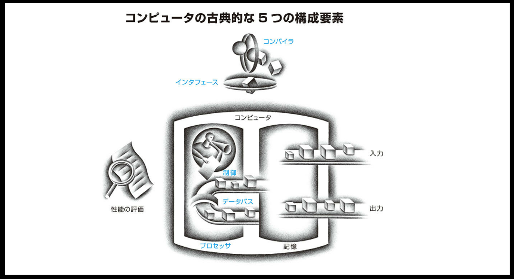
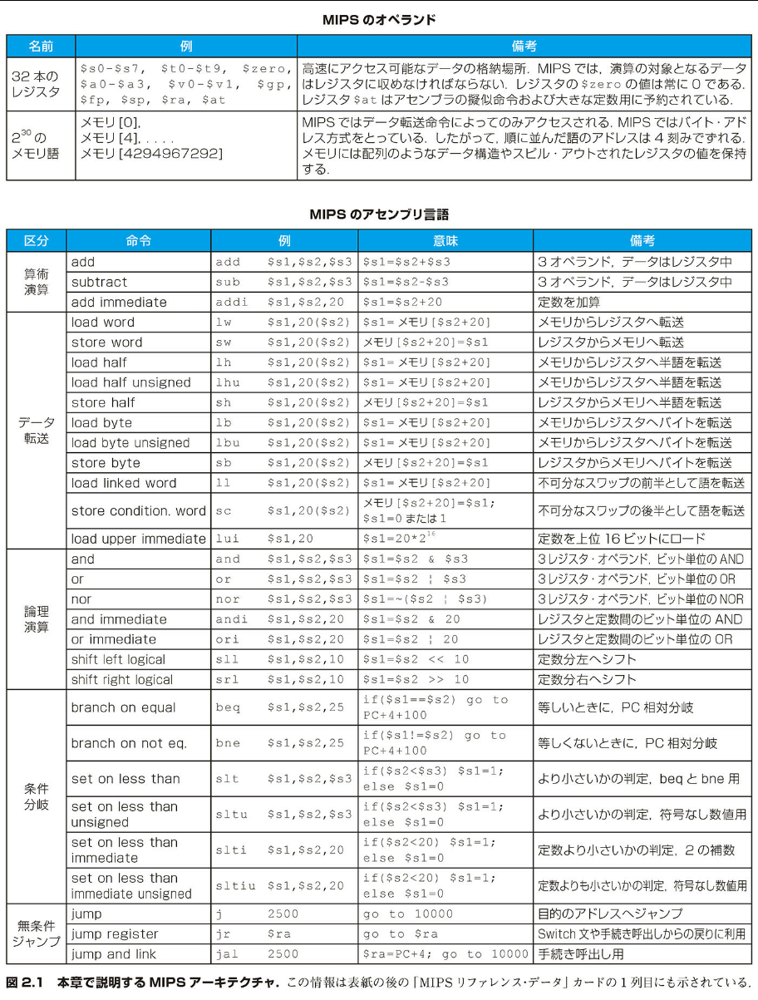

# 2 命令：コンピュータの言葉

> 余は、神とはスペイン語で話、ご婦人とはイタリア語で話し、男どもとはフランス語で話し、馬にはドイツ語で話しかける
> 神聖ローマ帝国行程　シャルル五世
> 1500-1558

## 2.1 | はじめに

コンピュータのハードウェアに命令を伝えるには、コンピュータの言葉で話さなければならない。コンピュータ言語の言葉を命令（instruction）と呼び、コンピュータの語集を命令セット（instruction set）と呼ぶ。本章では、実際のコンピュータの命令セットを読者に示す。命令セットには人が書くときの形とコンピュータが読むときの形があるので、その両方について説明する。命令を説明するにあたっては、トップダウン方式を採用する。最初は簡単な概念的モデルの形で紹介し、順々に精緻化して、最終的に実際のコンピュータの実際の言語の形にまでもっていく。第 3 章ではさらに下位レベルに降りて、演算を行うハードウェアおよび浮動小数点数の表現方法について明らかにする。

コンピュータの言語は人の言語と同様に多様性があると想像する読者も多いかもしれない。しかし、実際には、コンピュータの言語は独立の言語と言うよりはむしろ方言に近い。したがって、1 つの方言を覚えれば、別の方言を覚えることはさして難しくない。

本書で使用する命令セットは MIPS Technologies 社のものである。これは、1980 年代初頭から設計されたさまざまな命令セットのうちの最も洗練されたものの例である。他の命令セットを習得するのが容易であることを例証するために、下記の 3 種類の一般的な命令セットを概観する。

1. ARMv7。MIPS に似ている。2017 年から 2020 年の間に、ARM プロセッサを搭載したチップが千億個以上も生産され、世界で最も一般的な命令セットになるだろう。

2. Intel x86。PC とホスト PC 時代のクラウドの両方を強化する。

3. ARMv8。ARMv7 のアドレス空間を 32 ビットから 64 ビットに拡張したものである。後に見るが、皮肉なことに、この 2013 年の命令セットは ARMv7 よりも MIPS に近い。

このように命令セット間に類似性があることには、それなりの理由がある。まず、すべてのコンピュータは同じ根本原理に基づくハードウェア技術を用いて造られている。また、すべてのコンピュータが備えるべき基本的な演算機能というものがある。さらに、コンピュータの設計者は共通の目標を抱いている。それは、ハードウェアおよびコンパイラの開発を容易にするとともに、性能を最大化しながらコストと消費電力を最小化できるような、そんな言語を見つけ出すことである。この目標は時代の流れの中で磨きがかけられてきた。下に 1947 年に書かれた資料の一節を引用する。まだコンピュータを買うことのできなかった時代に書かれたにもかかわらず、この内容は現在でも立派に通用する。

> 任意の一連の操作の実行および制御に論理的に適合した［命令セット］の存在を、形式論理学的方法によって示すことは容易である。……現段階で言えることは、［命令セット］選定で考慮すべき重要命題は、どちらかと
> 言うと現実的性格のものだという点である。すなわち、［命令セット］を実現する装置が単純になること、実際に重要な問題にそれを明確に適用できて、しかも問題の高速な処理が可能なことである。
>
> Burks, Goldstine, and von Neumann, 1947

1940 年代のコンピュータにとっては「装置が単純であること」が重要命題であったが、これは今日のコンピュータでも変わることはない。本章の目標は、上記の助言に沿った命令セットを示すことである。そして、その命令セットがハードウェア的に表現される形、および高水準プログラミング言語との対応関係を示す。本書では、プログラミング言語には C を使用する。Java のようなオブジェクト指向言語ではそれがどう変化するかを、図 2.15 節に示す。

命令の表現法を学ぶことを通して、読者はコンピュータの本質がプログラム内蔵方式（stored program concept）にあることを理解できるだろう。さらに、読者にはコンピュータ言語でのプログラムのコーディングという「外国語」の演習をしてもらい、本書付属のシミュレータを用いてそれを実行してもらう。また、プログラミング言語やコンパイラの最適化が性能にどう影響するかも理解できるだろう。本章の締めくくりに、命令セットの歴史的発展過程と他のマシン方言を概観する。

この MIPS 命令セットを順次提示して、マシン構成との関係を説明する。このように、命令セットの構成要素を順次提示して説明を加えることにより、アセンブリ言語にも親しめるはずである。本章で取り上げる命令セットの一覧を、図 2.1 に示す。

命令セット（<<）
あるアーキテクチャによって理解されるコンピュータ命令の語彙

プログラム内蔵方式（<<）
各種の命令およびデータをメモリ内に数値として収めることができるという概念。プログラム内蔵コンピュータの母胎となった。
