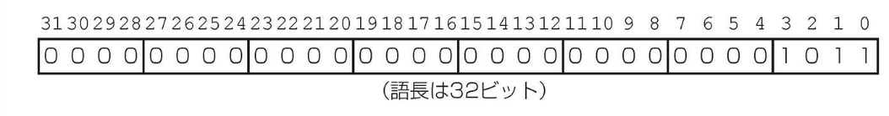

## 2.4 | 符号付き数と符号なし数

まず、コンピュータ内で数値がどのように表現されるかを簡単に見ておこう。指が 10 本あるため、人は数を 10 進数（decimal number）として習っている。しかし、数値は何進法でも表現できる。たとえば、10 進数の 123 は 2 進法では 1111011 と表現される。

コンピュータ内では、数値は高と低の電気信号系列の形で保持される。したがって、コンピュータ内の数値は 2 進数（binary number）である。2 進数の 1 文字はコンピュータ処理の「原子」の役割を担う。なぜならば、すべての情報はバイナリ・ディジット（binary digit）すなわちビット（bit）を単位として構成されるからである。この基本的な情報単位は 2 つの値のうちのどちらかを取る。その呼び方は何通りかある。具体的には、高／低、オン／オフ、真／偽、0／1 がある。

一般化すると、基数が何であれ、i 番目の位の数 d の値は下記の式で表される。

```
d × 基数^i
```

ここで、i は 0 から始め、右から左に向かって繰り上げる。この数え方は語中のビットの位取りにも適用する。語の何番目のビットかという値で基数をべき乗する。たとえば、下記の数があるとする。

```
1011₂
```

この値は 10 進数では下記のようになる。

```
(1 × 2³)+(0 × 2²)+(1 × 2¹)+(1 × 2⁰)₁₀
    =(1 × 8)+(0 × 4)+(1 × 2)+(1 × 1)₁₀
    =8 + 0 + 2 + 1₁₀
    =11₁₀
```

すなわち、語中のビットは右から左にビット 0、ビット 1、ビット 2、...、と呼ぶ。MIPS の語中のビットの位取りと、数値 1011₂ のビット配置を下に図示する。



語は横だけではなく縦に書かれることもあるので、左端とか右端といった表現はあいまいである。そこで、右端のビット（上図のビット 0）を表すときは最下位ビット（least significant bit）、左端のビット（上図のビット 31）を表すときは最上位ビット（most significant bit）という言葉を使用することにする。

MIPS の 1 語長は 32 ビットである。32 ビットのパターンは 2³² 通りある。したがって、それらのビット・パターンによって、0 から 2³² - 1（4,294,967,295₁₀）までの数値を表すことができる。

```
0000 0000 0000 0000 0000 0000 0000 0000₂ = 0₁₀
0000 0000 0000 0000 0000 0000 0000 0001₂ = 1₁₀
0000 0000 0000 0000 0000 0000 0000 0010₂ = 2₁₀
...
1111 1111 1111 1111 1111 1111 1111 1101₂ = 4,294,967,293₁₀
1111 1111 1111 1111 1111 1111 1111 1110₂ = 4,294,967,294₁₀
1111 1111 1111 1111 1111 1111 1111 1111₂ = 4,294,967,295₁₀
```

つまり、32 ビットの 2 進数は各ビットの値で 2 をべき乗した、下記の式で表すことができる（ここで、xi は x の i 番目のビットであることを意味する）。

```
(x31 × 2³¹) + (x30 × 2³⁰) + (x29 × 2²⁹) + ... + (x1 × 2¹) + (x0 × 2⁰)
```

このような正の数を、符号なし数と呼ぶ。その理由については、まもなくこの後で説明する。

### [ハードウェアとソフトウェアのインターフェース]

人間にとっては基数 2 は自然ではない。人には指が 10 本あるので、基数 10 が自然である。では、コンピュータではなぜ 10 進数を使用しないのだろうか。実際には、初期の商用コンピュータでは 10 進数の演算が提供されていた。問題は、コンピュータの内部ではいずれにせよオンおよびオフの信号が使用されていたことである。そこで、10 進数の数字を 1 つ 1 つ単にいくつかの 2 進数の数字で表した。しかし、10 進数では非常に効率が悪いことが明らかになったので、以降のコンピュータはすべて 2 進数に基づくようになった。そして、頻度の低い入出力の際にのみ 10 進数に変換するようになった。

上記の 2 進ビット・パターンは単に数値を有限個の数字列で表現する方法であることに留意してほしい。実際の数値は無限桁の数字列から成り、そのうちの最下位の数桁を除く大部分はゼロである。通常は先行するゼロを表示しないだけである。

これら 2 進のビット・パターンを四則演算するハードウェアを設計できる。計算結果の数値がハードウェアに用意されているビット幅に収まりきらない場合、オーバフロー（overflow）が発生したという。そのときにどのような措置をとるかは、プログラミング言語、オペレーティング・システム、そしてプログラムによって決まる。

コンピュータ・プログラムは正の数と負の数を扱うので、両者を区別する表現方法が必要となる。一番分かりやすい解決策は、1 ビットで表現できる符号を別に追加することである。この方法を符号付き絶対値（sign and magnitude）表現と呼ぶ。

残念ながら、符号付き絶対値表現には欠陥がいくつかある。まず、符号ビットをどこに置くかが定かでない。右にすべきか、それとも左にすべきか。初期のコンピュータではその両方が試みられた。第 2 に、計算結果の符号を設定するために、加算器に余分なステップが必要となる。なぜならば、事前に正しい符号を知ることはできないからである。最後に、この方式では、ゼロに正と負の 2 つがあることになる。それは不注意なプログラマが問題を起こす原因となる。このような欠陥があるために、符号付き絶対値表現はすぐに使われなくなった。

もっと扱いやすい方法を探索する過程で、符号なしの小さな数値から大きな数値を引き算したら、結果はどうなるかという疑問が提起された。その答えは、上位の 0 から値を借りてくるので、結果として上位に 1 が埋まるということである。

明らかにもっと良い代案がないため、最終的な解決策はハードウェアを単純にする方向で落ち着いた。すなわち、上位に 0 が先行する場合は正を意味するものとし、上位に 1 が先行する場合は負を意味するものとしたのである。符号付き 2 進数に関するこの表現方法を 2 の補数（two's complement）表現と呼ぶ。

```
0000 0000 0000 0000 0000 0000 0000 0000₂ = 0₁₀
0000 0000 0000 0000 0000 0000 0000 0001₂ = 1₁₀
0000 0000 0000 0000 0000 0000 0000 0010₂ = 2₁₀
...
0111 1111 1111 1111 1111 1111 1111 1101₂ = 2,147,483,645₁₀
0111 1111 1111 1111 1111 1111 1111 1110₂ = 2,147,483,646₁₀
0111 1111 1111 1111 1111 1111 1111 1111₂ = 2,147,483,647₁₀
1000 0000 0000 0000 0000 0000 0000 0000₂ = -2,147,483,648₁₀
1000 0000 0000 0000 0000 0000 0000 0001₂ = -2,147,483,647₁₀
1000 0000 0000 0000 0000 0000 0000 0010₂ = -2,147,483,646₁₀
...
1111 1111 1111 1111 1111 1111 1111 1101₂ = -3₁₀
1111 1111 1111 1111 1111 1111 1111 1110₂ = -2₁₀
1111 1111 1111 1111 1111 1111 1111 1111₂ = -1₁₀
```

上のビット・パターンの前半は、前と同じように正の数を表す。範囲は 0 から 2,147,483,647₁₀（2³¹ - 1）である。後半の最初のビット・パターン（1000...0000₂）は、最も小さい負の数である-2,147,483,648₁₀（- 2³¹）を表す。それ以降に続くビット・パターンは、順次値が大きくなる負の数を表す。範囲は-2,147,483,647₁₀（1000...0001₂）から-1₁₀（1111...1111₂）となる。

つまり、負の数-2,147,483,648₁₀ だけには対応する正の数が存在しないことになる。このような不釣り合いも不注意なプログラマにとっては心配の種だが、符号付き絶対値表現はプログラマとハードウェア設計者の両方にとって問題があった。このため今日のコンピュータでは、符号付きの数値を表すのにすべて 2 の補数表現が使用されている。

2 の補数表現の利点には、負の数の最上位ビットの値がすべて 1 となることが挙げられる。その結果、ハードウェアで数値の正負判定（0 は正とみなす）をする場合、最上位ビットを検査するだけで済む。この最上位ビットを特に符号（sign）ビットとも呼ぶ。符号ビットを利用すると、正の数も負の数も下記の式で表すことができる。

```
(x31 × -2³¹) + (x30 × 2³⁰) + (x29×2²⁹) + ... + (x1×2¹) + (x0×2⁰)
```

ここで、xi は数値 x の i 番目のビットを表す。符号ビットには-2³¹ を掛け、残りの各ビットには正の 2 を位数でべき乗したものを掛ける。

### 2 進から 10 進への変換

#### [例 題]

下記の 32 ビットの 2 の補数の 10 進値はいくつか。

```
1111 1111 1111 1111 1111 1111 1111 1100₂
```

[解 答] 上記の公式にこの数値の各ビットの値を代入すると、下記の結果が得られる。

```
(1×-2³¹) + (1×2³⁰) + (1×2²⁹) + ... + (1×2²) + (0×2¹) + (0×2⁰)
    = -2³¹ + 2³⁰ + 2²⁹ + ... + 2²
    = -2,147,483,648₁₀ + 2,147,483,644₁₀
    = -4₁₀
```

数値の変換に役立つ簡便法をこのあとすぐ紹介する。

符号なしの数値を操作した結果の数値がハードウェアの容量をオーバフローする可能性があるのと同様に、2 の補数に対する操作でもオーバフローが発生しうる。2 進ビット・パターンの左端のビットが左側に無限に続くべき数字と等しくない（符号ビットが正しくない）場合に、オーバフローが発生している。具体的には、負の数値の左側のビット・パターンが 0 である場合、または正の数値の左側のビット・パターンが 1 である場合である。

### [ハードウェアとソフトウェアのインターフェース]

符号付きおよび符号なしの表現は、算術演算だけではなく、ロードにも適用される。符号付きロードと言った場合、

その操作はレジスタ上位の空きビットに符号ビットを繰り返しコピーして埋める符号拡張（sign extension）と呼ぶ処理を伴う。目的は、レジスタ内でその数値を正しく表現することにある。符号なしのロードの場合は、データの左側には単に 0 を埋める。ビット・パターンで表現される数値には符号が付いていないからである。

32 ビットの語を 32 ビット・レジスタにロードする場合は問題はない。符号付きでも符号なしでも、ロードの仕方は同じである。バイトをロードする場合、MIPS には 2 通りの方法がある。具体的には、load byte（lb）と load byte unsigned（lbu）である。前者では、バイトを符号付き数値として扱い、レジスタの左部分の 24 ビットを符号拡張する。後者では、バイトを符号なし整数として扱う。C プログラムでバイトを使用する目的は、ほとんどの場合、短い符号付き整数としてではなく、文字を表すためである。したがって、事実上バイトのロードにはほとんどすべて lbu が使用される。

### [ハードウェアとソフトウェアのインターフェース]

メモリ・アドレスは、上記の数値とは異なり、0 から始まって最上位アドレスまで大きくなる。言い換えると、負のアドレスは存在しない。したがって、プログラム中では、正負のある数値を扱う場合と、正だけの数値を扱う場合とがある。プログラミング言語の中にはその区別が組み込まれているものがある。たとえば、C では、前者を整数（integer）と呼び、後者を符号なし整数（unsigned integer）と呼ぶ。プログラム中では、整数は int と宣言し、符号なし整数は unsigned int と宣言する。C のスタイル・ガイドの中には、区別を明確にするために、前者を signed int と宣言するように推奨しているものさえある。

2 の補数を取り扱う際に便利で説えやすい方法を 2 つ紹介しよう。まず、2 進数の値を正負反転させる方法である。すべての 0 を 1 に置き換え、すべての 1 を 0 に置き換えて、その結果に 1 を加えれば正負が反転される。この方法は、ある数値とそのビットを反転した数値の和が 111...111₂（-1）となる、という観察に基づいている。x + x̄ ≡ -1 が成立するので、x + x̄ + 1 = 0 つまり x + 1 = -x となる（x̄ という表記は、x 内のすべてのビットを 0 から 1 に、またはその逆に、反転させることを意味する）。

### 正負反転の簡便法

[例 題]
2₁₀ を正負反転せよ。ついで、-2₁₀ を正負反転して、結果を確かめよ。

[解 答]

```
2₁₀ = 0000 0000 0000 0000 0000 0000 0000 0010₂
```

この数値を正負反転するには、下記のように各ビットを反転させてから 1 を加える。

```
1111 1111 1111 1111 1111 1111 1111 1101₂
+                                       1₂
= 1111 1111 1111 1111 1111 1111 1111 1110₂
=                                     -2₁₀
```

今度は逆方向に処理を行う。

```
1111 1111 1111 1111 1111 1111 1111 1110₂
```

これについても、下記のように各ビットを反転させてから 1 を加える。

```
0000 0000 0000 0000 0000 0000 0000 0001₂
+                                       1₂
= 0000 0000 0000 0000 0000 0000 0000 0010₂
=                                       2₁₀
```

次に、n ビットで表される 2 進数をそれより長いビット数で表す方法を紹介しよう。たとえば、ロード、ストア、分岐、加算、set-on-less-than の各命令中の即値フィールドには、16 ビットの 2 進数が収められる。その値の範囲は-32,768₁₀（-2¹⁵）から 32,767₁₀（2¹⁵-1）である。即値フィールドを 32 ビット・レジスタに加算するには、16 ビットの数値を 32 ビットに変換しなければならない。その方法は、短い方の数値を長い方の右側の部分に単純にコピーし、長い方の余る部分を短い方の最上位ビットつまり符号ビットで埋めればよい。この方法を一般に符号拡張（sign extension）と呼ぶ。

### 符号拡張の簡便法

[例 題]
16 ビットの 2 進数の 2₁₀ と-2₁₀ を 32 ビットの 2 進数に変換せよ。

[解 答]
数値 2 を 16 ビットの 2 進数で表現すると、下記のようになる。

```
0000 0000 0000 0010₂ = 2₁₀
```

この数値を 32 ビットの 2 進数に変換するには、最上位ビット（0）を 32 ビットの語の左側半分に 16 回コピーし、元の値を右側半分にコピーする。その結果は下記のようになる。

```
0000 0000 0000 0000 0000 0000 0000 0010₂ = 2₁₀
```

つぎに、上で紹介した方法を使用して、16 ビットの 2 進数の 2 を正負反転する。すると、

```
0000 0000 0000 0010₂
```

は次のようになる。

```
1111 1111 1111 1101₂
+                    1₂
= 1111 1111 1111 1110₂
```

この場合も、符号ビットを 32 ビットの語の左側半分に 16 回コピーし、元の値を右側半分にコピーすればよい。結果は下記のようになる。

```
1111 1111 1111 1111 1111 1111 1111 1110₂ = -2₁₀
```

この方法がうまく機能する理由は、正の 2 の補数は左側に無限個の 0 が付いているものとみなすことができ、負の 2 の補数は左側に無限個の 1 が付いているものとみなすことができるためである。数値を表現する 2 進数のビット・パターンでは、ハードウェアの幅を超える先行ビットは隠されている。符号拡張は隠されたビットを元に戻す操作である。

### まとめ

本節の要点は、コンピュータの語中で正と負の両方の整数を表す必要があるということである。いろいろな方法があり、各方法にはそれなりの利点と欠点がある。その中で、1965 年以来、全面的な支持を得ているのが 2 の補数による表現法である。

補足: 符号付きの 10 進数においては、負の数を表すのに"-"を使用する。10 進数の長さには限度がないからである。2 進数や 16 進数（次節の図 2.4 を参照）のビット列は語の長さが固定なので、符号をコード化できる。このため、2 進や 16 進の表現では通常、"+"や"-"を使用しない。

### [自己診断]

下の 64 ビットの 2 の補数で表現されている数値の 10 進値はいくつか。

```
1111 1111 1111 1111 1111 1111 1111 1111 1111 1111 1111 1111 1111 1111 1111 1000₂
```

```
1. -4₁₀
```

```
2. -8₁₀
```

```
3. -16₁₀
```

```
4. 18,446,744,073,709,551,608₁₀
```

```
2 の補数ではなく、符号なし数であったならば、10 進値はいくつか。
```

[解答]

この問題を順を追って解いていきましょう。

64 ビットの 2 の補数で表される数値について:

1. まず、与えられた数値は:

```
   1111 1111 1111 1111 1111 1111 1111 1111 1111 1111 1111 1111 1111 1111 1111 1000₂
```

2. これは負の数です（最上位ビットが 1 のため）

3. 2 の補数の数値を求めるステップ:
   - 全てのビットを反転する
   - 1 を加える
   - すると正の値 8 が得られる
   - したがって、元の数は-8

よって、2 の補数としての値は -8₁₀ です。選択肢 2 が正解です。

符号なし数として解釈した場合:

- 全てのビットを単純に正の数として計算する
- この場合、18,446,744,073,709,551,608₁₀ となります
- これは選択肢 4 に一致します

したがって:

- 2 の補数としての解答: -8₁₀ (選択肢 2)
- 符号なし数としての解答: 18,446,744,073,709,551,608₁₀ (選択肢 4)

補足：2 の補数という呼び名は、n ビットの数値とその正負反転した数値との和が 2ⁿ であることに由来する。したがって、2 の補数表現の数値 x の補数、すなわち正負反転した数値は 2ⁿ - x または「2 の補数」である。

符号付き絶対値および 2 の補数に次ぐ第 3 の表現方法として、1 の補数（one's complement）と呼ばれる方式がある。この方式では、負の数は対応する正の数の各ビットを 0 から 1 および 1 から 0 へと反転させる（x̄ にする）ことによって得られる。この場合、x̄ の補数は 2ⁿ - x - 1 となる。それがこの名の由来である。この方法が考案されたのは、符号付き絶対値よりも良い解決策を模索する過程の中であった。実際、科学技術計算用コンピュータには、この表現方法を用いたものがある。この方式は 2 の補数方式と似ている。違いは、0 が 2 つあることである。00...00₂ が正の 0 を表し、11...11₂ が負の 0 を表す。最も小さい負の数 10...00₂ は-2,147,483,647₁₀ であり、正の数と負の数の数は同じとなる。1 の補数方式の加算器では、数値を減算するときステップが余計に必要となる。そのため、今日では 2 の補数方式が支配的である。

最後に、ゲタはき表現（biased notation）と呼ばれる表現方法がある。この方式では、最小の負の数を 00...00₂ で表し、最大の正の数を 11...11₂ で表す。0 は通常 10...00₂ とする。この方式の呼び名の由来は、表現すべき数値にゲタ（bias）をはかせてずらすことによる。第 3 章で浮動小数点について検討するときに、この方式についてさらに説明する。

バイナリ・ディジット（<<）
「バイナリ・ビット」とも言う。2 進数の 2 つの数字の 0 と 1 のどちらかで表される。データを構成する最小の単位。

最下位ビット（<<）
MIPS の語の右端のビット。

最上位ビット（<<）
MIPS の語の左端のビット。

オーバフロー（<<）
計算結果がレジスタに収まりきらない場合。

1 の補数（<<）
最も小さな負の数を 01...11₂ で表し、最も大きな正の数を 10...000₂ で表す方法。正の数の数と負の数の数が等しいが、ゼロは 2 つある。すなわち、正のゼロ（00...00₂）と負のゼロ（11...11₂）がある。この用語はまた、ビット・パターンの反転、つまり 0 を 1 に変え 1 を 0 に変える意味でも使用する。

ゲタはき表現（<<）
最も小さな負の値を 00…00₂ で表現し、最も大きな正の値を 11…11₂ で表現し、ゼロに対しては通常は 10…00₂ を値として割り当てる数値の表現方式。つまり、ゲタを履かせて（数値にゲタの値を加算する）別の表現をなくしている。
