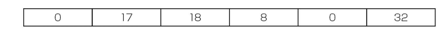
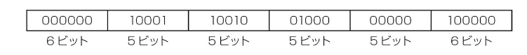
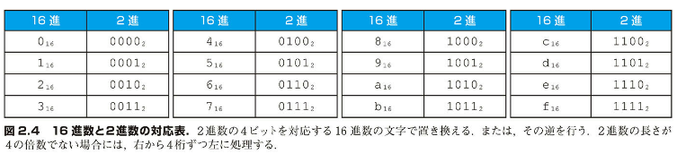
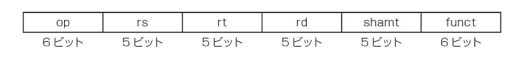
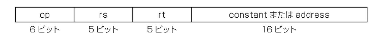
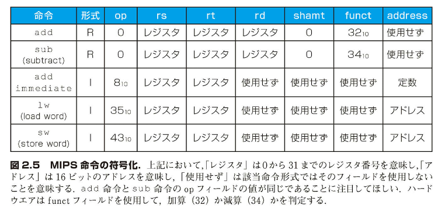
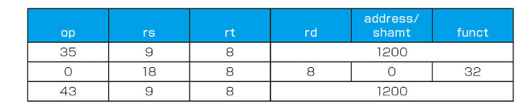
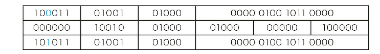
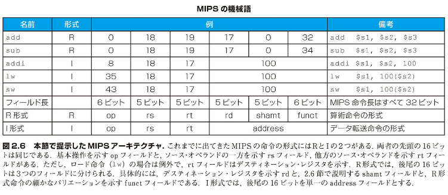
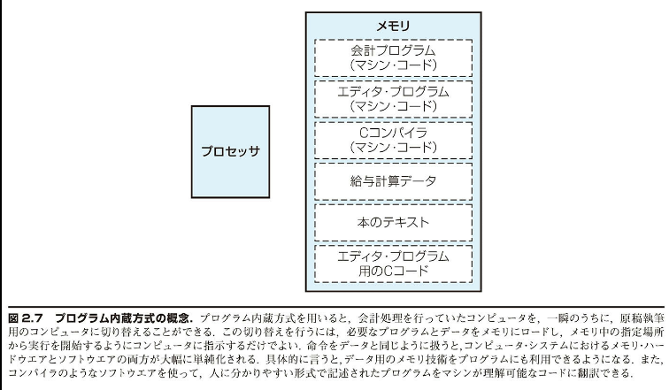

## 2.5 | コンピュータ内での命令の表現

本節では、人がコンピュータに命令する形式とコンピュータが命令を受け取る形式との違いを説明する。コンピュータ内では、命令も高低の電気信号系列で保持されるので、数値として表現することが可能である。実際、命令を構成する 1 つ 1 つの信号は 1 個の数値とみなすことができる。よって、それらの数値を並べたものも命令とみなせる。レジスタはほとんどすべての命令で使用されるので、レジスタ名と番号とを対応させる規約が欲しくなる。MIPS のアセンブリ言語では、レジスタの$s0から$s7 はレジスタ 16 から 23 に対応し、レジスタの$t0から$t7 はレジスタ 8 から 15 に対応する。もっと具体的には、$s0はレジスタ16を意味し、$s1 はレジスタ 17 を意味し、$s2はレジスタ18を意味し、$t0 はレジスタ 8 を意味し、$t1 はレジスタ 9 を意味する、といったぐあいである。32 本あるレジスタの残りの部分に関する規約については、次の節で説明する。

### MIPS アセンブリ言語命令のマシン命令への翻訳

[例 題]
MIPS の言語を 3 つに括弧化する次のステップを、例題として取り上げよう。下記の記号表現の命令があるとする。

```
add $t0, $s1, $s2
```

これを実際の MIPS の言語で表したものを、最初は 10 進数の組み合わせで、ついで 2 進数の組み合わせで示せ。

### [解 答]

10 進数による表現は下記のようになる。



命令のそれぞれの区切られた部分をフィールド(field)と呼ぶ。最初のフィールドと最後のフィールド(上の例では、内容が 0 のフィールドと 32 のフィールド)の 2 つで、これが加算命令であることを表す。2 番目のフィールドは加算の第 1 オペランドのレジスタの番号(17=$s1)を表し、3番目のフィールドは加算の第2オペランドのレジスタの番号(18=$s2)を表す。4 番目のフィールドは和を受け取るレジスタの番号(8=$t0)を表す。5番目のフィールドはこの命令では使用しないので、値が0に設定されている。結局、この命令はレジスタ$s1 の内容をレジスタ$s2の内容に加えて、和をレジスタ$t0 に収めることを意味する。

この命令を 10 進数のフィールドではなく、2 進数のフィールドで表すこともできる。すると、下記のようになる。



命令を表記するこのような枠取りを命令形式(instruction format)と呼ぶ。上記のビット数を数えてみるとわかるとおり、MIPS 命令の長さはちょうど 32 ビットである。つまり、1 命令は 1 語から成る。単純性は規則性につながるという設計原則につっとり、MIPS の命令はすべて長さが 32 ビットとなっている。

命令を数値で表現したものを、アセンブリ言語と区別して、機械語(machine language)と呼び、それらの命令を連ねたものをマシン・コード(machine code)と呼ぶ。

このように命令が機械語で表現されるなら、長くて暗記できない 2 進数を読み書きしなければならないように思えてくる。幸いとして 2 より大きな 2 進数に変換しやすい数値を使用することによって、そのような退屈な作業を避けることができる。ほとんどのコンピュータのデータ・サイズは 4 の倍数なので、16 進数(hexadecimal)が広く使用されている。16 は 2 のべき乗なので、2 進数を 4 ビットごとに区切って 1 文字の 16 進数で置き換えれば簡単に変換できる。図 2.4 に 2 進数と 16 進数の対応表を示す。

本書では見易る桁数を扱っているので、視点を選びずるために 10 進数であることを示すには添字の 10 を、2 進数には添字の 2 を、16 進数には、添字の 16 を使用する(添字がない場合は 10 進数とする)。なお、C と Java では 16 進数を示すのに 0xnnnn という表記法を用いている。



図 2.4 16 進数と 2 進数の対応表。2 進数の 4 ビットを対応する 16 進数の文字で置き換える。または、その逆を行う。2 進数の長さが 4 の倍数でない場合には、右から 4 桁ずつ左から処理する。

### 2 進数から 16 進数へ変換の簡便法

### [例 題]

下記の 16 進数および 2 進数の数値を互いに逆に変換せよ。

```
eca8 6420₁₆
0001 0011 0101 0111 1001 1011 1101 1111₂
```

### [解 答]

図 2.4 の対応表を参照して、下記のように変換する。


逆方向についても、同様である。


### MIPS のフィールド

説明がしやすくなるように、MIPS 命令の各フィールドには名前が付けられている。



各フィールドの意味は下記のとおりである。

■ op : 命令の基本操作。従来から命令操作コード(opcode、オペコード)と呼ばれている。

■ rs : 第 1 のソース・オペランドのレジスタ。

■ rt : 第 2 のソース・オペランドのレジスタ。

■ rd : デスティネーション・オペランドのレジスタ。つまり結果を収める先。

■ shamt : シフト量（シフト命令とこの用語の意味は 2.6 節で説明する。それまではこのフィールドは使用されないので、値は 0 となる）。

■ funct：機能。命令操作フィールドのバリエーションを表す。機能コード(function code)と呼ばれることがある。

上に示したフィールドよりも長いフィールドを必要とする命令があると、問題が発生する。たとえば、lw（ロード）命令には、レジスタを 2 つとアドレスを 1 つ指定しなければならない。もしアドレスの指定に 5 ビットのフィールドのどれかを当てるとすると、lw 命令内の定数は 2⁵ つまり、わずか 32 に限定されてしまう。この定数は配列またはデータ構造から要素を選択するために使用される。要素の数は 32 よりもはるかに大きいことが多い。したがって、5 ビットのフィールドでは小さすぎて役に立たない。

ここで、すべての命令長を同じにしたいという要求と、命令形式を 1 つにとどめたいという要求とが、両立しなくなるという問題が発生する。このことから、ハードウェア設計に関する最後の原則が浮かび上がる。

設計原則 3：優れた設計には適度な妥協が必要である。

MIPS の設計者が選択した妥協策は、すべての命令長を同じに保つことであった。その結果、命令の種類によって命令形式が異なる場合が発生する。上に示した命令形式は R 形式（レジスタ用）または R フォーマットと呼ぶ。これと区別して I 形式または I フォーマットという命令形式がある。I 形式は即値およびデータ転送命令用であり、下記のフィールド形式をとる。



アドレス・フィールドが 16 ビットあるので、lw 命令はベース・レジスタ rs 中のアドレスが ±2¹⁵ すなわち ±32,768 バイト（2¹³ ならば 8192 語）の範囲内の任意の語をロードできる。同様に、即値加算命令の定数も ±2¹⁵ の範囲内に制限される。この命令形式では、レジスタの数を 32 本よりも増やすのは困難だろう。もし増やそうとすると、rs フィールドと rt フィールドのそれぞれでビット数を増やす必要があり、すべてを 1 語に収めることが困難だからである。

先の例題に示したロード命令をもう一度眺めてみよう。

```
lw $t0,32($s3)     # A[8]が一時レジスタ$t0に代入される
```

この場合、$s3を表す19はrsフィールドに入れられ、$t0 を表す 8 は rt フィールドに入れられ、32 は address フィールドに入れられる。この命令に関しては、rt フィールドの意味が変わっていることに注意してほしい。lw 命令においては、rt フィールドは転送されるデータを受け取るデスティネーション・レジスタ(destination register)を表すことになる。

複数の命令形式を示すとハードウェアが複雑になる。しかし、命令形式にある程度の類似性を持たせれば、複雑性を抑えることができる。たとえば、R 形式命令と I 形式命令の最初の 3 つのフィールド名は同じにしてあり、I 形式の 4 番目のフィールドの長さを R 形式の残りの 3 つのフィールドの長さと同じにしてある。

この 2 つの命令形式をどうやって区別するのか、疑問を感じる読者もいることだろう。この 2 つは最初のフィールドの値によって区別される。それぞれの命令形式ごとに、最初のフィールドのとりうる値が決まっている。したがって、ハードウェアは命令の最初のフィールドをもとに、残りのフィールドを固定の 3 つのフィールドとして扱うか（R 形式）、それとも単一のフィールドとして扱うか（I 形式）を判断できる。本節で紹介した MIPS 命令の各フィールドの値を図 2.5 に示す。



図 2.5 MIPS 命令の符号化。上記において、[レジスタ]は 0 から 31 までのレジスタ番号を意味し、[アドレス]は 16 ビットのアドレスを意味し、[使用せず]は該当の命令形式ではそのフィールドを使用しないことを意味する。add 命令と sub 命令の op フィールドの値が同じであることに注目してほしい。ハードウェアは funct フィールドを使用して、加算（32）か減算（34）かを判定する。

### MIPS アセンブリ言語の機械語への翻訳

### 【例 題】

今度は、プログラマが書くステートメントからマシンが実行するコードまでを通して見ることにしよう。$t1には配列Aのベースが保持されており、$s2 が h に相当するとする。下記のステートメントがある。

```
A[300] = h + A[300]
```

このステートメントのコンパイル結果は下記のようになる。

```
lw $t0,1200($t1) # A[300]が一時レジスタ$t0に代入
add $t0,$s2,$t0  # h+A[300]が一時レジスタ$t0 に代入
sw $t0,1200($t1) # h+A[300]を A[300]に戻して格納
```

では、この 3 つの命令に対する MIPS の機械語コードはどうなるであろうか。

### [解 答]

便宜上、まず 10 進数を使用して機械語の命令を表現しよう。配列 A の開始アドレスを与える必要がある。図 2.5 から 3 つの機械語命令を決定できる。



lw 命令の op（最初のフィールド）は 35 である（図 2.5 を参照）。ベース・レジスタ 9（$t1）はrs（2番目のフィールド）に入れられる。デスティネーション・レジスタ8（$t0）は rt（3 番目のフィールド）に入れられる。A[300]（1200 = 300×4）を選択するためのオフセットは address（最後のフィールド）に入れられる。

次の add 命令は op（最初のフィールド）が 0 で funct（最後のフィールド）が 32 である。使用される 3 つのレジスタ（18、8、8）はそれぞれ 2 番目、3 番目、4 番目のフィールドに入れられる。これらはレジスタ$s2、$t0、$t0 に相当する。

sw 命令 op（最初のフィールド）は 43 である。この命令の以降のフィールドは lw 命令と同じである。

1200₁₀ = 0000 0100 1011 0000₂ なので、10 進数を 2 進表現に直すと、下記のようになる。



最初の命令と最後の命令がほとんど同じであることに注目してほしい。違うのは左から 3 番目のビットだけである。

### [ハードウェアとソフトウェアのインタフェース]

すべての命令のサイズを同じに保ちたいという願いと、レジスタの数を可能な限り多くしたいという願いと、相反する。レジスタの数を増やせば、命令フォーマット中のいずれかレジスタ・フィールドも、少なくとも 1 ビット多く必要となる。この制約と、小さければ小さいほど高速であるという設計原則に照らして、今日のほとんどの命令セットは 16 または 32 個の汎用レジスタを備えている。

本節で説明した MIPS の機械語を図 2.6 にまとめる。第 4 章で詳しく検討するが、関連する命令の 2 進表現が似ていると、ハードウェアの設計が単純化される。これらの命令は、MIPS アーキテクチャの規則性を示すもう 1 つの例である。



図 2.6 本節で提示した MIPS アーキテクチャ。これまでに出てきた MIPS の命令の形式には R 形式と I 形式の 2 つがある。両者の先頭の 16 ビットは同じである。基本操作を示す op フィールドと、ソース・オペランドの 1 方を示す rs フィールド、他方のソース・オペランドを示す rt フィールドがある。ただし、ロード命令（lw）の場合は例外で、rt フィールドはデスティネーション・レジスタを示す。R 形式では、後尾の 16 ビットは 3 つのフィールドに分けられる。具体的には、デスティネーション・レジスタを示す rd 2.8 節で説明する shamt フィールド、R 形式命令の細かなバリエーションを示す funct フィールドである。I 形式では、後尾の 16 ビットを単一の address フィールドとする。

### [根本事項]

今日のコンピュータは 2 つの根本原理に基づいて設計されている。

1. 命令は数値として表現される。
2. プログラムをメモリに格納して、数値と同様に読み書きすることができる。

この根本原理からプログラム内蔵（stored-program）方式の概念が生まれた。この方式の発明により、コンピュータの世界に魔法のランプの新ジニーが叩出された。図 2.7 にこの概念を示す。メモリには種々の要素が格納されていることが分かる。具体的には、エディタ・プログラムのソース・コード、それをコンパイルした結果のマシン・コード、コンパイルされたプログラムが使用するテキスト、さらにはコンパイルを行ったコンパイラまでも格納されている。

命令が数値で表されることの 1 つの結果を言えるが、プログラムが 2 進数形式のファイルとして出現されることが多くある。ここのの簡潔的な意味は、既存の命令セットとの互換性があれば、コンピュータは既存のソフトウェアを継承できることである。このような「バイナリ互換性」を求めることは、次世代のセットのアーキテクチャを制限して業界が進歩することにつながる。



### [自己診断]

次の MIPS 命令は何を表すか。下の 4 つの選択肢の中から 1 つを選べ。

| op  | rs  | rt  | rd  | shamt | funct |
| --- | --- | --- | --- | ----- | ----- |
| 0   | 8   | 9   | 10  | 0     | 34    |

1. sub $t0, $t1, $t2

2. add $t2, $t0, $t1

3. sub $t2, $t1, $t0

4. sub $t2, $t0, $t1

ステップバイステップで考えていきましょう：

1. まず、命令形式を確認します：

   - op = 0, funct = 34 は減算(sub)命令を示します
   - これは R 形式の命令です

2. レジスタ番号を確認します：

   - rs = 8 は $t0
   - rt = 9 は $t1
   - rd = 10 は $t2

3. MIPS 減算命令の形式を思い出します：

   - sub rd, rs, rt の形式
   - つまり rd = rs - rt

4. これを当てはめると：

   - $t2 = $t0 - $t1 となります

5. 選択肢と照らし合わせると：
   - 4 番の「sub $t2, $t0, $t1」が正しい答えとなります

したがって、答えは 4 です。

この命令は$t0から$t1 を引いた結果を$t2 に格納する操作を表しています。

ある人の年齢が 10 進数で 40 であるならば、16 進数ではいくつか。

ステップバイステップで解いていきましょう：

1. 40 を 2 進数に変換します：

   - 40 = 32 + 8
   - 40₁₀ = 0010 1000₂

2. 2 進数を 4 ビットずつ区切ります：

   - 0010 1000₂

3. それぞれの 4 ビットを 16 進数に変換します：

   - 0010₂ = 2₁₆
   - 1000₂ = 8₁₆

4. よって：
   - 40₁₀ = 28₁₆

したがって、10 進数の 40 は 16 進数では 28 になります。

命令形式（<<）
2 進数のフィールドで構成された、命令記述のための枠取り

機械語（<<）
コンピュータ・システム内で命令データをやり取りするときに使う 2 進表現

16 進数（<<）
基数を 16 とする数値

命令操作コード（<<）
命令の操作目的と形式を表すフィールド
