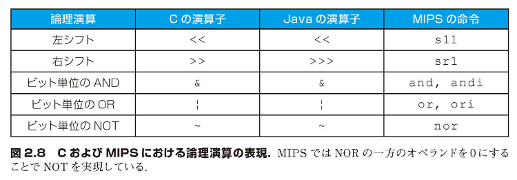
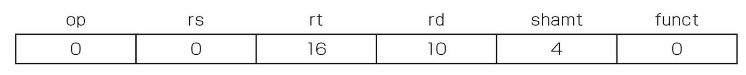

## 2.6 | 論理演算

> 「トワードルカティーヴ城のそういましたしもし本当にそうなのなら、そうなのかもしれない。彼にそうだったとしたらそうなのだのもしれない。でもそうじゃないんだから、そうはならない。これが論理というものさ。」]
>
> ルイス・キャロル『鏡の国のアリス』、1865

初期のコンピュータでは、語は体がもっぱら操作の対象となっていた。しかし、ほどなく、語の内部の数ビットのフィールド、またはさらに細かく個々のビットを操作する必要が認識されてきた。たとえば、語中でもビット形式の文字を検索する操作が例として挙げられる（2.9 節を参照）。やがて、語にビットを詰め込んだり引き出したりする操作を簡単にする命令がプログラミング言語と命令セット・アーキテクチャに追加された。そうした命令操作を論理演算と呼ぶ。下の表は Java における論理演算子と図 2.8 に示す。



図 2.8 C および MIPS における論理演算の表現。MIPS では NOR の一方のオペランドを 0 にすることで NOT を実現している。

そのような操作として、まずシフト（shift）と呼ばれるものを説明しよう。これは語中のすべてのビットを左または右にずらして、空いた部分に 0 を詰める操作である。たとえば、レジスタ$s0 に下記の値が収められているとする。

```
0000 0000 0000 00000 000 0000 0000 0000 10012 = 910
```

これを 4 ビット左にシフトする命令を実行すると、結果は下記のようになる。

```
0000 0000 0000 0000 0000 0000 0000 1001 00002 = 14410
```

左シフトに対して、右シフトもある。MIPS のこれらのシフト命令はそれぞれ、shift left logical (sll) および shift right logical (srl) と名付けられている。上記の操作を行う命令は下記のようになる。ただし、結果をレジスタ$t2 に入れるものとする。

```
sll $t2, $s0, 4    # レジスタ$t2 = レジスタ$s0 << 4 ビット
```

前節では R 形式命令における shamt フィールドの意味の説明を保留した。shamt は shift amount の略であり、シフトする量を表す。したがって、上記の命令を機械語コードで表すと、下記のようになる。



op と funct の両フィールドには 0 に設定され、rd には 10（レジスタ$t2）が設定され、rtには16（レジスタ$s0）が設定され、shamt には 4 が設定されている。rs フィールドは使用されないので、0 に設定されている。

shift left logical にはその他にも利点がある。1 ビット左にシフトすると、2 を掛けたのと同じ効果が得られる。10 進数を 1 桁左にシフトすると、10 を掛けることになるのと同じである。たとえば、上の sll では 4 ビット左にシフトしたので、24 すなわち 16 を掛けたのと同じ効果が得られる。上記の最初のビット・パターンは 9 を表しているので、9×16 ＝ 144 であり、結果は 2 番目のビット・パターンの値に等しい。

ビットに対する別の操作に AND（論理積）がある。AND は 2 つの操作対象ビットがともに 1 である場合に結果を 1 とし、そうでない場合には結果を 0 とする操作である。たとえば、レジスタ$t2 には下記の値が保持されているとする。

```
0000 0000 0000 0000 0000 1101 1100 00002
```

また、レジスタ$t1 には下記の値が保持されているとする。

```
0000 0000 0000 0000 0011 1100 0000 00002
```

以上に対して、次の MIPS 命令を実行する。

```
and $t0, $t1, $t2 # レジスタ$t0 = レジスタ$t1 & レジスタ$t2
```

すると、レジスタ$t0 に収められる結果は下記のようになる。

```
0000 0000 0000 0000 0000 1100 0000 00002
```

上記の結果から分かるように、AND を使用して 1 組のビット列にあるビット・パターンを適用し、ビット・パターンの中に 0 がある場合に、結果の対応ビットを強制的に 0 に設定できる。そのようなビット・パターンと AND の組み合わせを従来はマスク（mask）と呼んでいた。そのいわれは、マスクは特定のビットを「隠す」からである。

AND に対し、結果のビットを強制的に 1 に設定できるのが OR（論理和）という操作である。この命令は 2 つの操作対象のビットのどちらかが 1 である場合に結果を 1 とする。たとえば、レジスタ$t1と$t2 の内容が上記のままであるとする。それに対して、下記の MIPS 命令を実行してみる。

```
or $t0, $t1, $t2 # レジスタ$t0=レジスタ$t1｜レジスタ$t2
```

すると、レジスタ$t0 に収められる結果は下記のようになる。

```
0000 0000 0000 0000 0011 1101 1100 00002
```

最後の論理演算は NOT（論理否定）を求めるものである。NOT は 1 つのオペランドをとり、オペランドのあるビットが 0 なら結果の対応するビットを 1 とし、逆に 1 なら 0 とする。2 オペランド形式に合わせるために、MIPS の設計者は NOT の代わりに NOR（NOT OR）という命令を採用した。そのオペランドの 1 つが 0 であれば、NOR は NOT と等しくなる。つまり、A NOR 0 = NOT (A OR 0) = NOT(A)となる。

上の例のレジスタ$t1の値がまだ変わっておらず、レジスタ$t3 の値が 0 であるならば、次の MIPS 命令を実行すると、

```
nor $t0, $t1, $t3 # reg $t0 = ~(reg $t1|reg $t3)
```

結果として、レジスタ$t0 の値は下記のようになる。

```
1111 1111 1111 1111 1100 0011 1111 11112
```

C と Java の演算子の関係は図 2.8 に示したとおりである。算術演算の場合と同様に、論理演算 AND と OR においても定数の使用は多い。そこで、MIPS では、and immediate（andi）命令および or immediate（ori）命令を用意している。NOR に関しては定数を使用することは滅多にない。NOR の主な用途は単一のオペランドのビットを反転することだからである。したがって、その即値版は用意されていない。

補足：MIPS の命令セット全体の中には、XOR（排他的論理和）が含まれている。これは、対応する 2 つのビットが異なるときは結果を 1 とし、両者が同じときは 0 とするものである。C では、直の中に複数のビット・フィールド（field）もしくはロフィールド（field）を定義できる。これによって、1 語内に複数のオブジェクトを詰め込んだり、入出力装置のような外部的な素性を有するインタフェースの適合をとったりすることができる。すべてのフィールドは 1 語内に収まらなければならない。フィールドは符号なしの整数であり、最高の長さは 1 ビットである。C コンパイラは、MIPS の論理命令の and, or, sll, srl を使用して、フィールドを挿入したり抽出したりする。

補足：即値版の論理 AND および論理 OR は、上位 16 ビットに 0 を詰めて、32 ビットの定数を形成する。符号拡張を行う即値加算とは異なる。

### [自己診断]

語内のフィールドを切り出すことができるのは、次のどの演算操作か。

1. AND

2. 左へシフトし、続いて右にシフトする

では、この自己診断問題の解説をしていきましょう。

正解は **1. AND** です。

解説:

1. AND を使用する方法:

- AND はマスク操作として使用できます
- 抽出したいビットの位置に 1 を、それ以外の位置に 0 を持つマスクを用意します
- 元の値とマスクを AND 演算することで、必要なフィールドだけを残し、他のビットを 0 にできます

例:

```
元の値:      0000 1111 0000 1111
マスク:      0000 1111 0000 0000
AND結果:     0000 1111 0000 0000
```

2. シフト操作の問題点:

- 左シフトして右シフトする方法では、元のビット位置の情報が失われる可能性があります
- シフト操作は値を移動させるだけで、特定のフィールドを正確に抽出するには追加の操作が必要です
- 複数のフィールドが存在する場合、シフト操作だけでは必要なフィールドを分離するのが困難です

したがって、フィールドの抽出には AND 操作を使用する方が適切で効率的です。これは実際のプログラミングでもよく使用される手法です。

AND (<<)
ビット単位の論理演算の一種であり、2 つのオペランドをとって、両方の演算対象ビットが 1 である場合にのみ、結果を 1 とする。

OR (<<)
ビット単位の論理演算の一種であり、2 つのオペランドをとって、どちらか一方の演算対象ビットが 1 である場合に、結果を 1 とする。

NOT (<<)
ビット単位の論理演算の一種であり、1 つのオペランドをとって、そのビットを反転する。つまり、値が 1 であるビットを全べて 0 に変え、値が 0 であるビットを全べて 1 に変える。

NOR (<<)
ビット単位の論理演算の一種であり、2 つのオペランドをとって、それらの OR の NOT を計算する。すなわち、両方の演算対象ビットが 0 である場合にのみ、結果を 1 とする。
