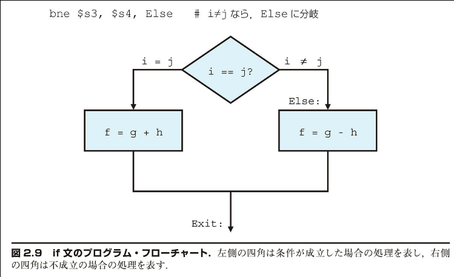

## 2.7 | 条件判定用の命令

> 「自動的な計算機の真価は、命令系列を繰り返し実行できること、しかもその繰り返し回数を計算結果に基づいて決められることにある。……判定は、数値の符号(マシンでの取り扱いは、ゼロを正とみなす)に基づいて行うようにすればよい。この意味は、条件命令を導入するということである。これによって、指定した数値の符号に応じて、スケジュールが適切な方を選んで実行させることが可能になる」
>
> Burks, Goldstine, and von Neumann, 1946

コンピュータが代える電卓とは異なる点の 1 つに、条件判定能力を持つことが挙げられる。入力データと計算によって得られた値に基づいて、別の命令を実行させることができる。一般に、プログラミング言語においては、条件を表すために if 文を使用する。それに加えて、必要に応して、goto 文とラベルを使用する。MIPS のアセンブリ言語には、条件判定用の命令が 2 つ用意されている。それらは goto の代替する if 文に使う。1 つ目の命令を下に示す：

```
beq  register1, register2, L1
```

この命令は、レジスタ 1 の値がレジスタ 2 の値と等しいときに、L1 というラベルの付いたステートメントにプログラム実行(制御)の流れを分岐させる。この命令名は branch if equal を略したものである。2 つ目の命令を下に示す：

```
bne  register1, register2, L1
```

この命令は、レジスタ 1 の値がレジスタ 2 の値と等しくないときに、L1 というラベルの付いたステートメントに制御の流れを分岐させる。この命令名は branch if not equal を略したものである。この 2 つのような命令を条件分岐 (conditional branch) 命令と呼ぶ。

### if-then-else 文の条件分岐へのコンパイル

【例 題】
下記のコードにおいて、f, g, h, i, j は変数である。5 つの変数を $s0 から $s4 の 5 つのレジスタに割り付けるとして、このコードをコンパイルした結果の MIPS コードを示せ。

```
if (i == j) f = g + h; else f = g - h;
```

【解 答】
この MIPS コードで何を行うべきかを示すフローチャートを図 2.9 に示す。最初の式では、等しいかどうかの比較が行われている。したがって、2 つのレジスタの値が等しいときに分岐する (beq) 命令を適用できそうだが、一般には条件を逆にチェックしたほうがコードの効率が高くなる。つまり、if 文のすぐ後の then の部分を実行するコードを飛び越すように分岐するのである(ラベル Else は後で定義する)。この場合、2 つのレジスタの値が等しくないときに分岐する (bne) 命令を使用する。そのアセンブリ・コードは次のようになる。



次の代入文は単一の演算を行う。すべてのオペランドがレジスタに割り付けられていれば、次の 1 つの命令で処理できる。

```
add $s0, $s1, $s2 # f=g+h (i≠j ならスキップ)
```

これには if 文の最後まで飛ぶ必要がある。そのためには別の種類の分岐を導入する必要がある。それを無条件分岐 (unconditional branch) と呼ぶことがある。

この命令はプロセッサに必ず分岐を行わせる。条件分岐と無条件分岐を区別するために、MIPS では無条件分岐命令をジャンプと名付け、j と略す（ラベル Exit は後で定義する）。

```
j Exit # Exit へジャンプ
```

if 文の else 部分にある代入文を単一の命令にコンパイルできる。ただ、その命令にラベル Else を付け加える必要がある。また、その命令の後に Exit というラベルを付けて、コンパイルの済んだ if-then-else コードの終了を示す必要がある。

```
Else: sub $s0,$s1,$s2  # f=g-h (i=jならスキップ)
Exit:
```

アセンブラはこのようにラベルを使用することにより、コンパイラやアセンブリ言語プログラマが、分岐先アドレスの計算にわずらわされずに済むようにしている。ロードおよびストアの際にアセンブラがアドレス算出を行っているのも同様の趣旨である（2.12 節を参照）。

### 【ハードウェアとソフトウェアのインターフェース】

コンパイラは、元のコード中にない分岐を生成したり、ラベル付けを行ったりすることがよくある。ラベルや分岐を明示的に書く必要がないことが、高水準プログラミング言語でプログラムを記述する利点の 1 つであり、コーディング時間が短縮される理由の 1 つである。

### ループ

条件判定は 2 つの局面で重要な役割を果たす。1 つは、if 文について、2 つの処理の流れのどちらかを選択する場合である。もう 1 つは、ループにおいて繰り返しを制御する場合である。どちらの場合でも、同じアセンブラ命令を用いて制御を行う。

### C の while ループのコンパイル

【例 題】
C 言語ではループは通常、下記のように形をしている：

```
while (save[i] == k)
    i += 1;
```

i と k はレジスタ$s3と$s5 にそれぞれ割付けられており、配列 save のベースは$s0 に収められているとする。上記の C コードをコンパイルした結果のアセンブリ・コードはどうなるか。

### 【解 答】

最初のステップでは、save[i]を一時レジスタにロードする。ただし、その前にアドレスを知る必要がある。配列 save のベースに i を加算してアドレスを得る前に、インデックス i に 4 を掛けなければならない。アドレスはバイト単位で付けられているからである。ここではやはり、論理左シフト命令を使用できる。2 ビットだけシフトすることが 4 倍することに相当するからである（前節を参照）。また、Loop その命令をラベル Loop を定用する必要がある。ループの最後で分岐して、そこに戻れるようにするためである。

```
Loop: sll $t1,$s3,2    # 4*iを一時レジスタ $t1に代入
```

save[i]のアドレスを得るために、$s0 中の save のベース・アドレスに $t1 を加算する必要がある。

```
add $t1,$t1,$s6    # save[i]のアドレスを一時レジスタ
                   # $t1に代入
```

これで、得られたアドレスを使用して、save[i]を一時レジスタにロードできる。

```
lw $t0,0($t1)      # save[i]を一時レジスタ $t0に代入
```

次の命令では、ループの終了判定を行い、save[i] ≠ k であれば、出口に飛ぶ。

```
bne $t0,$s5,Exit   # save[i] ≠ kなら、Exitへ
```

次の命令では、i に 1 を加算する。

```
addi $s3,$s3,1     # i = i + 1
```

このループの末尾では、ループの先頭にある while の判定に分岐して戻る。その後に Exit ラベルを追加すれば、作業は完了である。

```
j    Loop          # Loopへジャンプする
Exit:
```

(このコーディングの最適化に関しては、演習問題を参照)

### 【ハードウェアとソフトウェアのインターフェース】

末尾に分岐がある命令はコンパイルするうえで重要なので、基本ブロック（basic block）という呼び名を与えられている。それはブロック中には分岐も分岐先もない一続きの命令であるが、末尾に分岐があることと冒頭にラベルがあることは許される。コンパイルの最初の段階の作業の 1 つはプログラムを基本ブロックに分解することである。

条件判定は、等しいか等しくないかのチェックが最も一般的である。しかし、ある変数の値が他の変数よりも大きいか小さいかを判定する処理も有用だろう。たとえば、for ループにおいては、インデックス変数の値が 0 よりも小さくないかをチェックする。MIPS アセンブリ言語には、そのような比較を行うための命令が用意されている。この命令は、2 つのレジスタを比較して、第 1 のレジスタの値が第 2 のレジスタの値よりも小さいときに、第 3 のレジスタに 1 を設定し、そうでないときには 0 を設定する。この命令を set on less than 命令と呼び、slt と略す。たとえば、下記の命令は $s3 の値が $s4 の値より小さい場合に $s0 を 1 に、そうでなければ 0 に設定する。

```
slt $t0,$s3,$s4    # $s3が$s4よりも小さい場合、$t0を1に設定
```

比較の際に定数のオペランドを使うことがよくある。そのために、set on less than 命令の即値版が用意されている。レジスタ $s2 が定数 10 よりも小さいことを判定するためには、下記のようにコーディングすればよい。

```
slti $t0,$s2,10    # $s2が10よりも小さい場合、$t0を1に設定
```

### 【ハードウェアとソフトウェアのインターフェース】

MIPS のコンパイラは、slt, slti, beq, bne の各命令、およびレジスタ $zero を読むことによって常に得られる固定値 0 を使用して、すべての相対条件判定ルーチンを生成する。具体的な相対条件には、「等しい」「等しくない」「より小」「以下」「より大」「以上」がある。

単純性を保つべしとの von Neumann の助言に従い、MIPS アーキテクチャでは branch on less than 命令を組み込んでいない。理由は、この命令はまわりで単純で、クロック・サイクル時間を延ばすか、または命令当たりのクロック・サイクル数を増やすように作用するからである。それよりは、もっと速度の遅い 2 つの命令を組み合わせて使用した方が有効である。

### 【ハードウェアとソフトウェアのインターフェース】

比較命令は符号付きと符号なしの 2 通りの数値に対応しなければならない。整数の場合には、最上位ビットが 1 であれば、それは負の数であり、当然のことながら、最上位ビットが 0 である正の数よりも小さい。一方、符号なし整数の場合には、最上位ビットが 1 である数値は最上位ビットが 0 であるいかなる数値よりも大きい（次ページ後半では、最上位ビットのこの 2 重の意味を利用して、配列境界のチェックのコストの削減を図る）。

この状況に対応するために、MIPS では set-on-less-than 比較命令を別々に用意している。符号付き整数用には、set on less than (slt) 命令および set on less than immediate (slti) 命令が用意されている。符号なし整数用には、set on less than unsigned (sltu) 命令および set on less than immediate unsigned(sltiu) 命令が用意されている。

### 符号付きの比較と符号なしの比較

【例 題】
レジスタ $s0 に下記の 2 進値が収められている。

```
1111 1111 1111 1111 1111 1111 1111 11112
```

また、レジスタ $s1 に下記の 2 進値が収められている。

```
0000 0000 0000 0000 0000 0000 0000 00012
```

下記の 2 つの命令を実行すると、レジスタ $t0 と $t1 の値はどうなるか。

```
slt  $t0, $s0, $s1    # 符号付きの比較
sltu $t1, $s0, $s1    # 符号なしの比較
```

### 【解 答】

レジスタ $s0 中のデータの値は、整数の場合は -110 であり、符号なし整数の場合は 4,294,967,29510 である。レジスタ $s1 中のデータの値はどちらの場合でも 110 である。-110 < 110 なので、レジスタ $t0 の値は 1 となる。4,294,967,29510 > 110 なので、レジスタ $t1 の値は 0 となる。

符号付き数値を符号がないかのように扱うことは、0 ≤ x < y であるか否かをチェックするコストを削減する手段となる。これは配列のインデックスが境界から逸脱していないことをチェックするのに使用できる。ここで問となるのは、2 の補数表記の負の整数は符号なし表記の大きな数値のように見えることである。つまり、2 の補数表記では最上位ビットは符号ビットであるが、符号なし表記では最上位ビットは数値の上位桁を表す。したがって、x の符号なし比較は、x が y よりも小さいかどうかをチェックすることも兼ねるのである。したがって、x が負であるかどうかをチェックすることも含む。

### 境界チェックの簡便法

【例 題】
上で述べた簡便法を利用して、$s1 ≥ $s2 であるかまたは $s1 が負である場合に IndexOutOfBounds に分岐するインデックス境界違反のチェックのコストを削減せよ。

【解 答】
下記のように sltu を使用して、両方の境界をチェックする。

```
sltu $t0, $s1, $t2  # $s1>=$t2または$s1<0なら$t0に0を設定
beq  $t0, $zero, IndexOutOfBounds  # 範囲外ならエラー処理に分岐
```

### case 文／switch 文

たいていのプログラミング言語には、case 文または switch 文が用意されている。これは、1 つの変数の値に基づいて、いくつかの場合（ケース）の処理の中から 1 つを選択するものである。こうしたスイッチを実現する最も簡単な方法は、if-then-else 構文をいくつもつなげた形での条件判定である。

もう 1 つの方法は、それぞれの場合の処理のアドレスをテーブル（表）にして、その中どれとどこかをポインデックスに応じて、該当処理へジャンプさせるやり方がある。このジャンプ・アドレス・テーブル（jump address table）ないしジャンプ・テーブル（jump table）は、コード中のラベルに対応するアドレスを表す語の配列であるにすぎない。プログラムはジャンプ・アドレス・テーブルから該当するアドレスをレジスタにロードし、それからレジスタ中のアドレスを使用してジャンプする。このような手法をサポートするために、MIPS ではジャンプ・レジスタ命令（jump register：jr と表記）を用意している。これはレジスタ中に指定されているアドレスに無条件にジャンプする命令である。jr のさらに一般的な使い方を、次節で見る。

### 【ハードウェアとソフトウェアのインターフェース】

C や Java のようなプログラミング言語には、条件判定やループのための文（ステートメント）がたくさんあるが、それらを次の下位レベルで実現するための基礎となる文は、条件分岐である。

補足：遅延分岐という言葉を耳にしたことがある読者もいるだろう。それについては、第 4 章で説明する。MIPS のアセンブラでは、プログラマには遅延分岐が見えないようにしている。

### 【自己診断】

I. C 言語には条件判定やループのための文（ステートメント）がたくさんあるが、MIPS には少ししかない。下記の各記述はこの方針の適用になるかならないか、また、その理由も述べよ。

1. 条件判定文が多いと、コードを読みやすく理解しやすくなる。
2. 条件判定文が少ないと、実行を受け持つ下位の層でのタスクが単純化される。
3. 条件判定文が多いと、ステップ数が少なくて済み、一般にコーディング時間の短縮につながる。
4. 条件判定文が多いと、ステップ数が少なくて済み、一般に実行する命令数が少なくなる結果を生む。

II. C 言語には AND の演算子が 2 つ（& と &&）あり、OR の演算子も 2 つ（| と ||）あるのに対して、MIPS ではそうなっていないのはなぜか。

1. 論理演算子の AND と OR がそれぞれ&と|を実現するのに対して、条件の終が&&と||を実現する。
2. 上記の記述は逆である。&&と||が論理演算子に対応し、&と|が条件分岐に対応する。
3. &&と||は冗長なもので、&や|と同じことを意味する。それらは C プログラミング言語の前身である B から継承されただけである。

【解答】

I.

1. 適用外。条件判定文が多いとコードは読みやすくなるが、これはハードウェアの複雑さとトレードオフの関係にある。高級言語では可読性のために多くの条件文を提供するが、MIPS のような低レベル言語では単純性を重視する。

2. 適用。これはまさに MIPS の設計哲学を表している。少数の基本的な条件分岐命令だけを提供することで、ハードウェアの実装が単純化され、性能の向上につながる。

3. 適用外。高級言語での条件判定文の多さは確かにプログラミングを容易にするが、これは MIPS の設計目標（ハードウェアの単純化）とは異なる。

4. 適用外。条件判定文が多いことは必ずしも実行命令数の削減にはつながらない。むしろ、各条件文は基本的な MIPS 命令の組み合わせに変換される必要がある。

II.
正解は 1。その理由：

- 論理演算子(&, |)はビット単位の演算を行い、これらは MIPS の基本的な論理演算命令（AND, OR）で直接実現できる。

- 条件演算子(&&, ||)は短絡評価（左辺の結果によって右辺の評価をスキップする）を行う制御フローの機能で、これは MIPS の条件分岐命令を使って実現される。

- MIPS ではこれらの機能を基本的な論理演算命令と条件分岐命令の組み合わせで実現できるため、別々の専用命令を用意する必要がない。

2 と 3 は誤り。&&と||は&と|とは異なる機能を持ち、また、これらは単なる歴史的な遺物ではなく、それぞれ異なる用途に必要な機能である。

条件分岐（<<）
命令のタイプの 1 つで、2 つの値を比較し、その結果に基づいてプログラム中のどのアドレスに移すかを決定するもの。

基本ブロック（<<）
途中に分岐も分岐ラベルもない命令系列。ただし、末尾に分岐があり、先頭に分岐ラベルが付けられていることは可能。

ジャンプ・アドレス・テーブル（<<）
「ジャンプ・テーブル」ともいう。分岐先候補となっている命令のアドレスを収めた表。
