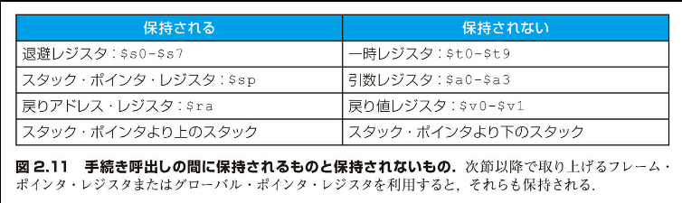
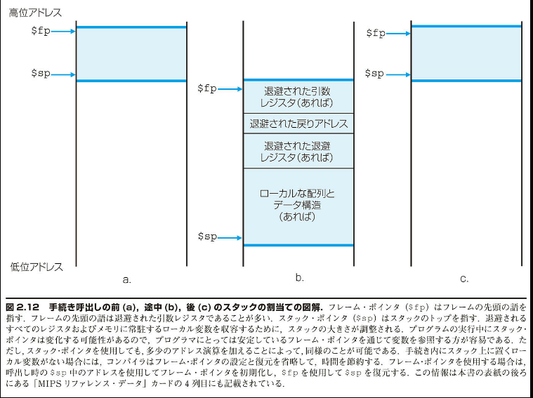
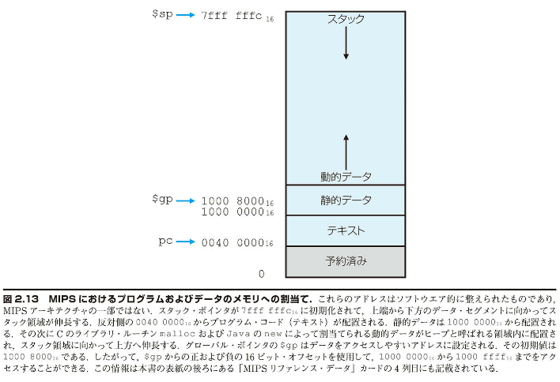
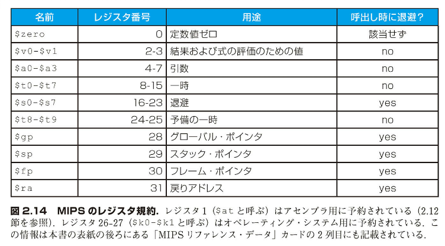
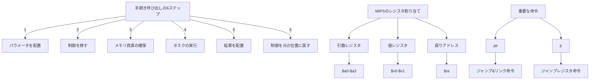
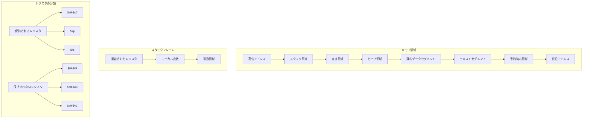

## 2.8 コンピュータ・ハードウェア内での手続きのサポート

手続き（procedure）ないし関数は、プログラムを構成する 1 つの方法である。こうした方法をとることによって、プログラムが分かりやすくなり、コードの再利用が可能となる。手続きを使用すると、プログラマはタスクの一部分だけに専念することができる。その際、パラメータが手続きとプログラムの残りの部分およびデータとのインタフェースの役割を果たす。また、パラメータは、プログラムを通して値を受け渡し、結果を返す働きをする。Java においての手続きに相当するものについては、図 2.15 節で説明する。いずれにせよ、C がコンピュータから受け取る必要があるすべての事柄を Java も必要とする。手続きは、ソフトウェアにおいて抽象化を実現する、1 つの方法である。

手続きはスパイのようなものとみなすことができる。スパイは秘密裏に計画を立て、情報を入手し、仕事を遂行し、自分の足跡を消し、要求された結果を手に元の場所に戻ってくる。使命を達した後には何の痕跡も残してはならない。さらに、スパイは「知る必要」のみに基づいて活動する。スパイは自分の届く主に関して理解をすることはできない。

それと同様に、手続きを実行する際には、プログラムは下記の 6 つの手順を踏まなければならない：

1. 手続きからアクセスできる場所にパラメータを置く。

2. 手続きに制御を移す。

3. 手続きに必要なメモリ資源を入手する。

4. 必要なタスクを実行する。

5. 呼出し元のプログラムからアクセスできる場所に結果を置く。

6. 制御を元の位置に戻す。手続きはプログラム内のいろいろな場所から呼出される可能性があるからである。

先に述べたように、コンピュータ内にデータを保持する場所としては、レジスタが最高速である。したがって、可能なかぎりレジスタを使用するようにしたい。そこで、MIPS では、手続き呼出しのために、32 本のレジスタのうちから下記のものを割当てている：

■ $a0-$a3: 4 本の引数レジスタ。パラメータを渡すために使用。

■ $v0-$v1: 2 本の値レジスタ。結果の値を返すために使用。

■ $ra: 1 本の戻りアドレス・レジスタ。制御を元に戻すために使用。

上記のレジスタを割当てることに加えて、MIPS のアセンブリ言語には手続き専用の命令が 1 つ用意されている。それは、手続きのアドレスにジャンプすると同時に、次の命令のアドレスをレジスタ $ra に退避する命令である。これをジャンプ＆リンク命令（jump-and-link）と呼び、jal と表記する。この命令は単に下記のように書く。

```
    jal [手続きのアドレス]
```

この命令の一部にリンクという言葉が組み込まれているのは、呼出した手続きから呼出し元に戻る「リンク」が形成されていることを意味する。具体的には、レジスタ $ra（レジスタ 31）に戻りアドレス（return address）が設定されていることを指す。戻りアドレスが必要な理由は、プログラム内のいくつもの場所から同じ手続きが呼出される場合があるからである。

そのような状況に対応するために、MIPS のようなコンピュータでは、上記の case 文のために導入されたジャンプ・レジスタ命令（jump register : jr）を使用する。この命令の働きは、レジスタ中に指定されているアドレスに無条件にジャンプすることである。

```
    jr $ra
```

この命令は、レジスタ $ra に記録されているアドレスにジャンプする。手続き呼出し点に戻るためには、最適の命令である。このように呼出し側（caller）のプログラムは、パラメータ値をレジスタ $a0-$a3 に収め、jal x を使用して手続き x（被呼出し側（callee）とも呼ばれる）にジャンプする。すると、被呼出し側は計算を実行し、結果をレジスタ $v0-$v1 に収め、jr $ra を使用して制御を呼出し側に戻す。

プログラム内競方点のプログラムでは、現在実行中の命令のアドレスを保持するレジスタが必要となる。歴史的ないきさつ上、このレジスタはプログラム・カウンタ（program counter）、略して PC と呼ばれることが多い。しかし、命令アドレス・レジスタ（instruction address register）と呼んだ方が意味がよく伝わるかもしれない。MIPS では、慣例に従い、このレジスタを PC と呼んでいる。jal 命令は、PC+4 をレジスタ $ra に退避して、次の命令とのリンクをとり、手続きから戻る準備をする。

### もっと多くのレジスタを使用する場合

手続きのためにコンパイラが必要とする引数用のレジスタが 4 つを超え、戻り値用のレジスタが 2 つを超える場合を考えよう。使命を完了した後は、痕跡を残さないようにすることになっている。したがって、呼出し側が使用したレジスタを、手続きが呼出される前の値に復元しなければならない。これは「ハードウェアとソフトウェアのインタフェース」の項で述べた、メモリにレジスタをスピル・アウトする必要があるケースの例である。

レジスタをスピル・アウトするための理想的なデータ構造はスタック（stack）である。スタックとは後入れ先出しの待ち行列である。スタックでは、一番最後に割当てられたスタック中のアドレスに対するポインタを必要とする。これは、次にスピル・アウトするレジスタをどこに入れるべきかを手続きに示すため、あるいは前のレジスタの値がどこにあるかを示すためである。レジスタが退避または復元されるたびに、スタック・ポインタ（stack pointer）の値は 1 語分増減される。MIPS では、スタック・ポインタ用にレジスタ 29 を予約しており、$sp という分かりやすい名前を付けている。スタックは昔から非常によく使用されていて、その操作には独特の用語が用いられている。具体的には、スタックにデータを入れることをプッシュ（push）すると言い、スタックからデータを取り出すことをポップ（pop）すると言う。

歴史的ないきさつがあって、スタックは高いアドレスから低いアドレスに向かって伸びる。これは、スタックにデータをプッシュするとは、スタック・ポインタから減算することを意味する。スタック・ポインタに加算するとスタックが縮み、データをポップすることになる。

他の手続きを呼出さない手続きのコンパイル

【例 題】
2.2 節の「C の複雑な代入文の MIPS へのコンパイル」の例題を C の手続きに変えよう。

```
    int leaf_example (int g, int h, int i, int j)
    {
        int f;

        f = (g + h) - (i + j);
        return f;
    }
```

この手続きをコンパイルした結果の MIPS のアセンブリ・コードはどうなるか。

【解 答】
パラメータ変数の g、h、i、j は引数レジスタの$a0、$a1、$a2、$a3 に相当し、f は$s0 に相当する。コンパイルされたプログラムの先頭には手続きのラベルがくる。

```
    leaf_example:
```

次のステップは、手続きによって使用されるレジスタを退避することである。手続き全体中の C の代入文は 2.2 節の例題と同じてある。そこでは一時レジスタが 2 つ使用されている。したがって、3 つのレジスタ $s0、$t0、$t1 を退避する必要がある。スタック上で 3 語分（12 バイト）のスペースをとり、それらも古い値を退避、つまりプッシュする。

```mips
addi $sp, $sp, -12    # スタックに3語分のスペースをとる
sw   $t1, 8($sp)      # レジスタ $t1を後の使用に備えて退避
sw   $t0, 4($sp)      # レジスタ $t0を後の使用に備えて退避
sw   $s0, 0($sp)      # レジスタ $s0を後の使用に備えて退避
```

手続きの呼出し前、呼出し中、呼出し後のスタックを図 2.10 に示す。次の 3 つのステートメントは手続き本体に相当し、2.2 節の例題になって下記のようになる。

```mips
add  $t0, $a0, $a1    # g+hがレジスタ $t0に代入される
add  $t1, $a2, $a3    # i+jがレジスタ $t1に代入される
sub  $s0, $t0, $t1    # f=$t0-$t1 つまり f=(g+h)-(i+j)
```

f の値を返すために、それを戻り値レジスタにコピーする。

```mips
add  $v0, $s0, $zero  # f を返す ($v0 = $s0 + 0)
```

呼出し元に制御を戻す前に、退避しておいた 3 つのレジスタの古い値を復元し、スタックをポップする。

```mips
lw   $s0, 0($sp)      # 呼出し側のためにレジスタ $s0を復元
lw   $t0, 4($sp)      # 呼出し側のためにレジスタ $t0を復元
lw   $t1, 8($sp)      # 呼出し側のためにレジスタ $t1を復元
addi $sp, $sp, 12     # スタックから3語分のスペースを除く
```

戻りアドレスを用いてジャンプ・レジスタ命令を実行して、この手続きを終える。

```mips
jr   $ra              # 呼出し元のルーチンにジャンプして戻る
```

上の例題では、一時レジスタを使用し、その古い値を退避および復元しなければならないものと想定した。しかし、一時レジスタの中には使用されていないものもある。そのような一時レジスタを退避および復元せずに済むよう、MIPS のソフトウェアでは 18 本のレジスタを下記の 2 つのグループに分けている。

■ $t0-$t9: この 10 本のレジスタは、手続き呼出しの際に被呼出し側で保存しない

■ $s0-$s7: この 8 本のレジスタは、手続き呼出しの際に保存されなければならない（使用する場合、被呼出し側で退避および復元する）

この簡単な規約によって、レジスタのスピル・アウトが制限される。上の例では、呼出し側ではレジスタ $t0 と $t1 が手続き呼出しの間を通じて保存されることを期待していないので、対応する2つのストア命令とロード命令をコードから除外できる。しかし、$s0 については、退避および復元しなければならない。呼出し元がその値を必要とすると想定されるからである。

### 入れ子にされた手続き

他の手続きを呼び出さない手続きをリーフ（leaf）手続きと呼ぶ。すべての手続きがリーフ手続きであったならば、話は簡単である。しかし、実際はそうではない。あるスパイが使命を遂行する過程で別のスパイを雇うこともある。その雇われたスパイがさらに別のスパイを雇うこともある。同様に、手続きが他の手続きを呼び出すこともある。さらに、再帰型の手続きは自分自身の「クローン」を呼出す。手続き内でレジスタを使用するときは注意が必要であるが、リーフでない手続きを呼び出すときは、さらにいくつかの注意が必要である。

たとえば、メイン・プログラムから、jal A を使用して、手続き A を呼び出すとする。その際に、レジスタ $a0 に引数の値3が入れられるとする。続いて、手続きAから、jal B を使用して、手続きBを呼び出すとする。その際にも、レジスタ $a0 に引数の値7が入れられるとする。手続きAはまだタスクを完了していないので、レジスタ $a0 の使用に関してこの2つの手続き間で競合が発生する。同様に、レジスタ $ra 中の戻りアドレスについても、競合が発生する。なぜならば、手続きBを呼び出すと、$ra には B からの戻りアドレスが設定されるからである。この問題の発生を防ぐ手だてを講じないと、手続き A はその呼出し元に制御を戻せなくなってしまう。

1 つの解決策は、上の例題で行ったように、保存されるべき値のすべてのレジスタをスタック上にプッシュすることである。呼出し側は、呼出し後にも必要となる引数レジスタ（$a0-$a3）および一時レジスタ（$t0-$t9）があれば、それらをプッシュする。被呼出し側は、戻りアドレス・レジスタの $ra および被呼出し側で使用する退避レジスタ（$s0-$s7）をプッシュする。スタック・ポインタの $sp も、スタック中に記かれるレジスタを記録できるように調整する。手続きから戻るときに、レジスタをメモリから復元し、スタック・ポインタを再調整する。

### 入れ子状にリンクされた、再帰型手続きのコンパイル

【例 題】
階乗を計算する再帰的手続きを取り上げよう。

```c
int fact (int n)
{
    if (n < 1) rerutn (1);
        else return (n * fact (n-1));
}
```

この手続きをコンパイルした結果の MIPS のアセンブリ・コードはどうなるか。

【解 答】
パラメータ変数の n は引数レジスタ $a0 に相当する。コンパイル済みのプログラムでは、最初に手続きのラベルを示し、それから戻りアドレスと $a0 の 2 つのレジスタをスタックに退避する。

```mips
fact:
    addi $sp,$sp,-8    # スタック上に2語分スペースをとる
    sw   $ra,4($sp)    # 戻りアドレスを退避する
    sw   $a0,0($sp)    # 引数nを退避する
```

fact が最初に呼び出されるときに、sw によって、fact を呼び出したプログラム中のアドレスが退避される。次の 2 つの命令は n が 1 よりも小さいかどうかをチェックし、n が 1 以上であれば L1 に分岐する。

```mips
slti $t0,$a0,1       # n < 1であるかどうかをチェック
beq  $t0,$zero,L1   # n ≥ 1であれば、L1に分岐
```

n が 1 未満である場合、fact は 1 を返す。そのためには、値レジスタに 1 を入れる。具体的には、1 を 0 に加算して、その和を$v0 に代入する。それから、退避されている 2 つの値をポップし、戻りアドレスにジャンプする。

```mips
addi $v0,$zero,1     # 1を返す
addi $sp,$sp,8       # スタックから2語分スペースを落とす
jr   $ra             # 呼出し元に戻る
```

スタックから 2 つのデータをポップする前に、$a0と$ra にロードすることもできる。しかし、n が 1 未満の場合は$a0と$ra の値は不要であるので、それらの命令をスキップする。

n が 1 以上である場合、n を繰り下げて、それから繰り下げた値を用いて再び fact を呼び出す。

```mips
L1: addi $a0,$a0,-1      # n ≥ 1であれば、引数を(n-1)とする
    jal  fact            # (n-1)を用いてfactを呼び出す
```

次の命令は fact から戻るための処理である。まず、古い引数と古い戻りアドレスを復元し、スタック・ポインタを戻す。

```mips
lw   $a0, 0($sp)     # 引数nを復元する
lw   $ra, 4($sp)     # 戻りアドレスを復元する
addi $sp, $sp,8      # スタックから2語分スペースを落とす。
```

次に、値レジスタの$v0に古い引数$a0 と値レジスタの最新の値との積を代入する。ここでは、乗算命令を使用できるものと想定する。実際には第 3 章で乗算命令を説明する。

```mips
mul  $v0,$a0,$v0     # n * fact(n - 1)を返す
```

最後に、fact から戻りアドレスにジャンプして戻る。

```mips
jr   $ra             # 呼出し元に戻る
```

### 【ハードウェアとソフトウェアのインタフェース】

一般に C の変数は記憶内の 1 つのロケーションである。その解釈はタイプ（type）と記憶クラス（storage class）に応じて異なる。タイプの例として、整数と文字を挙げておく（2.9 節を参照）。C には 2 種類の記憶クラスがある。具体的には、自動（automatic）

変数と静的（static）変数である。自動変数は手続きの内部だけで存在し、手続きが終了する際に破棄される。静的変数は手続きの開始および終了を超えて存在する。すべての手続きの外で定義された C の変数は静的とみなされる。また、キーワード static を使用して宣言された変数も同様である。それ以外の変数は自動変数である。静的なデータへのアクセスを単純化するために、MIPS のソフトウェアでは別のレジスタを予約している。これをグローバル・ポインタ（global pointer）または$gp と呼ぶ。

手続き呼出しの間に保持されるものを図 2.11 に要約する。スタックの内容を保持するために、いくつかの方式が使用されていることに注意してほしい。これらの操作によって、呼出し側がスタックからロードしたときに、スタックにストアしたものと同じデータが再び得られることが保証される。$spより上のスタックの内容を保持するには、被呼出し側が常に$sp より上には書き込まないようにしているだけである。$sp の内容自体を保持するには、被呼出し側で引いた分と同じ値を加えるようにしている。その他のレジスタを保持するためには（使用された場合）、それらをスタック上に退避して、そこから復元している。

| 保持される                         | 保持されない                       |
| ---------------------------------- | ---------------------------------- |
| 退避レジスタ：$s0-$s7              | 一時レジスタ：$t0-$t9              |
| スタック・ポインタ・レジスタ：$sp  | 引数レジスタ：$a0-$a3              |
| 戻りアドレス・レジスタ：$ra        | 戻り値レジスタ：$v0-$v1            |
| スタック・ポインタより上のスタック | スタック・ポインタより下のスタック |



図 2.11 手続き呼出しの間に保持されるものと保持されないもの。次節以降で取り上げるフレーム・ポインタ・レジスタまたはグローバル・ポインタ・レジスタを利用すると、それらも保持される。

新しいデータ用のスペースのスタック上での割当て

関数を実現するに際に、より上位の C の部分に含まれる変数であるがレジスタに割付けられないものを格納するためにも、スタックが使用されることである。そのような変数の例に、手続き内の配列やデータ構造がある。スタックのうちで手続きによって退避されたレジスタとローカル変数が収められている領域を手続きフレーム（procedure frame）またはアクティベーション・レコード（activation record）と呼ぶ。手続き呼出しの前、途中、後のスタックの状態を図 2.12 に示す。

MIPS のソフトウェアの中には、手続きのフレームの先頭の語を示すために、フレーム・ポインタ（frame pointer）$fpを使用するものがある。手続きを実行中にスタック・ポインタは変わる可能性がある。したがって、メモリ内のローカル変数を参照する際のオフセットはその位置に応じて変化しうる。そのために、手続きを理解することが難しくなる。それと異なり、フレーム・ポインタは手続き内でローカルなメモリを参照する際の、安定した基準となる。フレーム・ポインタを明示的に使用してもしなくても、アクティベーション・レコードがスタック上に存在することは注意してほしい。手続き内では$sp を変更しないようにすることによって、$fp の使用を避けることもできる。それまでの例題では、手続きに入るときと手続きから出るときだけに、スタック・ポインタを調整していた。



### 新しいデータ用のスペースのヒープまでの割当て

ある手続きの中だけで使用される自動変数に加えて、C のプログラムは静的変数および動的なデータ構造のためのメモリを必要とする。MIPS においてメモリを割当てる方式を図 2.13 に示す。スタックはメモリの上端から下の方に向かって伸びる。メモリの下端の最初の部分は予約されている。そのすぐ上に MIPS の機械語コードが配置される。この部分は伝統的にテキスト・セグメント（text segment）と呼ばれている。その上に静的データ・セグメント（static data segment）が配置される。ここには定数およびその他の静的変数が収められる。配列はある固定的なサイズのデータ・セグメントによって処理されるのに対し、リンクトリストのようなデータ構造は使用される空間に増減したり加算したりする自由がある。このようなデータ構造は伝統的にヒープ（heap）と呼ばれている。メモリ中で、ヒープは静的データ・セグメントの上に配置される。データ用のスペースをこのように割当てると、スタックとヒープは互いに相手方に向かって伸長することになる。したがって、両者がそれぞれ増大または縮小するのに応じて、メモリを効率よく使用することが可能になる。

C では、関数を明示的に使用して、メモリの割当ておよび解放を行う。malloc()はヒープ上でスペースを割当て、そのポインタを返す。free()はポインタによって示されているヒープ上のスペースを解放する。C においては、プログラムを通してメモリの割当てを制御するのだが、そのことが多くの一般的かつ解決困難なバグの原因となっている。スペースを解放し忘れると、「メモリ・リーク」につながる。それが続くと、メモリが消費し尽くされて、オペレーティング・システムがクラッシュする可能性がある。スペースを早く解放しすぎると、いわゆる宙ぶらりんなポインタ（dangling pointer）が生じてしまい、意図せぬ事態が発生する可能性がある。主としてそのようなバグを避けるために、Java ではメモリの割当てと不要になったメモリの解放（ガーベッジ・コレクション）を自動的に行う。

MIPS のアセンブリ言語用のレジスタの使用規約を図 2.14 にまとめる。この使用規約は、「一般的な場合を高速化する」もの 1 つの例である。引数を 4 つまで取れ、戻り値用のレジスタが 2 つあり、8 つのレジスタを保存でき、一時レジスタが 10 個あれば、ほとんどの手続きでレジスタの内容をスタックに退避せずに済む。



[表の内容]
| 名前 | レジスタ番号 | 用途 | 呼出し時に退避? |
|------|--------------|------|-----------------|
| $zero | 0 | 定数値ゼロ | 該当せず |
| $v0-$v1 | 2-3 | 結果および式の評価のための値 | no |
| $a0-$a3 | 4-7 | 引数 | no |
| $t0-$t7 | 8-15 | 一時 | no |
| $s0-$s7 | 16-23 | 退避 | yes |
| $t8-$t9 | 24-25 | 予備の一時 | no |
| $gp | 28 | グローバル・ポインタ | yes |
| $sp | 29 | スタック・ポインタ | yes |
| $fp | 30 | フレーム・ポインタ | yes |
| $ra | 31 | 戻りアドレス | yes |



図 2.14 MIPS のレジスタ規約。レジスタ 1（$atと呼ぶ）はアセンブラ用に予約されている（2.12節を参照）。レジスタ26-27（$k0-$k1）はオペレーティング・システム用に予約されている。この情報は本書の表紙の裏ろたにある「MIPS リファレンス・データ」カードの 2 列目にも記載されている。

補足：パラメータが 5 つ以上の場合は、どうしたらいいだろうか。その場合、MIPS ソフトウェア規約ではフレーム・ポインタの上にスタックを使用することにしている。つまり、最初の 4 つのパラメータはレジスタ$a0から$a3 に入れ、残りはメモリ領域に入れてフレーム・ポインタを通してアクセスするのである。

図 2.12 の説明で述べたように、手続き内ではスタックの変数への参照がすべて同一のオフセットとなるので、フレーム・ポインタは便利である。しかし、フレーム・ポインタがどうしても必要というわけではない。GNU MIPS ではフレーム・ポインタを使用しているが、MIPS の C コンパイラは使用していない。後者ではレジスタ 30 を別の退避レジスタとして使用している。

補足：再帰型の手続きの中には、再帰方式よりも、繰り返し（イタレーション）によって実現できるものがある。この場合、手続き呼出しのオーバーヘッドがなくなので、性能を大きく改善できる。たとえば、和を累計する下記の手続きを考えてみよう。

```c
int sum (int n, int acc) {
    if (n>0)
        return sum (n-1, acc+n)
    else
        return acc;
}
```

ここで手続き sum(10) を呼出したとしよう。すると、再帰的に sum(2,3)、sum(1,5)、sum(0,6) が呼出され、4 回目に結果の 6 が返される。このような再帰的な呼出しを末尾呼出し（tail call）と呼ぶ。この例を下記のように書き換えれば、非常に効率よく実現できる（$a0-$a1=acc とする）。

```mips
sum:    slti  $t0, $a0, 1      # n<=0 かどうかチェック
        bne   $t0, $zero, sum_exit  # N<=0 ならば、sum_exitへ分岐
        add   $a1, $a0         # n を acc に累計
        addi  $a0, $a0, -1     # n を 1 繰り下げ
        j     sum              # sum にジャンプ
sum_exit:
        add   $v0, $a1, $zero  # 戻り値 acc を設定
        jr    $ra              # 呼出し元に戻る
```

【自己診断】
C および Java に関する下記の記述のうち、一般的に正しいのはどれか。

1. C ではプログラマがデータを明示的に管理するが、Java ではデータの管理は自動化されている。

2. C では Java よりも、ポインタに関わるバグやメモリ・リークのバグが多く発生しやすい。

【解答】

【解答】
1 と 2 の両方が正しい記述です。

その理由は：

1. この記述は正しいです。C ではプログラマが明示的にメモリの割り当て（malloc）と解放（free）を管理する必要がありますが、Java ではガーベッジコレクションが自動的にメモリ管理を行います。

2. この記述も正しいです。その理由として：
   - C ではポインタの直接操作が可能で、不適切な使用によりメモリ破壊やバッファオーバーフローなどのバグが発生しやすい
   - メモリの手動管理が必要なため、必要なメモリの解放し忘れによるメモリリークが起きやすい
   - Java ではこれらの問題がガーベッジコレクションやポインタの直接操作の制限により、大幅に軽減されています

このような違いは、C と Java の設計思想の違いを反映しています。C は高いパフォーマンスと細かい制御を重視する一方、Java は安全性と開発の容易さを重視しています。

手続き（<<）
提供されたパラメータに基づいて指定されたタスクを実行する、プログラム内のサブルーチン。

ジャンプ＆リンク命令（<<）
分岐先にジャンプすると同時に、次の命令のアドレスをレジスタ（MIPS では$ra）に退避する命令。

戻りアドレス（<<）
呼出し元の手続きから呼出し元の手続きの適切なアドレスに戻るためのリンク。MIPS ではレジスタ$ra に収められる。

呼出し側（<<）
手続きを起動する要求を発し、必要なパラメータの値を渡すプログラム。

被呼出し側（<<）
呼出し側から渡されたパラメータに基づいて一連の命令を実行し、それから制御を呼出し側に返す手続き。

プログラム・カウンタ（PC）（<<）
実行中のプログラムの命令のアドレスが記憶されているレジスタ。

スタック（<<）
後入れ先出し方式の待ち行列としてレジスタを退避するデータ構造。

スタック・ポインタ（<<）
スタックの中で最も新しく割り当てられたアドレスを示す値。レジスタをどこにスピル・アウトするか、スピル・アウトしたレジスタの値をどこで見つけられるかを示す。

グローバル・ポインタ（<<）
静的データを指し示すために予約されたレジスタ。

手続きフレーム（<<）
「アクティベーション・レコード」とも言う。手続き呼出しの際に退避されたレジスタとローカル変数を記憶しているスタックのセグメント。

フレーム・ポインタ（<<）
ある手続きに関して退避されているレジスタとローカル変数が格納されているメモリ・ロケーションを示す値。

テキスト・セグメント（<<）
UNIX オブジェクト・ファイルのセグメントであり、ソース・ファイル中のルーチンの機械語コードが収められている。





これらの図は以下の主要な概念を表現しています：

1. 手続き呼び出しの基本構造図：

   - 手続き呼び出しの 6 つの基本ステップ
   - MIPS の主要なレジスタ割り当て
   - 重要な命令（jal, jr）の役割

2. メモリ構造とスタック図：
   - メモリの全体的な構造（高位から低位まで）
   - スタックフレームの構成
   - レジスタの分類（保持されるものと保持されないもの）

特徴的な点：

- スタックは高位アドレスから低位に向かって成長
- メモリ領域は明確に区分けされている
- レジスタは用途に応じて分類され、呼び出し時の保持/非保持が定義されている
