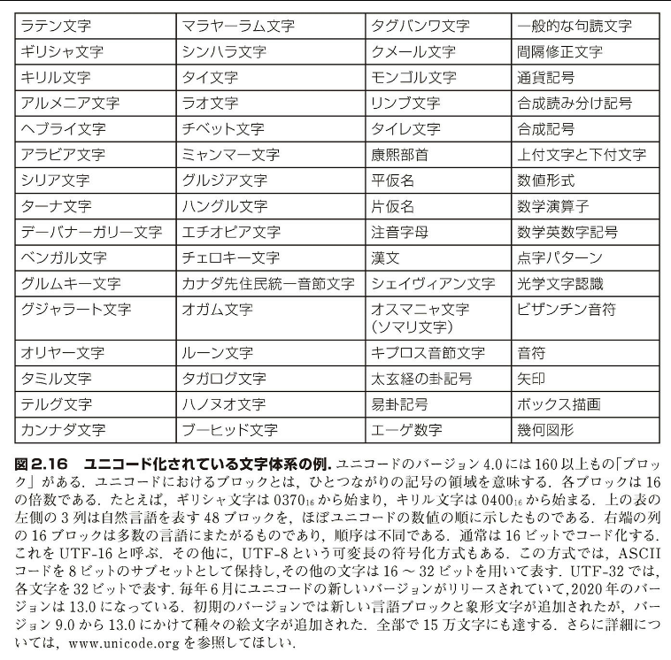
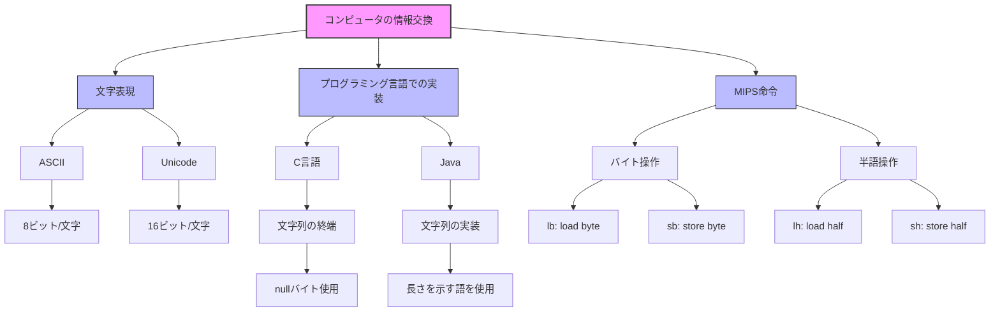

## 2.9 人との情報交換

> !(@ |=> （www open tab bar is great - ワーオ、バーのオープン・タブは十二い）
>
> キーボード下野 "Hatless Atlas," 1991 の 4 行目（ASCII 文字を示す好奇がある。たとえば、"!" は "wow" 、"(" は "open"、"|" は "bar" などといった具合）。

コンピュータは数値を処理するものとして発明された。しかし、商用に供されるようになると、コンピュータはすぐにテキスト処理に使用されるようになった。今日のコンピュータはほとんど、8 ビットのバイトを使用して文字を表す。その代表的なコードが、ASCII（American Standard Code for Information Interchange：米国規格協会が制定した情報交換用標準コード）である。図 2.15 に ASCII コードの一覧を示す。

### ASCII 対 2 進数

【例 題】
数値を数値ではなく ASCII の文字列で表現できる。数値 10 を ASCII 文字列で表現した場合、32 ビットの整数と比べて、記憶するのに必要な容量はどれだけ増大するか。

【解 答】
10 億は 1,000,000,000 である。よって、これを ASCII 文字で表現するには 10 文字が必要となる。ASCII の 1 文字は 8 ビットであるので、必要な容量は 10 × 8 = 80 ビットである。したがって、増大率は 80/32 つまり 2.5 倍となる。容量が増大するのに加え、それらの数値に対し四則演算を行うハードウェアも難しくなり、そのエネルギー消費が増大する。こうして、コンピュータの専門家は 2 進数が自然であるという信念に至った。10 進数マシンは一時的なのめらしさにとどまった。


命令をいくつか並べて使用すれば、語からバイトを抽出できる。したがって、語のロード（lw）と語のストア（sw）の命令があれば、語だけでなくバイトの転送にも不便はない。
しかし、プログラムの中にはテキストを扱うものが多い。そこで、MIPS ではバイトを転送する命令を用意している。load byte（lb）命令はメモリから 1 バイトをロードして、レジスタの右端の 8 ビットにおさめる。store byte（sb）命令はレジスタの右端の 8 ビットを取り出して、メモリに書き込む。バイトをコピーする命令は下記のようになる

```assembly
lb $t0, 0($sp) # ソースからバイトを読みだす
sb $t0, 0($gp) # デスティネーションにバイトを書き込む
```

文章はいくつか並べて使用するのが普通である。これを文字列（string）という。

文字列の長さは通常は可変である。文字列の長さを示す方法は 3 通りある。

1. 文字列の最小のな文字を文字列の長さを示すために使用する
2. 付随する変数に文字列の長さを保持する（データ構造として）
3. 文字列の最後の文字に文字列の終端を表す特定の文字を使用する

C 言語では 3 番目の方法を取っており、文字列の終端を値がゼロのバイト（ASCII では null と呼ぶ）で示す。

例えば"Cal"という文字列を 10 進表現を用いて C で表すと、67, 97, 108, 0 となる（後で見るように、Java では 1 番目の方法がとられている）

## C の文字列の使い方を示す文字列コピー手続きのコンパイル

【例題】

手続き strcpy は文字列 y を文字列 x にコピーする。文字列の表現には終端文字を null とする C の規約を用いる

```C
void strcpy(char x[], char y[])
{
    int i;
    i = 0;
    while ((x[1] = y[i]) != '\0');
        i += 1;
}
```

この手続きをコンパイルした結果の MIPS のアセンブリ・コードはどうなるか？

【解答】

MIPS のアセンブリ・コードの重要なセグメントを下に示す。
配列 x および y のベース・アドレスは$a0および$a1 に保持されており、i は$s0に割りつけられているとする。
strcoyはスタック・ポインタを調整し、それから保持すべきレジスタ$a0 をスタック上に退避する

```assembly
strcpy:
    addi    $sp,$sp,-4       # スタックトップに1語分のスペースを取る
    sw      $s0, 0($sp)      # $s0 を退避する
```

i を 0 に初期化するために、次の命令で $s0 を 0 に設定する. そのためには、0 に 0 を加算して、その和を $s0 に代入する.

```assembly
    add     $s0, $zero, $zero # i = 0 + 0
```

これからループを開始する. i を y[i] に加算することによって、y[i] のアドレスを最初に設定する.

```assembly
L1: add     $t1, $s0, $a1    # y[i] のアドレスを $t1 に代入
```

i を 4 倍する必要がないことに注意してほしい. その理由は、前の例と同様に、y は語の配列ではなくバイトの配列であるからである.

load byte (lb) 命令はバイトを符号拡張するが、load byte unsigned (lbu) 命令はバイトをゼロ拡張する.

y[i] 中の文字をロードするには、lbu 命令を使用して、該当の文字を $t2 に収める.

```assembly
    lbu     $t2, 0($t1)      # $t2 = y[i]
```

先ほどと同様のアドレス計算を行って、x[i] のアドレスを $t3 に収める. それから、$t2 中の文字をそのアドレスにストアする.

```assembly
    add     $t3, $s0, $a0    # x[i] のアドレスを $t3 に代入
    sb      $t2, 0($t3)      # x[i] = y[i]
```

次に、文字がゼロ（つまり文字列の最後）であったならばループから抜け出る.

```assembly
    beq     $t2,$zero,L2     # y[i] がゼロなら、L2 に分岐
```

そうでないときは、i を繰り上げてループの頭に戻る.

```assembly
    addi    $s0, $s0,1       # i = i + 1
    j       L1               # L1へジャンプする
```

ループを抜け出たら、文字列の最後の文字に到達しているので、$s0 とスタック・ポインタを書き戻して、手続きを終了し、呼出し元に戻る.

```assembly
L2: lw      $s0, 0($sp)      # y[i] == 0、文字列の終了
                             # $s0 の前の値を復元する
    addi    $sp, $sp,4       # スタックを 1 語分ポップする
    jr      $ra              # 呼出し元に戻る
```

C では、文字列をコピーするのに、通常は配列の代わりにポインタを使用する. その理由は、上記 i の繰り上げ操作を避けるためである. 配列とポインタの処理の違いについては、2.14 節で説明する.

上記の手続き strcpy はリーフ手続きである. したがって、コンパイラは i を一時レジスタに割付けて、$s0 の退避と復元を省くことができる. ここで、$t レジスタを単に一時的なものと考える代わりに、被呼出し側が便宜的に使用するものと考えることができる. コンパイラはリーフ手続きを見つけると、まず一時レジスタを使用し、それをすべて使い切ってから、退避する必要のあるレジスタを使用する.

### Java における文字と文字列

ユニコード（Unicode）は、大部分の自然言語の文字体系を普遍的にコード化したものである. ユニコード化されている文字体系のリストを図 2.16 に示す. ユニコードには、ASCII 中で使用されている記号（symbol）の数と同じくらいの数の文字体系がある. 可能な限り多くの文字体系を含めるために、Java ではユニコードを採用している. ユニコードでは通常、16 ビットで 1 文字を表す.

MIPS の命令セットの中には、そのような半語（halfword）と呼ばれる 16 ビットを、明示的にロードおよびストアする命令がある. load half (lh) 命令は半語をメモリからロードして、レジスタの右端の 16 ビットに収める. load byte 命令と同様に、load half (lh) 命令は半語を符号付きの数値として扱い、レジスタの左半分の 16 ビットを符号拡張して満たす. これに対し、load half unsigned (lhu) 命令は符号なし整数を処理の対象とする. したがって、lb よりも lbu の方が使用頻度が高いのと同様に、lh よりも lhu の方が使用頻度が高い. store half (sh) 命令は半語をレジスタの右端の 16 ビットから取り出して、メモリに書き込む. 半語をコピーする命令列は下記のようになる.

```assembly
lhu     $t0, 0($sp)      # ソースから半語（16ビット）を読み出す
sh      $t0, 0($sp)      # デスティネーションへ半語（16ビット）を書き込む
```

文字列は標準の Java クラスであり、文字列を連結、比較、変換するメソッドがあらかじめ定義されていて使えるようになっている. C とは異なり、Java では Java 配列と同様に、文字列の長さを示す語が用いられる.



補足： MIPS のソフトウェアでは、スタックを語アドレスに整列化しようとする. そうすれば、プログラムでは常に lw および sw を使用してスタックにアクセスできる. この規約は、スタック上に 1 文字を取ったときに、たとえ 1 バイトしか必要がなくとも、4 バイトが割当てられることを意味する. しかし、文字列変数またはバイトの配列では 1 語に 4 バイト分のデータが詰め込まれる. また、Java の short 型の文字列変数および配列では、1 語に半語が 2 つ詰め込まれる.

補足： Web の国際的な性質を反映して、今日のほとんどの Web ページでは、ASCII に代わってユニコードが使用されている.

【自己診断】
Ⅰ.C および Java の文字および文字列に関する下記の記述のうち、どれが正しいか.

1. 同じ文字列が占めるメモリは、C の場合は Java の場合の約半分である.
2. C および Java においては、文字列は文字の 1 次元配列の非公式な呼び名に過ぎない.
3. C および Java の文字列の終端は null（値がゼロのバイト）で示される.
4. 長さに対応して、文字列の操作も C の方が Java よりも高速である.

Ⅰ．正解は 1 です。

解説：

1. ✓ 正しい。C では文字列は 1 文字 1 バイトで保存されるのに対し、Java では Unicode を使用するため 1 文字 2 バイト（16 ビット）必要です。そのため、同じ文字列でも C の方が約半分のメモリ容量で済みます。

2. ✗ 誤り。C では文字列は文字の 1 次元配列として扱われますが、Java では文字列は独立したオブジェクトとして扱われ、様々なメソッドを持つクラスとして実装されています。

3. ✗ 誤り。C の文字列は null 終端（値がゼロのバイト）で示されますが、Java の文字列は長さを示す語を使用し、null 終端は使用しません。

4. ✗ 誤り。Java の文字列操作は最適化されており、必ずしも C の方が高速というわけではありません。また、Java では文字列操作のための様々な組み込みメソッドが提供されています。

Ⅱ.1,000,000,00010 を保持できる変数のうち、下記のどのタイプが記憶容量を最も多くとるか.

1. C の int
2. C の string
3. Java の string

Ⅱ．正解は 3（Java の string）です。

解説：

1. C の int は通常 32 ビット（4 バイト）で、10 億（1,000,000,000）を十分保持できます。

2. C の string は文字列として表現する場合、数値を文字に変換して保存し、null 終端が必要ですが、基本的に 1 文字 1 バイトです。

3. Java の string は：
   - 各文字が Unicode で 16 ビット（2 バイト）必要
   - 文字列の長さ情報を保持
   - オブジェクトとしてのオーバーヘッド
   - 文字列操作のためのメソッド情報

これらの要因により、Java の string が最も多くのメモリを使用します。

（解答）

【根本事項】

コンピュータの初心者は、データのタイプがデータ自体に記録されているのではなく、そのデータを操作するプログラムによって解釈されることに、驚かされる.

自然言語を例にして、説明しよう. "won"という語は何を意味するだろうか. 文脈が分からないと、この質問に答えることはできない. 特に、何語を使っているのかが重要である.

1. 英語では、"won"は動詞"win"の過去形である.
2. 韓国語では、"won"は韓国の通貨単位を表す名詞である.
3. ポーランド語では、"won"は香しいことを表す形容詞である.
4. ロシア語では、"won"は臭いことを表す形容詞である.

2 進数もいくつかのタイプのデータを表すことができる. たとえば、32 ビットの下記のビット・パターンがあるとする.

```binary
    01100010 01100001 01010000 00000000
```

このビット・パターンは下記のことを表しうる.

1. プログラムがこれを符号なし整数として扱う場合、1,650,544,640.
2. プログラムがこれを符号つき整数として扱う場合、+1,650,544,640.
3. プログラムがこれを終端がゼロで区切られた ASCII 文字列として扱う場合、"baP".
4. プログラムがこれを Pantone カラー照合システムのシアン、マゼンタ、黒、黄色の 4 つの基調色が混合したものとして扱うならば、暗青色.

2.5 節の末尾の「根本事項」を思い出せば、命令も数値として表される. したがって、このビット・パターンは MIPS の下記の機械語命令を表すこともできる.

```binary
    011000  10011  00001  01010  00000  000000
```

これはアセンブリ言語命令の下記の乗算に相当する（第 3 章を参照）.

```assembly
    mult $t2, $s3, $at
```

間違ってワープロ・ソフトに画像を読ませると、ワープロ・ソフトは画像データをテキストとして解釈しようとする. すると、奇妙な画像が画面に表示される結果を招く. テキスト・データを画像処理ソフトに読ませても、同様の問題が生ずるだろう.

プログラム内蔵コンピュータはこのようにデータのタイプに縛られずに動作することから、ファイル・システムにはファイルのタイプを表す接尾辞（たとえば、.jpg, .pdf, .txt）をファイル名に付けるという、命名規約を設けている. それにより、プログラムがファイル名をチェックして、データの不整合による予期せぬ現象を減らすことができる.



この図は以下の主要な概念を示しています：

1. コンピュータにおける情報交換の 3 つの主要な側面

   - 文字表現（ASCII・Unicode）
   - プログラミング言語での実装（C 言語・Java）
   - MIPS 命令セット

2. 各実装方式の特徴

   - ASCII は 8 ビット/文字
   - Unicode は 16 ビット/文字
   - C 言語は文字列終端に null バイトを使用
   - Java は文字列の長さを示す語を使用

3. MIPS 命令の種類
   - バイト操作命令（lb, sb）
   - 半語操作命令（lh, sh）

配色については：

- メインの概念（トップレベル）をピンク系
- サブカテゴリを青系
  で表現し、階層構造を視覚的に分かりやすくしています。

追加の図が必要な場合や、特定の部分をより詳細に図示したい場合はお申し付けください。
