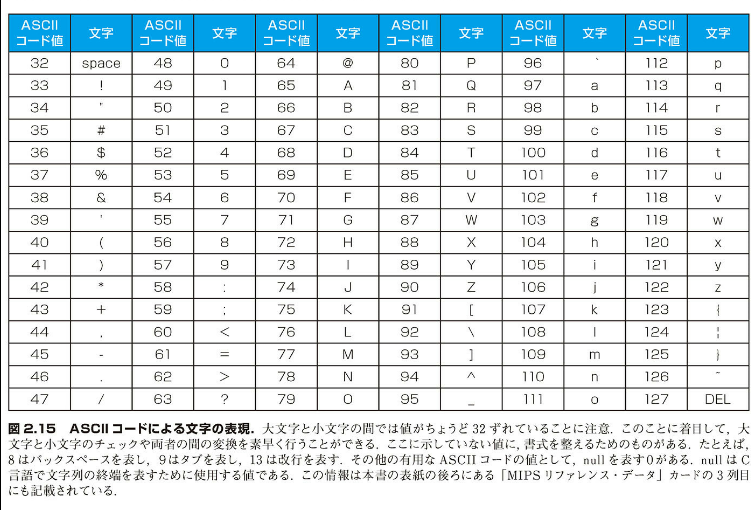

## 2.9 人との情報交換

> !(@ |=> （www open tab bar is great - ワーオ、バーのオープン・タブは十二い）
>
> キーボード下野 "Hatless Atlas," 1991 の 4 行目（ASCII 文字を示す好奇がある。たとえば、"!" は "wow" 、"(" は "open"、"|" は "bar" などといった具合）。

コンピュータは数値を処理するものとして発明された。しかし、商用に供されるようになると、コンピュータはすぐにテキスト処理に使用されるようになった。今日のコンピュータはほとんど、8 ビットのバイトを使用して文字を表す。その代表的なコードが、ASCII（American Standard Code for Information Interchange：米国規格協会が制定した情報交換用標準コード）である。図 2.15 に ASCII コードの一覧を示す。

### ASCII 対 2 進数

【例 題】
数値を数値ではなく ASCII の文字列で表現できる。数値 10 を ASCII 文字列で表現した場合、32 ビットの整数と比べて、記憶するのに必要な容量はどれだけ増大するか。

【解 答】
10 億は 1,000,000,000 である。よって、これを ASCII 文字で表現するには 10 文字が必要となる。ASCII の 1 文字は 8 ビットであるので、必要な容量は 10 × 8 = 80 ビットである。したがって、増大率は 80/32 つまり 2.5 倍となる。容量が増大するのに加え、それらの数値に対し四則演算を行うハードウェアも難しくなり、そのエネルギー消費が増大する。こうして、コンピュータの専門家は 2 進数が自然であるという信念に至った。10 進数マシンは一時的なのめらしさにとどまった。

