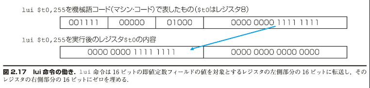
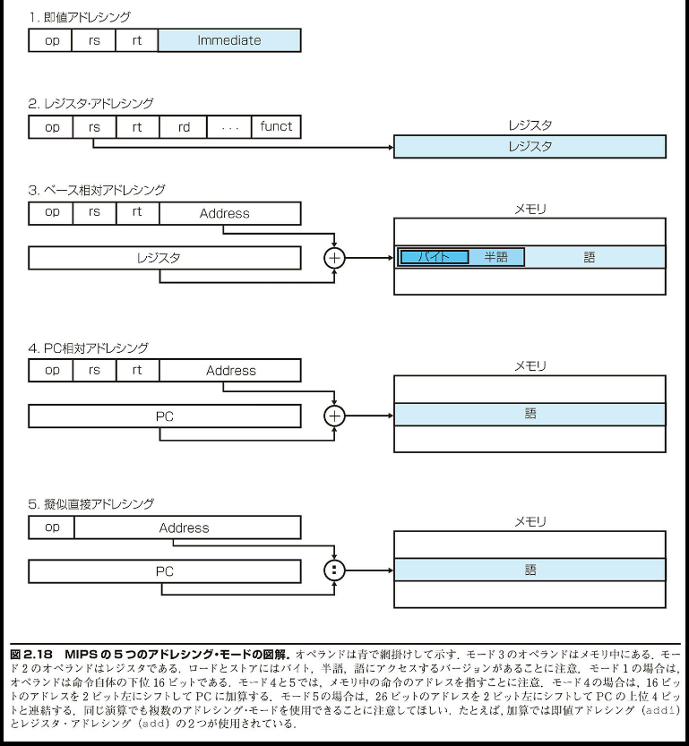
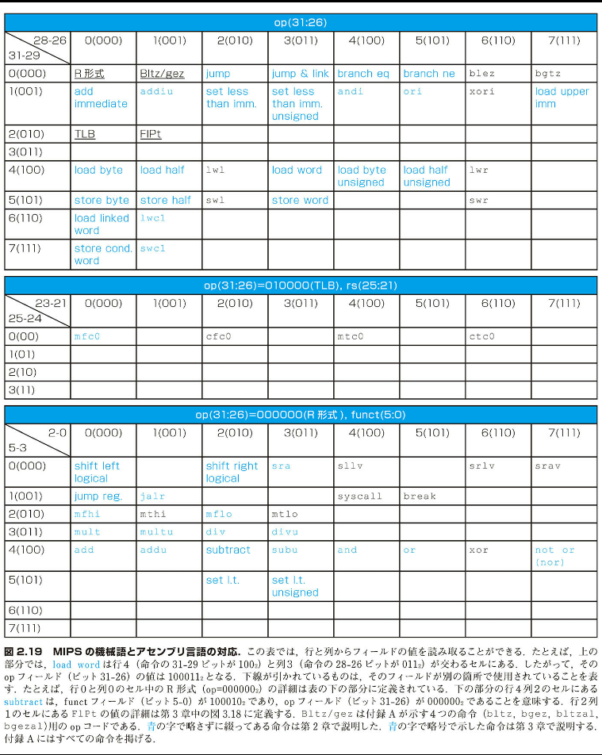
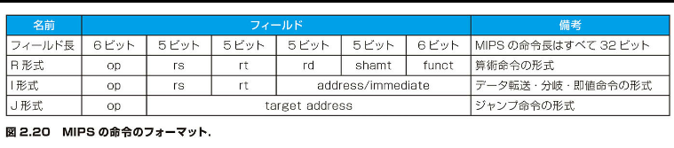
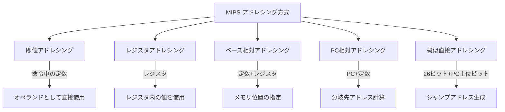
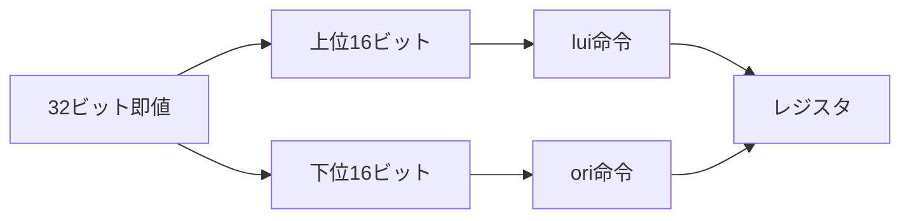
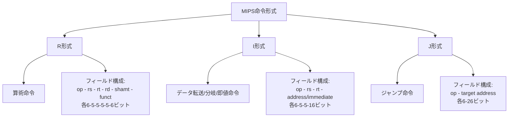

## 2.10 | 32 ビットの即値およびアドレスに対する MIPS のアドレシング方式

MIPS のすべての命令の長さを 32 ビットに保てば、ハードウェアが単純化される. しかし、32 ビット定数や 32 ビット・アドレスを扱えた方が便利な場合がある. 本節では、最初に大きな定数を扱うための一般的な解決策を示し、つぎに分岐およびジャンプの際に使用する命令アドレスの最適化を示す.

### 32 ビットの即値のオペランド

定数は小さいことが多く、ほとんど 16 ビットに収まる. しかし、ときには、定数の長さが 16 ビットを超えることがある. その場合に備えて、MIPS の命令セットには load upper immediate (lui) 命令が用意されている. この命令は、定数の上位 16 ビットをレジスタに入れるためのものである. それに続けて別の命令を使用して、その定数の下位 16 ビットを設定することができる. lui 命令の働きを図 2.17 に示す.



[図 2.17 lui 命令の働き：lui 命令は 16 ビットの即値定数フィールドの値を対象とするレジスタの左側部分の 16 ビットに転送し、そのレジスタ右側部分の 16 ビットにゼロを埋める.]

32 ビットの定数のロード
【例 題】
下記の 32 ビットの定数をレジスタ $s0 にロードする MIPS アセンブリ・コードを示せ.

```binary
    0000 0000 0011 1101 0000 1001 0000 0000
```

【解 答】
最初に、lui 命令を使用して、上位 16 ビットをロードする. この定数の上位 16 ビットは 10 進数では 61 である.

```assembly
    lui $s0,61         # 10進数の 61 は 2 進数の 0000 0000 0011 1101
```

その結果、レジスタ $s0 の内容は下記のようになる.

```binary
    0000 0000 0011 1101 0000 0000 0000 0000
```

次に、下位 16 ビットを追加する. その値は 10 進数では 2304 である.

```assembly
    ori $s0,$s0,2304   # 10進数の 2304 は
                      # 2 進数の 0000 1001 0000 0000
```

最終的に、レジスタ $s0 には求める値が下記のように設定される.

```binary
    0000 0000 0011 1101 0000 1001 0000 0000
```

### 【ハードウェアとソフトウェアのインタフェース】

コンパイラまたはアセンブラのどちらかが、大きな定数を分割してレジスタ上に設定し直す作業を受け持たなければならない. この即値フィールドの大きさに関する制限は、即値をとる命令中の定数の場合だけではなく、ロードとストアの際のメモリ・アドレスを表す場合にも問題になる. この作業をアセンブラが受け持つ場合は（MIPS ではこの方式を用いている）、長い値を作るための一時レジスタが必要となる. このことが、一時レジスタ $at がアセンブラ用に予約されている、1 つの理由である.

このように、MIPS の機械語のシンボル表現はもはやハードウェアに制約されるのではなく、アセンブラ開発者が選択した事柄に制約される（2.12 節を参照）. 本書では、コンピュータのアーキテクチャを説明するために、ハードウェアに密着して説明する. そして、プロセッサ中に実在しないアセンブラの拡張言語を使用するときには、その旨を注記する.

補足： 32 ビットの定数を生成する際には注意が必要である. addi 命令はその命令の 16 ビットの即値フィールドの左端のビットを語の上位 16 ビットにコピーする. 2.6 節で見た ori (即値との論理和) 命令は上位 16 ビットにゼロを埋めるので、32 ビットの定数を生成する際は、アセンブラは ori を lui と組み合わせて使用する.

### 分岐とジャンプにおけるアドレシング

最も単純なアドレシングはジャンプ命令のものである. この命令形式を J 形式と呼ぶ. この命令形式は 6 ビットの op フィールドと残り全ビットのアドレス・フィールドから構成される. たとえば、下記のステートメントがあるとする.

```assembly
    j   10000    # 10000番地にジャンプ
```

これに対応するアセンブラ・コードは下記のようになる（後で見るように、実際にはもう少し複雑である）.

```
    2           10000
    6ビット     26ビット
```

ジャンプ命令の op（命令操作）コードの値は 2 で、ジャンプ先のアドレスは 10000 となっている.

条件分岐命令の場合は、ジャンプ命令とは異なり、分岐先アドレスの他にオペランドを 2 つ指定しなければならない. たとえば、下記のステートメントがある.

```assembly
    bne  $s0,$s1,Exit   #$s0 ≠ $s1 ならば、Exit へ分岐
```

これをアセンブルすると、下記のようになり、分岐先アドレス用には 16 ビットしか残らない.

```
    5        16        17        Exit
    6ビット    5ビット    5ビット     16ビット
```

プログラムのアドレスがこの 16 ビットのフィールドに納まらなければならないとすると、プログラムの大きさは 2¹⁶ を超えることはできないことになる. 今日では、それでは余りにも小さすぎて、現実的な方策とは言えない. 解決策として、分岐先アドレスに加算するレジスタを指定する方法が考え出された. その場合、分岐命令はプログラム・カウンタ値を下記のように計算する.

```
    プログラム・カウンタ値 = レジスタ値＋分岐先アドレス
```

こうすると、2³² までの大きさのプログラムに条件分岐を適用できる. 分岐命令におけるアドレスの問題はこうして解決される. 残る問題は、どのレジスタを使用するかということである.

その答えは、条件分岐の使われ方を検討することによって得られる. 条件分岐はループおよび if 文中で使われる. したがって、分岐先は分岐命令の近くにある公算が大きい. たとえば SPEC では、全条件分岐の約半分の分岐先は 16 命令以内である. プログラム・カウンタ（PC）には現在の命令のアドレスが記憶されているので、分岐先アドレスに加えるレジスタとして PC を使用すれば、現在の命令から ±2¹⁵ 語の範囲で分岐することができる. ほとんどのループや if 文は 2¹⁶ 語よりもずっと小さいので、PC はこの目的に最適である.

この形式の分岐アドレシングを PC 相対アドレシング（PC-relative addressing）と呼ぶ. 第 4 章で説明するが、ハードウェアにとっては、PC を早期に繰り上げて次の命令を指しておくと便利である. そこで、実際には MIPS では、現在の命令のアドレス（PC）を基準にするのではなく、次の命令（PC + 4）のアドレスを基準にして相対アドレシングを行う. これも、「一般的な場合を高速化する」もう 1 つの例である. この場合は、近くにある命令のアドレスを指すようにしている.

最近のほとんどのコンピュータがそうであるが、MIPS でもすべての条件分岐に PC 相対アドレシングを適用している. 分岐先は分岐命令の近くである公算が大きいからである. 一方、ジャンプ＆リンク（jump-and-link）命令では呼出す対象の手続きが呼出し元の近くにあるという保証はない. したがって、手続き呼出しの場合には、別の形式のアドレシングを適用する. 具体的には、ジャンプ（jump）命令およびジャンプ＆リンク命令では、どちらも J 形式を適用して、長いアドレスの指定を可能にしている.

MIPS の命令長はすべて 4 バイトである. そこで MIPS では、PC 相対アドレシングにおいて、次の命令までのバイト数の代わりに語数を使用する. これにより、分岐先を遠くまで延ばすことができる. 16 ビット・フィールドがバイト・アドレスではなく語アドレスを表すと解釈すれば、4 倍遠くまで分岐できるわけである. 同様に、ジャンプ命令中の 26 ビット・フィールドも語アドレスを表す. これは、28 ビットのバイト・アドレスを表すことを意味する.

補足： PC は 32 ビットなので、ジャンプに関してはどこかから 4 ビットを補わなければならない. MIPS のジャンプ命令は PC の下位 28 ビットだけを置換し、上位 4 ビットは元のままとする. ローダおよびリンカ（2.12 節を参照）は、256M バイト（6400 万命令）のアドレス境界を超えてプログラムを配置することのないようにしなければならない. さもないと、ジャンプ（jump）命令をジャンプ・レジスタ（jump-register）命令および他の命令で置き換えて、レジスタに 32 ビット・アドレス全体をロードするようにしなければならない.

### 機械語での分岐オフセットの表記

【例 題】
2.7 節の「C の while ループのコンパイル」に示した例題中の while ループをコンパイルすると、下記の MIPS アセンブリ・コードが得られる.

```assembly
    Loop: sll   $t1,$s3,2      # 4*i を一時レジスタ $t1 に代入
          add   $t1,$t1,$s6    # save[i] のアドレスを $t1 に代入
          lw    $t0,0($t1)     # save[i] を一時レジスタ $t0 に代入
          bne   $t0,$s5,Exit   # save[i]≠k なら、Exit へ
          addi  $s3,$s3,1      # i = i + 1
          j     Loop           # Loop へジャンプする
    Exit:
```

このループの開始アドレスが 80000 であるとする. このループの MIPS 機械語コードはどうなるか.

【解 答】
アセンブルした結果の命令とアドレスは下記のようになる.

```
    80000   0    0    19    9    2    0
    80004   0    9    22    9    0    32
    80008   35   9    8         0
    80012   5    8    21        2
    80016   8    19   19        1
    80020   2         20000
    80024   ...
```

MIPS ではバイト・アドレス方式をとっている. したがって、順序に並んだ語のアドレスは 1 語のバイト数の 4 刻みである. 4 行目の bne 命令では、完全なアドレス（80024）の代わりに、または相対分岐命令（12 + 80012）の代わりに、次の命令のアドレス（80016）に 2 語すなわち 8 バイトを加える相対アドレシングを行っている. 最後の行のジャンプ命令では、ラベル Loop に対応する完全なアドレス（20000 × 4 = 80000）を指定している.

### 【ハードウェアとソフトウェアのインタフェース】

条件分岐の分岐先はほとんどが近くにある. しかし、ときには、分岐先が非常に遠くて、2¹⁶ ビットでは表せないことがある. そのような場合には、大きな定数値の場合と同様、アセンブラが助け船を出してくれる. 具体的には、分岐先へ飛ぶ無条件ジャンプを挿入して、挿入したそのジャンプを飛ばすか否かに条件判定を変えるのである.

### より遠くへの分岐

【例 題】
レジスタ $s0 とレジスタ $s1 が等しいときに分岐する下記の命令があるとする.

```assembly
    beq     $s0,$s1,L1
```

もっと遠くへ分岐可能な命令列で、上記命令を置き換えよ.

【解 答】
上記の命令を下記で置き換えることができる.

```assembly
    bne $s0,$s1,L2
    j L1
L2:
```

### MIPS のアドレシング・モードのまとめ

一般に、複数のアドレシング形式があるときに、個々の形式をアドレシング・モード（addressing mode）と呼ぶ. 各アドレシング・モードにおけるオペランドのとり方を、図 2.18 に示す. MIPS には下記のアドレシング・モードがある.

1. 即値アドレシング（immediate addressing）: 命令中に指定した定数をオペランドとする.

2. レジスタ・アドレシング（register addressing）: オペランドにレジスタをとる.

3. ベース相対アドレシング（base addressing）ないしディスプレースメント・アドレシング（displacement addressing）: 命令中に指定した定数とレジスタの和によって、オペランドが記憶されているメモリの位置を示す.

4. PC 相対アドレシング (PC-relative addressing)：PC と命令中に指定した定数との和によってアドレスを示す。

5. 擬似直接アドレシング (pseudodirect addressing)：命令中の 26 ビットと PC の上位ビットを連結したものがジャンプ・アドレスとなる。

### 【ハードウェアとソフトウェアのインタフェース】

MIPS アーキテクチャでは 32 ビット・アドレスが用いられているとここまで説明してきたが、ほとんどすべてのマイクロプロセッサ（MIPS を含む）のアドレス空間は 64 ビットに拡張されている（図付録 E を参照）。この拡張は大規模化するソフトウェアのニーズに応えるためである。命令セットを拡張する過程で、次世代のアーキテクチャにソフトウェアを円滑に移行できるように上位互換性が図られている。



### 機械語とアセンブリ言語の対応

ときには、機械語から逆に元のアセンブリ言語に戻す必要に迫られることがある。たとえば、メモリ・ダンプを見たいときである。図 2.19 に MIPS の命令と機械語コードの対応関係を示す。この図は、手作業でアセンブリ言語と機械語の間の翻訳を行う際に役立つ。

### マシン・コードの復号

【例 題】
下記の機械語の命令に相当するアセンブリ言語の命令は何か。

```binary
    00af802016
```

【解 答】
最初のステップは、16 進数を 2 進数に変換して、op フィールドを見つけることである。

```binary
    (ビット 31 28 26 5 2 0)
    0000 0000 1010 1111 1000 0000 0010 0000
```

op フィールドを調べて命令操作の種類を判定する。図 2.19 から、ビット 31-29 が 000 であり、ビット 28-26 が 000 であるものを探すと、R 形式の命令であることが分かる。図 2.20 に従って、このバイナリ表現の命令を R 形式のフィールドにフォーマットし直そう。

```assembly
    op      rs      rt      rd      shamt   funct
    000000  00101   01111   10000   00000   100000
```

図 2.19 の下の部分から、R 形式の命令操作のいずれであるかを判定できる。この場合、ビット 5-3 が 100 であり、ビット 2-0 が 000 なので、このバイナリ表現は add 命令であることが分かる。



この命令の残りの部分を復号するためには、フィールドの値を見る。rs フィールドの 10 進値は 5、rt フィールドの 10 進値は 15、rd フィールドの 10 進値は 16 である（shamt は使用されていない）。図 2.14 から、これらの値はそれぞれレジスタ $a1、$t7、$s0 を表すことが分かる。したがって、この命令のアセンブリ言語表現は下記のようになる。

```assembly
    add $s0, $a1, $t7
```

MIPS 命令のすべての命令形式を図 2.20 に示す。第 2 章でこれまで提示した MIPS の命令セットは、図 2.1 にまとめて示してある。この中に載っていない MIPS の命令は、主として算術演算および実数に関するものである。それについては、次章で説明する。



[図 2.20 の表の内容]
名前：フィールド：備考
フィールド区：6 ビット：5 ビット：5 ビット：5 ビット：5 ビット：6 ビット：MIPS の命令はすべて 32 ビット
R 形式：op：rs：rt：rd：shamt：funct：算術命令の形式
I 形式：op：rs：rt：address/immediate：データ転送・分岐・即値命令の形式
J 形式：op：target address：ジャンプ命令の形式

### 【自己診断】

I. MIPS における条件分岐のアドレスの範囲は次のどれか（K = 1024）。

1. 0 から 64K - 1 の間のアドレス
2. 0 から 256K - 1 の間のアドレス
3. 分岐点の前後それぞれ約 32K の範囲のアドレス
4. 分岐点の前後それぞれ約 128K の範囲のアドレス

II. MIPS におけるジャンプ命令およびジャンプ & リンク命令のアドレスの範囲は次のどれか（M = 1024K）。

1. 0 から 64M - 1 の間のアドレス
2. 0 から 256M - 1 の間のアドレス
3. 分岐点の前後それぞれ約 32M の範囲のアドレス
4. 分岐点の前後それぞれ約 128M の範囲のアドレス
5. 上位 6 ビットが PC から得られる 64M のアドレスの範囲内ならどこでもよい
6. 上位 4 ビットが PC から得られる 256M のアドレスの範囲内ならどこでもよい

III. 値が 0000 000016 である機械語命令に対応するものは MIPS アセンブリ言語では次のどれか。

1. j
2. R 形式
3. addi
4. sll
5. mfc0
6. 未定義の命令操作コードであり、0 に対応する正規の命令は存在しない。

(解答)

PC 相対アドレシング（<<）
プログラム・カウンタ（PC）と命令中の定数との和がアドレスとなる、アドレシング方式。

アドレシング・モード（<<）
オペランド（操作対象）とアドレスの種々の指定方法によっていくつかに分類される、アドレシングの方式。

### MIPS アドレシング方式の概要



### 32 ビット即値の扱い方



### 命令形式の種類



これで各命令形式のビット構成がより明確に表示されるはずです。各フィールドの意味も追加で説明します：

### フィールドの説明

#### R 形式のフィールド

- `op`: 操作コード (6 ビット)
- `rs`: 第 1 ソースレジスタ (5 ビット)
- `rt`: 第 2 ソースレジスタ (5 ビット)
- `rd`: デスティネーションレジスタ (5 ビット)
- `shamt`: シフト量 (5 ビット)
- `funct`: 機能コード (6 ビット)

#### I 形式のフィールド

- `op`: 操作コード (6 ビット)
- `rs`: ベースレジスタ (5 ビット)
- `rt`: デスティネーションレジスタ (5 ビット)
- `address/immediate`: アドレスまたは即値 (16 ビット)

#### J 形式のフィールド

- `op`: 操作コード (6 ビット)
- `target address`: ジャンプ先アドレス (26 ビット)

このように整理することで、各命令形式の構造とビット配置がより明確になります。

### アドレス範囲の特徴

#### 条件分岐命令

- 16 ビットのアドレスフィールド
- PC 相対アドレシング使用
- 分岐可能範囲: 分岐点の前後約 32K 語

#### ジャンプ命令

- 26 ビットのアドレスフィールド
- PC 上位 4 ビットと結合
- アドレス範囲: 256MB 以内

### 重要な補足事項

1. すべての命令は 32 ビット長
2. メモリアドレスは 64 ビットに拡張可能
3. アドレスは 4 バイト単位で計算
4. 分岐命令は次の命令(PC+4)を基準に計算

この図式化により、MIPS のアドレシング方式の全体像と各要素の関係性が視覚的に理解しやすくなっています。
