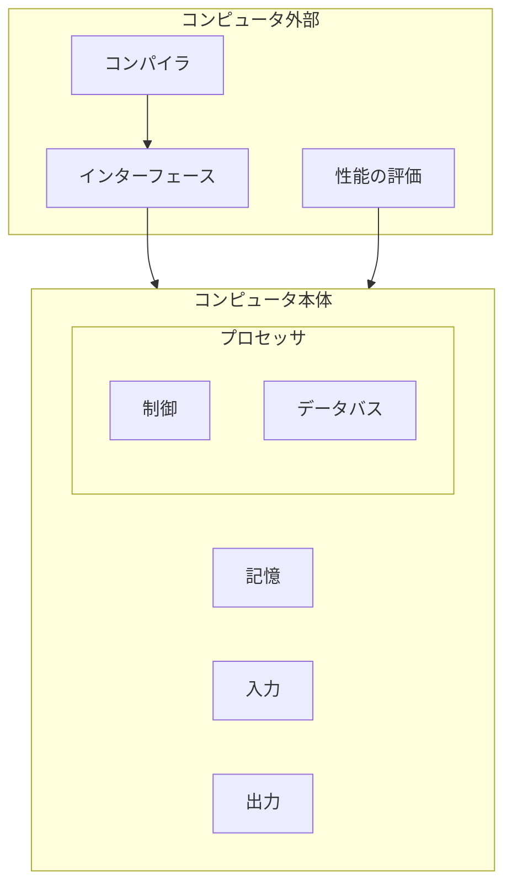
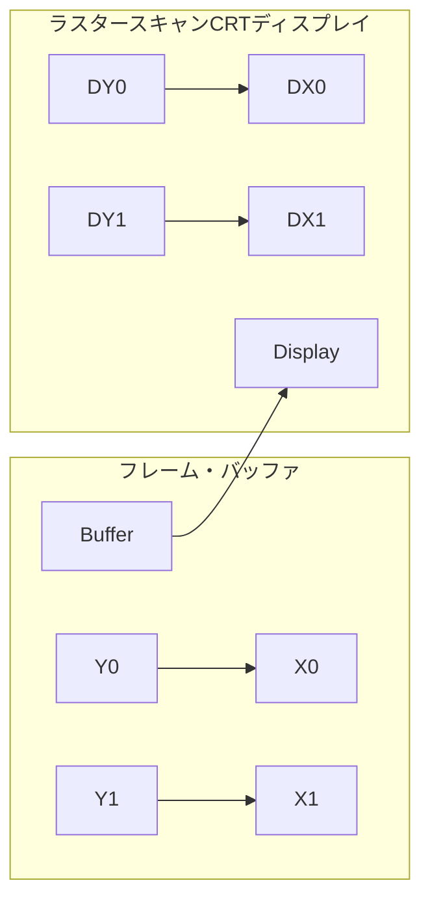

# 1.4 コンピュータの内部

個々のプログラムの根底にあるソフトウェアという概念を知ったので、次にコンピュータの箱を開けてハードウェアの中身を見てみよう。いかなるコンピュータでも、根底にあるハードウェアは基本的に同じ機能を遂行する。それは、データの入力、データの出力、データの処理、データの記憶である。これらの機能をどのように実行するかが本書の中心的なテーマであり、以降の章はこれら4つの機能に関してそれぞれ異なる側面から説明するものと言える。

非常に重要なのでしっかり頭に刻み込んでほしい事項が出てきたとき、本書ではそれらを、「根本事項」と題して強調することとする。本書には根本事項が十数項目ある。その最初は、データの入力、出力、処理、記憶のタスクを遂行するコンピュータの5つの構成要素である。

コンピュータの主要な2つの構成要素は、マイクロフォンのような入力装置（input device）と、スピーカーのような出力装置（output device）である。名前から類推されるように、入力はコンピュータにデータを入力するものであり、出力は処理結果をユーザーに示すためのものである。装置によっては、入力と出力の両方の機能を果たすものがある。無線ネットワークがその例である。

入出力（I/O）装置については第5章と第6章で詳しく説明する。ここでは、ハードウェアの概要をざっと眺めてみよう。まず、外部入出力装置から始める。

**［根本事項］**  
コンピュータの古典的な5つの構成要素は、入力、出力、記憶、データバス、制御である。データバスと制御を合わせてプロセッサと呼ぶこともある。コンピュータの標準的な構成を図1.5に示す。この構成は、どのようなハードウェア・テクノロジを採用するかに左右されない。現在および過去の、すべてのコンピュータのすべての要素は概念的にこれらの5つに分類できる。この点を常に読者の念頭に置いてもらいため。

以降の各章の最初のページにコンピュータの5つの構成要素を図示し、該当の章で取り上げる部分を色で強調して示す。

図1.5 コンピュータの古典的な5つの構成要素。プロセッサは記憶装置から命令とデータを取り出す。入力装置はデータを記憶装置に書き込み、出力装置は記憶装置からデータを読み出す。制御装置は、データバス、記憶装置、入力装置、そして出力装置の動作を指定する信号を送る。

# 画面の内側

最も人目を引く入出力はグラフィック・ディスプレイであろう。ほとんどすべてのパーソナル・モバイル・デバイスでは、液晶ディスプレイ（liquid crystal display: LCD）が使用されることが多い。ディスプレイ装置を薄くして、消費電力を下げるためである。LCDは光源ではなく、光の透過量を制御するだけである。通常、LCDには棒状の分子が含まれている。その分子が、背面から照射される光（場合によっては反射光）の偏光面をねじ曲げる働きをする。液晶に電圧をかけると、分子の配列が変わって、光をねじ曲げなくなる。偏光角が90度異なる2枚のスクリーンの間に液晶物質がはさまれているので、光はねじ曲げられないとその間を通過できない。今日、ほとんどのLCDではアクティブ・マトリックス・ディスプレイ（active matrix display）技術が使用されている。このアクティブ・マトリックスには、電圧を精密に制御して画像を鮮明にするための小さなスイッチが、ピクセルごとに備えられている。CRTの場合と同様、各点に対応した赤・緑・青のマスクによって、最終画像における3原色の彩度が決まる。カラー・アクティブ・マトリックス LCD では、各点に3つのトランジスタ・スイッチが付いている。

画像は画素つまりピクセル（pixel）のマトリクスで構成される。これはビットのマトリクスとも見ることができ、ビットで描いた画像をビット・マップ（bit map）と呼ぶ。画面の大きさと解像度によって、表示画面のマトリクスのサイズは典型的なタブレットでは 1024×768 から 2048×1536 ピクセルに及ぶ。カラー・ディスプレイでは3原色（赤、緑、青）のそれぞれに8ビットを必要とする。つまり、1ピクセル当たり24ビットを使用し、何千万色ものカラーを表示できる。

グラフィック・ディスプレイを支える主要ハードウェアは、ラスター・リフレッシュ・バッファ（raster refresh buffer）、またの名をフレーム・バッファ（frame buffer）と呼ぶ。画面上に表示される画像がフレーム・バッファ中にビット・マップの形式で格納される。そして、それがある一定のリフレッシュ・レートで読み出されて、画面に表示される。1ピクセル当たり4ビットを用いたフレーム・バッファの例を図1.6に示す。

図1.6 左側の各座標のフレーム・バッファの内容が、右側のラスター・スキャンCRTディスプレイの対応する座標の表示の濃淡を決定する。ピクセル（X₀,Y₁）のビット・パターンは0011である。これはピクセル（X₁,Y₁）のビット・パターン1101よりも薄いグレーを表す。

ビット・マップの目的は画面に表示する画像を忠実に表現することである。グラフィック・システムに対する要求が高まる理由として、人の目が変化の検出に優れている点を挙げられる。たとえば、画面を更新した際、変更のあった部分となかった部分との間のごくわずかなずれを、人の目は検出できる。

# タッチスクリーン

> 「コンピュータのディスプレイを通じて、私は航行中の航空母艦の甲板に戦闘機を着艦させたり、素粒子がポテンシャルの井戸に衝突するのを観察したり、ロケットに乗って光速に近い速さで飛行したりした。それは、コンピュータが内部で行っている処理を目に見える形にして映めたということである。」
>
> Ivan Sutherland, コンピュータ・グラフィックスの父,  
> Scientific American, 1984

PCでは、キーボードやマウスと共に、LCDディスプレイも使用されている。ところが、ポストPC時代のタブレットやスマートフォンでは、キーボードやマウスに代わって、タッチスクリーンが使用される。マウスを使う場合は、対象を間接的に指す。それに対して、タッチスクリーンのユーザー・インタフェースには、ユーザーが関心のある対象を直接ポイントするという、優れた利点がある。

タッチスクリーンを実現する方法はいろいろあるが、今日の多くのタブレットでは、静電容量方式が用いられている。人は電気的な導体であるので、ガラスのような絶縁体が透明な導体で覆われているスクリーンに人が触れると、静電界に歪みが生じ、その結果として静電容量が変化する。この技法では、同時に複数の箇所に触れることができる。それにより、魅力的なユーザー・インタフェースにつながりうる、ジェスチャー操作を可能としている。

# 筐体の中身

Apple iPhone Xs Maxスマートフォンの内部を図1.7に示す。この装置の大部分は、コンピュータの古典的な5つの構成要素のうちの入出力装置によって占められているが、それは驚くべきことではない。それらの入出力装置を列挙すると、静電容量式マルチタッチLCDディスプレイ、前向きカメラ、後向きカメラ、マイクロフォン、ヘッドフォン・ジャック、スピーカー、加速度計、ジャイロスコープ、Wi-Fiネットワーク、Bluetoothネットワークなどである。データバス、制御、およびメモリは、ほんの一部を占めるにすぎない。

*[図1.7の説明文]*
左側に置かれているのは、静電容量式マルチタッチLCDを表示している。その右に置かれているのは、バッテリーで、右端に置かれているのは、iPhoneの背面に取り付ける金属枠である。中央を取り囲むように置かれている小さな部品は、コンピュータに当たるものである。それらは、バッテリーの横のケース内にこちんと収まるように置かれ、電気を供えて、金属ケースの左側に置かれている。L字型のポートを拡大したもの、図1.8に示す。これは、プロセッサとメモリが詰められているプリント基板である。写真提供：TechInsights, www.techInsights.com

図1.8中の小さな長方形には、先進技術を駆使したデバイスである集積回路（integrated circuit）、通称チップ（chip）が収容されている。図1.8の中央に見られるA12パッケージには、クロック周波数が2.5GHzの大きなARMプロセッサと小さなARMプロセッサが2つ収容されている。プロセッサ（processor）はプログラムの命令に忠実に従って動く部分であり、数値演算を行ったり、条件を判定したり、入出力に信号を送ったりする動作を行う。プロセッサのことをCPUと呼ぶこともある。CPUとはお役所的響きのある中央演算処理装置（central processor unit）の略である。
