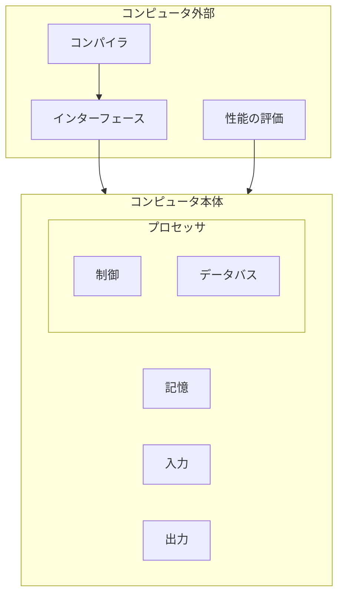
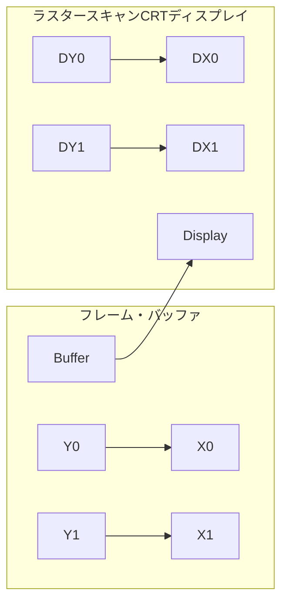

# 1.4 コンピュータの内部

個々のプログラムの根底にあるソフトウェアという概念を知ったので、次にコンピュータの箱を開けてハードウェアの中身を見てみよう。いかなるコンピュータでも、根底にあるハードウェアは基本的に同じ機能を遂行する。それは、データの入力、データの出力、データの処理、データの記憶である。これらの機能をどのように実行するかが本書の中心的なテーマであり、以降の章はこれら4つの機能に関してそれぞれ異なる側面から説明するものと言える。

非常に重要なのでしっかり頭に刻み込んでほしい事項が出てきたとき、本書ではそれらを、「根本事項」と題して強調することとする。本書には根本事項が十数項目ある。その最初は、データの入力、出力、処理、記憶のタスクを遂行するコンピュータの5つの構成要素である。

コンピュータの主要な2つの構成要素は、マイクロフォンのような入力装置（input device）と、スピーカーのような出力装置（output device）である。名前から類推されるように、入力はコンピュータにデータを入力するものであり、出力は処理結果をユーザーに示すためのものである。装置によっては、入力と出力の両方の機能を果たすものがある。無線ネットワークがその例である。

入出力（I/O）装置については第5章と第6章で詳しく説明する。ここでは、ハードウェアの概要をざっと眺めてみよう。まず、外部入出力装置から始める。

**［根本事項］**  
コンピュータの古典的な5つの構成要素は、入力、出力、記憶、データバス、制御である。データバスと制御を合わせてプロセッサと呼ぶこともある。コンピュータの標準的な構成を図1.5に示す。この構成は、どのようなハードウェア・テクノロジを採用するかに左右されない。現在および過去の、すべてのコンピュータのすべての要素は概念的にこれらの5つに分類できる。この点を常に読者の念頭に置いてもらいため。

以降の各章の最初のページにコンピュータの5つの構成要素を図示し、該当の章で取り上げる部分を色で強調して示す。

図1.5 コンピュータの古典的な5つの構成要素。プロセッサは記憶装置から命令とデータを取り出す。入力装置はデータを記憶装置に書き込み、出力装置は記憶装置からデータを読み出す。制御装置は、データバス、記憶装置、入力装置、そして出力装置の動作を指定する信号を送る。

# 画面の内側

最も人目を引く入出力はグラフィック・ディスプレイであろう。ほとんどすべてのパーソナル・モバイル・デバイスでは、液晶ディスプレイ（liquid crystal display: LCD）が使用されることが多い。ディスプレイ装置を薄くして、消費電力を下げるためである。LCDは光源ではなく、光の透過量を制御するだけである。通常、LCDには棒状の分子が含まれている。その分子が、背面から照射される光（場合によっては反射光）の偏光面をねじ曲げる働きをする。液晶に電圧をかけると、分子の配列が変わって、光をねじ曲げなくなる。偏光角が90度異なる2枚のスクリーンの間に液晶物質がはさまれているので、光はねじ曲げられないとその間を通過できない。今日、ほとんどのLCDではアクティブ・マトリックス・ディスプレイ（active matrix display）技術が使用されている。このアクティブ・マトリックスには、電圧を精密に制御して画像を鮮明にするための小さなスイッチが、ピクセルごとに備えられている。CRTの場合と同様、各点に対応した赤・緑・青のマスクによって、最終画像における3原色の彩度が決まる。カラー・アクティブ・マトリックス LCD では、各点に3つのトランジスタ・スイッチが付いている。

画像は画素つまりピクセル（pixel）のマトリクスで構成される。これはビットのマトリクスとも見ることができ、ビットで描いた画像をビット・マップ（bit map）と呼ぶ。画面の大きさと解像度によって、表示画面のマトリクスのサイズは典型的なタブレットでは 1024×768 から 2048×1536 ピクセルに及ぶ。カラー・ディスプレイでは3原色（赤、緑、青）のそれぞれに8ビットを必要とする。つまり、1ピクセル当たり24ビットを使用し、何千万色ものカラーを表示できる。

グラフィック・ディスプレイを支える主要ハードウェアは、ラスター・リフレッシュ・バッファ（raster refresh buffer）、またの名をフレーム・バッファ（frame buffer）と呼ぶ。画面上に表示される画像がフレーム・バッファ中にビット・マップの形式で格納される。そして、それがある一定のリフレッシュ・レートで読み出されて、画面に表示される。1ピクセル当たり4ビットを用いたフレーム・バッファの例を図1.6に示す。

図1.6 左側の各座標のフレーム・バッファの内容が、右側のラスター・スキャンCRTディスプレイの対応する座標の表示の濃淡を決定する。ピクセル（X₀,Y₁）のビット・パターンは0011である。これはピクセル（X₁,Y₁）のビット・パターン1101よりも薄いグレーを表す。

ビット・マップの目的は画面に表示する画像を忠実に表現することである。グラフィック・システムに対する要求が高まる理由として、人の目が変化の検出に優れている点を挙げられる。たとえば、画面を更新した際、変更のあった部分となかった部分との間のごくわずかなずれを、人の目は検出できる。

# タッチスクリーン

> 「コンピュータのディスプレイを通じて、私は航行中の航空母艦の甲板に戦闘機を着艦させたり、素粒子がポテンシャルの井戸に衝突するのを観察したり、ロケットに乗って光速に近い速さで飛行したりした。それは、コンピュータが内部で行っている処理を目に見える形にして映めたということである。」
>
> Ivan Sutherland, コンピュータ・グラフィックスの父,  
> Scientific American, 1984

PCでは、キーボードやマウスと共に、LCDディスプレイも使用されている。ところが、ポストPC時代のタブレットやスマートフォンでは、キーボードやマウスに代わって、タッチスクリーンが使用される。マウスを使う場合は、対象を間接的に指す。それに対して、タッチスクリーンのユーザー・インタフェースには、ユーザーが関心のある対象を直接ポイントするという、優れた利点がある。

タッチスクリーンを実現する方法はいろいろあるが、今日の多くのタブレットでは、静電容量方式が用いられている。人は電気的な導体であるので、ガラスのような絶縁体が透明な導体で覆われているスクリーンに人が触れると、静電界に歪みが生じ、その結果として静電容量が変化する。この技法では、同時に複数の箇所に触れることができる。それにより、魅力的なユーザー・インタフェースにつながりうる、ジェスチャー操作を可能としている。

# 筐体の中身

Apple iPhone Xs Maxスマートフォンの内部を図1.7に示す。この装置の大部分は、コンピュータの古典的な5つの構成要素のうちの入出力装置によって占められているが、それは驚くべきことではない。それらの入出力装置を列挙すると、静電容量式マルチタッチLCDディスプレイ、前向きカメラ、後向きカメラ、マイクロフォン、ヘッドフォン・ジャック、スピーカー、加速度計、ジャイロスコープ、Wi-Fiネットワーク、Bluetoothネットワークなどである。データバス、制御、およびメモリは、ほんの一部を占めるにすぎない。

*[図1.7の説明文]*
左側に置かれているのは、静電容量式マルチタッチLCDを表示している。その右に置かれているのは、バッテリーで、右端に置かれているのは、iPhoneの背面に取り付ける金属枠である。中央を取り囲むように置かれている小さな部品は、コンピュータに当たるものである。それらは、バッテリーの横のケース内にこちんと収まるように置かれ、電気を供えて、金属ケースの左側に置かれている。L字型のポートを拡大したもの、図1.8に示す。これは、プロセッサとメモリが詰められているプリント基板である。写真提供：TechInsights, www.techInsights.com

図1.8中の小さな長方形には、先進技術を駆使したデバイスである集積回路（integrated circuit）、通称チップ（chip）が収容されている。図1.8の中央に見られるA12パッケージには、クロック周波数が2.5GHzの大きなARMプロセッサと小さなARMプロセッサが2つ収容されている。プロセッサ（processor）はプログラムの命令に忠実に従って動く部分であり、数値演算を行ったり、条件を判定したり、入出力に信号を送ったりする動作を行う。プロセッサのことをCPUと呼ぶこともある。CPUとはお役所的響きのある中央演算処理装置（central processor unit）の略である。

# メモリと記憶階層

図1.8中のiPhone Xs Maxパッケージには、2つのメモリ・チップも収容されている。各チップの容量は32ギビビットまたは2GiBである。メモリ（memory）は、実行中のプログラムと、プログラムが必要とするデータを格納する場所である。メモリはDRAMチップで構成されている。DRAMはダイナミックRAM（dynamic random access memory：記憶保持動作の要る随時読み出し書き込み可能なメモリ）の略である。プログラムの命令とデータを収めるためには、いくつかのDRAMがまとめて使用される。磁気テープ装置のように順を追ってしか読み書きできない記憶装置とは対照的に、RAMではどの部分を読み出すにもかかる時間は同じである。

ハードウェアの各要素を掘り下げて見ていくと、マシンの内部構造が見えてくる。プロセッサ内には、別のタイプのメモリであるキャッシュ・メモリもある。キャッシュ・メモリ（cache memory）は、DRAMにとってのバッファの働きをする小さくて高速なメモリである（キャッシュの一般的な定義は、「物を隠しておく安全な場所」である）。キャッシュは、異なるメモリ技術であるスタティックRAM（static random access memory：SRAM）を使用して作られている。SRAMは高速だが集積密度が低いので、DRAMよりも高価である（第5章を参照）。SRAMとDRAMは記憶階層の2つの層である。

上で述べたように、設計を改善する主要なアイデアの1つは、抽象化である。最も重要な抽象化の1つは、ハードウェアと最低水準のソフトウェアとの間のインタフェースである。ソフトウェアは体系的言語を通じてハードウェアと連絡を取る。そこで使われる言葉を命令と呼び、言語体系をコンピュータの命令セット・アーキテクチャ（instruction set architecture）または単にアーキテクチャ（architecture）と言う。命令セット・アーキテクチャには、2進数の機械語を正しく動作させるためにプログラマが知っていなければならない事柄がすべて含まれる。通常、入出力処理の実行およびメモリの割当てをはじめとする低水準のシステム機能は、オペレーティング・システムによってカプセル化される。したがって、アプリケーション・プログラマはそのような詳細について心配する必要はない。アプリケーション・プログラマに提供される、基本命令セットとオペレーティング・システム・インタフェースとの組み合わせを、アプリケーション・バイナリ・インタフェース（application binary interface: ABI）と呼ぶ。

命令セット・アーキテクチャのおかげで、コンピュータ設計者はコンピュータの機能をそれが実行されるハードウェアから独立して論ずることができる。たとえば、ディジタル時計の機能（時刻を刻む、時刻を表示する、アラームを設定するなど）を、時計のハードウェア（水晶発振器、LEDディスプレイ、プラスチック・ボタンなど）から独立して語ることができるのと同じである。コンピュータ設計者は、アーキテクチャとアーキテクチャの実装方式（implementation）とを区別する。アーキテクチャの実装方式とは、抽象化されたアーキテクチャに基づくハードウェアである。ここから次の根本事項が浮かび上がってくる。

**［根本事項］**  
ハードウェアもソフトウェアも一連の階層から構成される。下位階層は上位階層から細目を隠す働きをする。この抽象化の原理を利用して、ハードウェア設計者もソフトウェア設計者もコンピュータ・システムの複雑さに対処する。抽象化されたさまざまな水準間のインタフェースの中で特に重要なものに、命令セット・アーキテクチャがある。これはハードウェアと最低水準のソフトウェアとの間のインタフェースである。この抽象化されたインタフェースのおかげで、コストおよび性能の異なるさまざまな実装方式のもとでも、同じソフトウェアの実行が可能になる。

# データの安全な格納場所

これまで、データの入力、データを用いての計算、データの表示について見てきた。ところが、コンピュータは電源が切れると、それまで処理したものがすべて失われてしまう。というのも、コンピュータ内部の記憶には揮発性メモリ（volatile memory）が使用されているからである。つまり、電気が切れると、記憶内容が失われてしまう。これに対し、DVDプレーヤは、電源を切っても録画されている映画は消えない。不揮発性メモリ（nonvolatile memory）技術を利用しているからである。

そこで、実行中のプログラムとデータの保持に使用する揮発性メモリと、実行していないプログラムとデータの保持用のメモリとを区別することとする。前者を主記憶（main memory）または1次記憶（primary memory）と呼び、後者を2次記憶（secondary memory）と呼ぶ。2次記憶は記憶階層の次の下位層を形成する。1次記憶としては、1975年以来、ずっとDRAMが主流を占めている。一方、2次記憶としては、もっと前から、ずっと磁気ディスク（magnetic disk）装置が主流となっている。サイズおよび形状の理由から、パーソナル・モバイル・デバイスでは不揮発性メモリの一種であるフラッシュ・メモリ（flash memory）がディスクに代わって使用されている。iPhone Xs Maxの64GiBのフラッシュ・メモリが収容されているチップを、図1.8に示す。フラッシュ・メモリは、DRAMよりも遅いが、不揮発性であることに加えて、DRAMよりもずっと安い。ビット当たりのコストはディスクよりも高いが、ディスクよりもはるかに小型で、壊れにくく、消費電力が少ない。したがって、PMDに関しては、フラッシュ・メモリが標準の2次記憶になっている。残念ながら、ディスクやDRAMと異なり、フラッシュ・メモリは多くの回数書き込みを行うと寿命を迎える。したがって、ファイル・システムは書き込み回数を記録しておき、メモリが寿命に達するのを避ける方策を講じておくとよい。たとえば、よく使用されるデータの格納場所を移動させる。第5章で、フラッシュ・メモリについてさらに詳しく説明する。

# 他のコンピュータとの通信

ここまで、入力、演算、表示、データの保存について説明してきた。しかし、今日のコンピュータの観点からすると、まだ抜けているものが1つある。それはコンピュータ・ネットワークである。図1.5に示したプロセッサが記憶装置や入出力に接続されているように、コンピュータはネットワークにより相互接続される。ネットワークで他のコンピュータと通信することを通して、ユーザーはコンピュータの力を増幅できる。今日、ネットワークはコンピュータ・システムのバックボーンとなるまでに普及した。新しく製品化されるパーソナル・モバイル・デバイスまたはサーバーは、ネットワーク用インタフェースを最低限装備していなければ物笑いの種となるだろう。コンピュータをネットワークに接続すれば、下記の利点が得られる。

■ 通信：コンピュータ間で情報を高速に交換できる。

■ 資源の共有：個々のコンピュータがそれぞれ独自の入出力を備えるのではなく、ネットワークを通して複数のコンピュータで入力を共有できる。

# コンピュータネットワークの発展と特徴

■ リモート・アクセス：遠隔地のコンピュータ同士をつなぐことによって、ユーザーは自分のコンピュータのそばにいなくてもよくなる。

ネットワークの伝送路長と性能は千差万別である。通信のコストは、通信速度および伝送路長の増大につれて高くなる。おそらく最も知られたネットワークはEthernetであろう。Ethernetは伝送路長が最大1キロメートルで、伝送速度は最大で毎秒40Gビットである。伝送路長と速度の制約上、Ethernetは建物の同一フロアのコンピュータを接続するのに適する。という訳で、Ethernetはいわゆるローカル・エリア・ネットワーク（local area network）の代表格となっている。ローカル・エリア・ネットワークは、ルーティングやセキュリティの機能も備えたスイッチと相互接続される。ワイド・エリア・ネットワーク（wide area network）は、大陸間をまたがってインターネットのバックボーンを形成し、Webをサポートしている。媒体には、基本的には光ファイバが使用されている。通常、回線は電話会社から借り受けている。

この40年の間で、ネットワークの進歩によりコンピュータ利用形態が変わってきた。それには、ネットワークがあまねく普及したことと、ネットワークの性能が劇的に向上したことの、2つの側面がある。1970年代には、個人で電子メールにアクセスできる人はほとんどおらず、インターネットもWebも存在せず、2地点間で大量のデータを受け渡す主たる方法は磁気テープを物理的に郵送することであった。ローカル・エリア・ネットワークはほとんど存在せず、わずかに存在したワイド・エリア・ネットワークの伝送容量は小さくてアクセスできる人も限られていた。

ネットワーク技術が改善されるにつれて、コストは大幅に安くなり、情報伝送の容量もはるかに増大した。たとえば、約40年前に開発された、標準化された最初のローカル・エリア・ネットワークはEthernetの1バージョンであり、最大伝送容量（「バンド幅」とも言う）は毎秒10Mビットであった。それが100台は無理にしても、数十台ものコンピュータで共有されているのが一般的だった。今日、ローカル・エリア・ネットワーク技術は毎秒1～100Gビットの伝送容量を持つが、せいぜい数台程度のコンピュータで共有されるようになっている。

光通信技術も同様の成長を遂げており、ワイド・エリア・ネットワークの伝送容量はキロビット単位からギガビット単位へと増大し、世界的なネットワークに接続されるコンピュータは数百台から数え切れないほどの台数へと増大している。以上のような劇的なネットワークの普及と伝送容量の増大により、過去30年間の情報革命においては、ネットワーク技術が中心的な役割を担うようになった。

ここ15年ほど、別の革新的なネットワーク技術により、コンピュータ間の通信方法が新たな展開を見せている。ワイヤレス技術が広く普及して、ポストPC時代を迎えたのである。ワイヤレスが爆発的に普及するようになった背景には、メモリなどの半導体に使われているのと同じ低コストの半導体技術（CMOS）を用いて、無線通信を行えるようになったことがある。現在利用可能なワイヤレス技術は、IEEEの標準では802.11acと呼ばれる。この技術を利用することにより、毎秒1Mビットから100Mビット近くまでのデータ伝送が可能になる。ワイヤレス技術は、たまたまその近くにいるすべてのユーザーが電波を共有するという点で、有線のネットワークとは大きく異なっている。

# ［自己診断］
■ 半導体のDRAMメモリとフラッシュ・メモリとディスク記憶装置は大きく異なっている。それぞれについて、揮発性、およおよその相対アクセス時間、DRAMと比較しておおよその相対コストのそれぞれについて、列挙せよ。

（解答）

# 用語解説
**入力装置** （<<）  
コンピュータに情報を与えるのに用いる装置。キーボードがその例である。

**出力装置** （<<）  
計算処理の結果をユーザーまたは他のコンピュータに伝えるための装置。ディスプレイは前者の例である。
